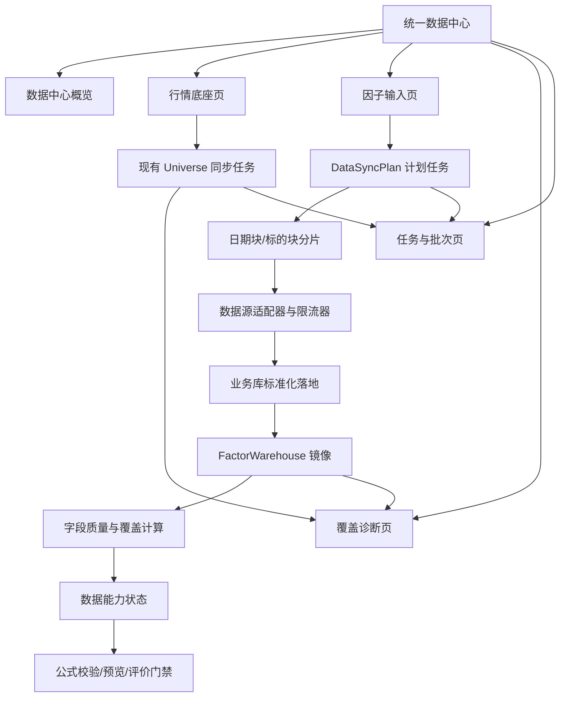

# 基础数据与外部数据中心整合最终改良方案

> 版本：V1.0
>
> 状态：待产品、数据和后端评审
>
> 适用范围：基础数据（日线行情）与外部数据（因子输入数据）的统一入口、同步编排、覆盖诊断和因子评价门禁

## 1. 最终结论

项目不应继续维护两个互相割裂的数据入口，也不应把外部数据简单改造成基础数据的复制品。

最终采用“统一数据中心、底层任务隔离、能力动态呈现”的方案：

1. **基础数据中的日线行情保持现状**。现有行情表、`UniverseDataPanel`、增量同步、历史补齐、缺口修复、任务进度和性能优化逻辑不重写、不迁移、不改变数据口径。
2. **外部数据接入同一个数据中心**，复用统一的任务、批次、覆盖率、失败重试和诊断模型，但按数据源分别执行。
3. **数据覆盖优先于公式扩展**。公式只有在语法、数据、时间语义和覆盖率都满足时，才允许进入预览和正式评价。
4. **连续、事件、快照、宏观状态四类数据分开治理**，不再用“同步成功”或“有记录”代表“可以做长历史因子评价”。
5. **没有真实历史源时不伪造历史**。允许保存草稿和观察，但阻断回测、IC、Testing、Shadow 或 Active 发布。

## 2. 当前问题和证据

### 2.1 基础数据与外部数据职责分裂

基础数据已经具备：

- 日常增量同步；
- 历史补齐；
- 分段缺口修复；
- 智能同步；
- 取消、轮询、断点续跑和任务结果展示。

现有路由和任务实现应视为稳定底座：[universe.py:173](D:/ai_project/dataAanlystNew/app/api/routes/universe.py:173)、[universe_sync_task.py:194](D:/ai_project/dataAanlystNew/app/services/universe_sync_task.py:194)。

外部数据目前主要是按股票执行“同步今天/最近一次快照”，同步请求没有统一的起止日期、分片、数据源能力和覆盖率门禁：[external_data.py:55](D:/ai_project/dataAanlystNew/app/api/routes/external_data.py:55)。

### 2.2 成功状态不能代表可用覆盖

当前外部数据页面展示“同步完成、成功数量、记录数、最近同步时间”，但缺少：

- 有效日期范围；
- 每日股票覆盖率；
- 字段非空率；
- 最大连续历史深度；
- PIT 可信度；
- 可用于哪种因子评价。

因此会出现“同步任务成功，但公式结果全部为 NaN”的情况。

### 2.3 外部数据源具有不同能力边界

| 数据集 | 当前实际能力 | 目标定位 |
|---|---|---|
| 日线行情 | 有稳定的历史、增量和缺口修复链路 | 连续因子底座 |
| 股票估值 | 少量快照，历史覆盖不足 | PIT 连续/低频因子 |
| 财报 | 有公告日历史，但覆盖集中在少量标的 | PIT 基本面因子 |
| 主力资金 | 当前入库为空；接口通常只提供近端历史 | 连续资金流因子 |
| 龙虎榜 | 事件日数据 | 事件因子 |
| 今日人气榜 | 当前 Top-N 快照，免费接口不提供历史回填 | 快照/候选池增强 |
| 尾盘代理 | 候选池分钟数据，当前覆盖为空或很窄 | 候选池派生因子 |

主力资金采集代码虽然能读取近端数据，但当前同步只取当日记录写入业务表：[capital_flow_data.py:63](D:/ai_project/dataAanlystNew/app/services/capital_flow_data.py:63)、[external_data_sync_task.py:171](D:/ai_project/dataAanlystNew/app/services/external_data_sync_task.py:171)。没有历史授权源或用户导入文件时，不能支持 2025 年起的长历史评价。

### 2.4 性能统计存在口径风险

基础数据页面中的“处理数量、耗时、平均速度”需要统一单位和公式。任务扩容前必须先修正计时统计，否则无法判断外部数据是否造成回归。

## 3. 设计原则

### 3.1 稳定底座不重写

以下内容保持原样：

- 日线行情数据表及现有唯一键；
- `UniverseDataPanel` 的日常同步、历史补齐和高级修复交互；
- `/universe/*` 现有接口契约；
- `universe_sync_task.py` 的行情抓取和写入逻辑；
- 日线行情当前的复权、交易日和股票池口径。

新增能力通过服务适配器接入，不直接在行情同步代码中塞入估值、资金流或财报逻辑。

### 3.2 统一控制面，隔离执行面

- 页面、任务列表、批次和数据覆盖诊断统一；
- 行情任务和外部数据任务分开队列、分开资源预算；
- DuckDB 继续单写入队列；
- 同一数据源/同一目标表/同一分片禁止重复执行，不同数据源在预算允许时可受控并行。

### 3.3 数据能力必须可证明

每个字段都必须回答：

```text
在什么日期范围、什么股票池、什么数据语义下，覆盖到多少，是否允许用于什么评价？
```

### 3.4 缺失值不伪造

- 抓取失败、没有记录、非事件日和未公布财报不能默认填 0；
- 真实业务上的 0 才写入 0；
- 缺失值保留 NULL，并进入覆盖率和门禁计算。

## 4. 目标架构



### 4.1 数据层职责

| 层 | 职责 | 是否改造日线行情 |
|---|---|---|
| 业务库 | 保存标准化业务记录、来源和历史版本 | 否 |
| FactorWarehouse | 保存因子执行所需的 DuckDB 表 | 只新增外部数据质量元数据，不改日线口径 |
| 批次元数据 | 记录来源、请求区间、分片、行数、失败和校验 | 新增 |
| 质量快照 | 记录字段级覆盖、新鲜度、连续性和 PIT 状态 | 新增 |
| 公式能力层 | 将字段数据状态映射到 DSL 和评估门禁 | 新增 |

## 5. 统一数据模型

### 5.1 数据集能力契约

新增 `DatasetCapability`，至少包含：

```json
{
  "dataset": "capital_flow",
  "provider": "akshare:stock_individual_fund_flow",
  "grain": "symbol_trade_date",
  "fields": ["main_net_inflow", "main_net_inflow_pct"],
  "history_start": null,
  "history_end": "2026-08-14",
  "max_provider_lookback_days": 100,
  "join_mode": "same_day",
  "evaluation_mode": "continuous",
  "pit_required": false,
  "status": "blocked",
  "block_reason": "historical_source_insufficient"
}
```

能力状态与字段类别分离：

- `domain`：行情、估值、财报、资金流、事件、情绪、尾盘、宏观；
- `readiness`：`available / degraded / blocked`；
- `evaluation_mode`：`continuous / event / snapshot / regime`。

不能再用字段目录中的 `layer=B` 暗示数据已可用。

### 5.2 同步计划和分片

新增 `DataSyncPlan` 和 `DataSyncPartition`，逻辑字段包括：

- 数据集、数据源和目标表；
- 股票池快照 ID；
- 起止日期；
- 同步模式：增量、历史、缺口、快照、事件；
- 日期分片与股票分片；
- 状态、重试次数、游标和最后心跳；
- 接收行数、写入行数、跳过行数、失败行数；
- 当前批次和数据质量结果。

现有 `AsyncTaskRecord` 继续作为前端任务状态兼容层，避免改动任务中心的基础契约。

### 5.3 数据质量快照

新增字段级统计：

- `row_count`；
- `distinct_symbols`；
- `distinct_trade_days`；
- `min_date / max_date`；
- `nonnull_rate`；
- `daily_coverage_p50 / p90`；
- `max_continuous_days`；
- `missing_date_count`；
- `stale_days`；
- `pit_valid`；
- `readiness` 和 `block_reason`。

## 6. 同步模式

### 6.1 日常增量

目标：保证最近交易日数据新鲜度。

- 行情增量保持原实现；
- 外部数据按数据源频率执行；
- 只请求未完成日期和未覆盖标的；
- 不重复拉取已完成分片；
- 先写标准化表，质量校验通过后再标记可用。

### 6.2 历史补齐

目标：根据真实数据源能力补齐指定日期区间。

- 由用户选择股票池、日期范围和数据集；
- 自动按日期块和股票块拆分；
- 每个分片可重试、暂停和恢复；
- 超出数据源历史能力时，创建前就返回阻断提示；
- 不允许用最近快照回填历史。

### 6.3 缺口修复

目标：只补齐诊断出的缺失日期和标的。

- 质量层产生缺口清单；
- 任务只消费缺口清单；
- 修复后重新计算该字段质量；
- 不触发行情底座的全量重建。

### 6.4 事件/快照采集

龙虎榜、人气榜和候选尾盘代理不伪装成连续历史：

- 事件数据按事件日期补齐；
- 快照数据按采集时刻留存；
- 候选池分钟数据标记股票池和采集源；
- 只能进入对应的事件、快照或候选池评价模式。

## 7. 各数据集改造方案

### 7.1 日线行情：保持不动

保留现有：

- 日常同步；
- 历史补齐；
- 高级修复；
- 股票池、交易日、复权和写入策略；
- 当前前端进度和任务取消交互。

只新增两个只读能力：

- 将行情覆盖结果提供给统一数据中心；
- 将行情任务状态适配为统一任务列表。

### 7.2 资金流：第一优先级外部数据

当前问题：接口可返回近端数据，但现有同步只取最后一行写入当天，不能支撑长历史。

改造：

1. 复用已有 `normalize_fund_flow_frame`，一次处理整段历史数据；
2. 新增历史分片写入，不再只调用“今日同步”；
3. 加入来源历史上限和授权提示；
4. 对 `main_net_inflow` 计算字段级非空率与连续交易日；
5. 没有 2025 年历史源时，允许从数据采集日开始积累，但禁止回测旧区间；
6. 达到连续覆盖门槛后，才解除公式评价阻断。

### 7.3 估值：PIT 快照

- 保留 `trade_date` 快照；
- 评价时按 `symbol` 和 `trade_date` 做最近可见值 as-of 连接；
- 设置最大数据年龄；
- 必须记录原始快照日期和评价日期；
- 真实历史源不足时，只允许从可证明的起始日开始评价。

### 7.4 财报：公告日对齐

财报表的日期是 `announcement_date`，不能被通用执行器当作普通 `trade_date` 直读。

改造：

- 以公告日作为可见时间；
- 对每个交易日选择 `announcement_date <= trade_date` 的最新版本；
- 保留报告期、公告日和版本来源；
- 缺少同期报告时标记为不可用，不填 0；
- 支持高流动性股票池优先，再逐步扩大。

### 7.5 龙虎榜、人气榜和尾盘代理

- 龙虎榜：仅事件日评价，不要求连续覆盖；
- 人气榜：仅当前或采集以来的快照，不承诺历史回填；
- 尾盘代理：候选池派生数据，当前不进入全市场因子评价；
- 三者在前端显示“事件/快照/候选池”标签，而不是显示为普通连续数据集。

## 8. 因子 DSL 与数据中心联动

公式编辑器继续使用静态公式目录，但增加动态能力查询。

### 8.1 公式状态分层

```text
语法可编译
  → 字段存在
  → 数据源存在
  → 日期区间覆盖
  → 字段非空率合格
  → PIT/事件语义正确
  → 允许预览或正式评价
```

状态定义：

- `draft_supported`：可保存草稿；
- `preview_supported`：可执行有限预览；
- `evaluation_supported`：可进入正式评价；
- `blocked`：数据或语义不满足，阻断运行。

### 8.2 以主力净流入公式为例

对以下公式：

```text
sum(main_net_inflow, 20) / max(sum(amount, 20), 1)
```

预检必须显示：

- 语法：通过；
- 函数：通过；
- 行情依赖：可用；
- 资金流依赖：阻断；
- 数据表：`raw_fund_flows`；
- 当前非空率：0%；
- 当前可评价日期：无；
- 建议：历史补数、接入历史源或从采集日开始积累。

而不是只显示“公式编译成功”。

### 8.3 字段卡片改造

左侧字段列表保留现有布局，增加：

- 数据状态标签；
- 最近可用日期；
- 覆盖率；
- 评价模式；
- 不能使用时的原因。

字段仍可插入草稿，但 blocked 字段插入后必须在编辑器中显示阻断提示，禁止绕过预检直接提交评价。

## 9. 前端最终布局

### 9.1 数据中心首页

顶部摘要：

- 行情底座状态；
- 可评价因子输入数；
- blocked 数据集数；
- 最近完整交易日；
- 正在执行任务数；
- 最近失败分片数。

主体四个 Tab：

1. 行情底座：嵌入现有基础数据页面，不改布局和交互；
2. 因子输入：外部数据集表格；
3. 覆盖诊断：按字段/公式/日期/股票池查询；
4. 任务与批次：统一查看基础和外部任务。

### 9.2 因子输入表格

列调整为：

| 数据集 | 数据模式 | 有效日期 | 股票覆盖 | 非空率 | 新鲜度 | 因子结论 | 操作 |
|---|---|---|---:|---:|---|---|---|

操作按钮由数据源能力动态生成：

- 日常增量；
- 历史补齐；
- 修复缺口；
- 查看质量；
- 查看失败分片。

### 9.3 性能展示

统一显示：

- 总耗时（毫秒或秒只能选一种）；
- 实际处理分片数；
- 成功/跳过/失败；
- 接收行数/写入行数；
- 网络耗时、解析耗时、数据库耗时；
- 当前吞吐和分位耗时。

不再同时展示相互矛盾的“总耗时”和“平均速度”。

## 10. 后端 API 规划

### 10.1 保留接口

以下接口保持兼容：

- `/universe/*`；
- 现有日线行情同步和状态接口；
- 旧外部数据同步接口。

旧外部接口内部改为调用统一计划服务的 `daily_incremental` 模式，不立即删除。

### 10.2 新增接口

```text
GET  /data-center/overview
GET  /data-center/capabilities
GET  /data-center/coverage
POST /data-center/sync-plans
GET  /data-center/sync-plans/{id}
POST /data-center/sync-plans/{id}/cancel
POST /data-center/sync-plans/{id}/retry
GET  /data-center/batches
GET  /data-center/gaps
```

同步请求核心字段：

```json
{
  "dataset": "capital_flow",
  "universe": "all_a_shares",
  "start_date": "2025-06-23",
  "end_date": "2026-08-06",
  "mode": "historical_backfill",
  "provider": "auto",
  "max_workers": 4
}
```

接口创建计划前先执行能力预检；如果数据源历史范围不足，返回可执行的阻断原因，不创建长时间无效任务。

## 11. 性能和并发方案

### 11.1 资源优先级

```text
行情日常增量 > 行情缺口修复 > 外部日常增量 > 外部历史补数 > 低优先级快照
```

### 11.2 写入策略

- DuckDB 单写队列；
- 网络抓取线程不直接写 DuckDB；
- 标准化结果进入批量写入队列；
- 批量 upsert 保持幂等；
- 失败分片只重试失败部分；
- 任务取消后保留已完成分片。

### 11.3 性能验收底线

- 基础日线同步性能不得因整合下降；
- 外部历史任务不得阻塞行情日常增量；
- 相同数据分片重复提交不得产生重复记录；
- 任务进度每 30 秒内至少有一次心跳；
- 统计单位和吞吐公式一致；
- 页面刷新不触发全库扫描；
- 覆盖率使用增量统计或缓存快照。

## 12. 去除、保留和新增清单

### 保留

- 基础数据日线行情同步全部能力；
- 现有交易日、复权和股票池规则；
- 现有任务中心和 AsyncTask 兼容接口；
- 外部数据现有接口作为兼容入口。

### 去除或禁止

- “同步成功 = 因子可用”的判断；
- 仅按记录总数判断覆盖；
- 对缺失外部数据填 0；
- 对没有历史源的数据提供伪历史回补按钮；
- 外部数据任务共享一个全局串行锁；
- 公式目录将所有字段无条件标为可用；
- 公式执行器直接对所有源表使用同一 `trade_date` 查询逻辑。

### 新增

- 数据集能力契约；
- 统一同步计划与分片；
- 字段级质量快照；
- 数据中心概览；
- 覆盖诊断；
- PIT/as-of 数据提供器；
- 外部数据源历史能力和授权边界；
- 公式与数据状态联动门禁。

## 13. 实施顺序

### 阶段一：低风险整合控制面

- 新增数据中心入口和统一概览；
- 原样嵌入基础数据页面；
- 接入现有行情任务状态；
- 为外部数据增加字段级覆盖和能力状态；
- 修正性能统计口径；
- 不改变行情同步实现。

### 阶段二：外部数据计划任务

- 新增 `DataSyncPlan`、分片和批次元数据；
- 外部旧接口委托到计划服务；
- 先实现财报、资金流的增量和历史分片；
- 新增失败重试、断点续跑和缺口修复。

### 阶段三：数据提供器和因子门禁

- 实现 same-day、as-of、event、snapshot 四类连接策略；
- 公式预检接入字段覆盖和 PIT 状态；
- 正式评价只使用 `evaluation_supported` 字段；
- 事件和快照数据进入独立评价模式。

### 阶段四：数据源扩展

- 主力资金历史源或文件导入；
- 估值真实历史快照源；
- 财报全市场分批补齐；
- 尾盘分钟历史源评估；
- 人气榜从采集启动日起沉淀历史。

## 14. 验收标准

### 14.1 基础数据回归

- 原有日常增量、历史补齐、高级修复均可正常运行；
- 行情表结构、数据口径和历史结果不变；
- 基础数据性能不低于改造前基线；
- 外部数据任务运行时不会阻塞行情日常增量。

### 14.2 外部数据

- 每个数据集都能展示真实日期范围、股票覆盖率和字段非空率；
- 历史能力不足时，任务创建阶段即可明确阻断；
- 分片支持取消、重试和断点续跑；
- 重复提交不会产生重复数据；
- 缺失值不会被自动填 0；
- 任务成功状态与数据可用状态分离。

### 14.3 因子评价

- `close`、`amount` 等日线公式可正常预览和评价；
- `main_net_inflow` 数据为空时，公式能编译但评价被阻断，并显示具体缺口；
- `pe_ttm`、`roe_ttm` 使用正确 PIT/as-of 连接；
- 龙虎榜只能走事件评价；
- 人气榜和尾盘代理不能被误认为连续全市场因子；
- 任何零覆盖字段不能通过填 0 获得假样本。

### 14.4 前端体验

- 基础数据原有页面布局和操作方式不被破坏；
- 数据中心能统一查看基础、外部和因子覆盖状态；
- 按钮文案与数据源能力一致；
- 任务进度、速度、耗时和写入量口径一致；
- blocked、degraded、available 不只用颜色表达，必须有文字原因。

## 15. 最终取舍

本方案不承诺“所有外部数据立即全覆盖”。正确目标是：

1. 先保障日线行情这个连续因子底座；
2. 再把有真实历史来源的数据建设成可评价输入；
3. 将事件和快照数据按正确模式使用；
4. 没有历史来源的数据只从采集日起积累，不伪造回测能力；
5. 通过统一数据中心让用户始终知道“现在有什么数据、能评价什么、还缺什么”。

这比继续增加公式数量更优先，也比重写已经稳定的基础数据同步更安全。

## 16. 实施状态（2026-08-15）

### 16.1 第一批已完成

- 公式能力目录从静态 `enabled: true` 改为读取真实仓库能力快照；
- 字段新增 `available`、`limited`、`event`、`snapshot`、`blocked` 状态，以及非空记录、真实日期范围和评价许可；
- `prev_close` 改为由 `close` 按标的和交易日派生，不修改日线行情物理表；
- `roe_ttm` 按 `announcement_date <= trade_date` 做 as-of 连接；
- `pe_ttm`、`pb` 使用最多 7 日有效期的历史快照 as-of 连接；
- 公式预览改为先读取预热窗口并完成滚动计算，再截取目标交易日；
- 公式预览响应增加评价模式、阻断字段和覆盖受限警告；
- 公式资源栏和右侧上下文帮助展示真实数据状态、覆盖区间和正式评价许可；
- 日线大表只读取轻量表级元数据，外部小表才执行字段级非空统计，并使用 30 秒缓存。

### 16.2 第二批已完成（外部数据同步控制面）

- 外部数据新增同步能力契约，明确每个数据集可用模式及提供商历史上限；
- 同步任务支持“最近快照”与“真实历史范围”，创建前先预览并校验日期范围；
- 估值历史模式使用个股历史估值接口，按真实交易日写入 `PE_TTM/PB` 快照；接口未返回的日期不填补；
- 人气榜、尾盘代理、ETF 指标等不支持历史的数据集，在历史模式下禁止执行，而不是伪造回填；
- 资金流同步由只写最新一行改为按数据源真实返回逐日 upsert，单次最多 100 日，不填补缺失日期；
- 外部同步完成后，相关业务表会自动镜像到 FactorWarehouse，避免同步完成但公式仓库仍是旧数据；
- 外部数据页新增仓库字段覆盖诊断：显示真实有效日期、非空率、有效交易日、标的数和评价状态；
- 资金流的 60 日评价门槛改为按日线交易日历计算：最近每个交易日均须覆盖至少 70% 的日线股票池；同时展示日覆盖率 P50/P90，避免把零散日期或少量标的数据当作连续历史；
- 任务创建时冻结同步计划，并将计划和已处理标的写入任务恢复元数据；
- 外部同步任务使用独立 `DataSyncPlan/DataSyncPartition` 持久化日期/标的分片；取消后保留已完成分片，重试只复制失败或未完成分片；
- 任务面板可查看冻结计划、分片进度和失败分片错误，不再仅依赖标的游标恢复；
- 财报历史回填按用户选择的 `announcement_date` 区间裁剪；“最近快照”保留全量幂等刷新，以接收延迟公告和修订版；
- 估值和资金流新增“检查并修复缺口”：只以本地已有日线的中国股票交易日为基准识别缺失记录，并将最多 200 个缺口冻结为可重试的标的/日期修复分片；
- 设置页新增“数据中心”聚合入口，使用四个 Tab 统一查看原有行情底座、外部因子输入、仓库覆盖诊断及任务与批次；原基础数据页保留不动；
- 外部同步增加行情优先门禁：行情任务运行时禁止创建新的外部同步；若行情任务在外部任务中途启动，外部任务在下一分片前暂停等待，不再继续消耗第三方请求容量；
- 统一任务中心接入外部同步：可按外部数据筛选并取消运行任务，任务详情附带冻结计划、日期范围及完成/跳过/失败分片汇总；
- 历史回填支持预设窗口或手动选择起止日期；
- 龙虎榜历史任务按冻结的起止日期执行，不再在后台重新按当天计算；
- 前端沿用原有同步总览表，在筛选条增加模式/窗口选择、能力禁用和实际执行范围提示。

### 16.3 明确保留不动

- `UniverseDataPanel` 原有布局与操作；
- `/universe/*` 接口；
- `universe_sync_task.py`；
- 日线行情表结构、复权口径、增量同步、历史补齐和缺口修复链路。

### 16.4 后续批次与验证限制

1. 将缺口诊断从估值/资金流扩展到字段级质量快照和更多可回填数据集；
2. 资金流连续有效交易日达到 60 日前，保持正式评价阻断；
3. 扩大财报高流动性池覆盖，持续积累估值 PIT 快照；
4. 将龙虎榜和人气榜接入事件/快照专用评价模式；
5. 具备可靠分钟历史来源后再解除尾盘代理阻断；
6. 将数据中心的外部任务批次明细扩展为跨行情/外部的统一查询 API 与受控并发观测指标；
7. 当前机器缺少 `sqlalchemy` 和 `pytest`，后端白盒测试已补入但须在项目完整 Python 依赖环境中执行。
