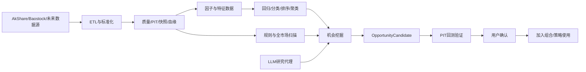

# 机会中心、ETL、机器学习与 LLM 自动挖掘扩展方案

> 文档性质：后续扩展设计基线 / 待持续完善
> 适用项目：dataAanlystNew 个人量化工作台
> 版本：v0.1
> 日期：2026-08-16
> 状态：草案

## 1. 文档目标

本文件独立记录以下后续能力的产品归属、技术接口和演进边界：

- ETL 与数据治理；
- 回归、分类、排序、聚类等机器学习研究；
- LLM 自动挖掘机会；
- 全市场机会扫描与组合回测的隔离；
- AI 发现结果向因子、模型、回测和组合的受控流转。

本文件不替代《组合策略因子模型与回测全链路贯通开发方案》，后者负责当前组合策略和回测主链路，本文件负责未来研究和机会发现能力。

## 2. 已确认的产品边界

### 2.1 沿用当前一级导航

当前项目已经存在一级菜单“机会中心”，不新增“机会挖掘”或“AI 研究”一级菜单。

现有二级页签保持：

```text
候选池 | 观察池 | 已排除 | 扫描记录
```

“机会挖掘”继续作为“候选池”页面中的扫描工作区，不另建一套页面。

### 2.2 全市场能力与组合回测隔离

当前机会中心已经存在 A 股全市场扫描，典型范围约 5,500 只股票。该能力必须保留，用于发现候选和因子/模型研究。

```text
全市场基础数据/扫描
  -> 机会中心
  -> 候选池

当前组合成员快照
  -> 组合回测
  -> 买卖流水与证据
```

- 全市场扫描结果不得自动混入组合回测股票池。
- 组合回测只处理当前组合的几十到上百只股票及其 PIT 成员快照。
- 候选进入组合必须经过用户确认；加入后才参与后续组合回测和模拟交易。
- 沪深300等基准指数只作为买入并持有参考线，不属于全市场选股范围。

## 3. 模块职责

| 模块 | 负责 | 不负责 |
|---|---|---|
| 基础数据 | 数据源、ETL、同步任务、质量、快照、血缘和修复 | 因子定义、模型训练、股票推荐 |
| 因子中心 | DSL 公式、因子版本、FactorSet、数据能力与计算记录 | 模型生命周期、直接下单 |
| 因子模型管理 | 回归、分类、排序、聚类、实验、验证和激活 | 数据源治理、组合买卖执行 |
| 机会中心 | 全市场扫描、AI 挖掘、候选解释和候选生命周期 | 直接激活模型、直接生成交易订单 |
| 回测中心 | PIT 验证、交易流水、买卖依据、风险和绩效 | 创建因子公式、训练模型 |
| 策略规则 | 选择已经生效的模型并配置执行、仓位和风控 | 修改因子或模型内容 |

## 4. 目标数据与研究链路



## 5. ETL 与数据治理扩展口

### 5.1 数据分层

```text
Raw      第三方原始响应，保留来源和哈希
Standard 清洗、证券映射、日期、单位和口径统一
Feature  因子和机器学习特征
Serving  回测、扫描、模型和页面可直接读取的数据
```

### 5.2 统一接口

```python
class SourceAdapter:
    def fetch(self, request): ...

class Transform:
    def execute(self, input_snapshot): ...

class QualityValidator:
    def validate(self, candidate_snapshot): ...

class DatasetPublisher:
    def publish(self, validated_snapshot): ...
```

每个数据集至少保存：

- `dataset_id`、`dataset_type`、`frequency`、`market`；
- `schema_version`、`source_id`、`source_version`；
- `dataset_snapshot_id`、`parent_snapshot_id`、`content_hash`；
- `as_of_at`、`acquired_at`、`published_at`；
- `quality_status`、`pit_status`、`lineage`。

### 5.3 技术分工

- MySQL：业务元数据、任务、质量结论、最新 Score 和引用关系。
- DuckDB/Parquet：历史批量数据、研究数据集和临时因子矩阵。
- Pandas：时间对齐、滚动窗口、缺失处理、因子和特征计算。
- 当前不引入新的大型数据平台；达到单机瓶颈后再评估分布式计算。

## 6. 通用机器学习扩展

### 6.1 统一任务类型

现有 FactorModelRun 向通用实验契约扩展：

```text
regression     预测未来收益或连续风险值
classification 预测上涨/下跌、风险或事件类别
ranking        对股票候选进行相对排序
clustering     股票风格、市场状态和异常群组发现
```

统一模型接口：

```python
fit(dataset)
predict(dataset)
evaluate(dataset)
save_artifact()
```

### 6.2 模型生命周期

```text
实验草稿 -> 训练 -> 时间序列验证 -> 待评审
         -> 影子运行 -> 已激活 -> 已退役
         \-> 失败/拒绝
```

- 回归、分类和排序可生成 Score，但必须声明 Score 语义和方向。
- 聚类结果只生成群组标签、市场状态或派生特征，不直接生成买卖订单。
- 所有模型绑定精确数据快照、FeatureSet/FactorSet、代码版本、参数和训练区间。
- 训练数据与组合回测股票池分离；全市场训练不改变组合回测的候选范围。

## 7. 机会中心页面改造

### 7.1 保持当前布局

保留当前页面的：

- 数据准备状态；
- 前往基础数据、运行增量同步、数据就绪后自动扫描；
- 候选池、观察池、已排除、扫描记录；
- 扫描范围、最低机会分、扫描方式、合并消息面；
- 开始、暂停、继续、中止、按原参数重试；
- 任务进度和分阶段状态。

### 7.2 扫描方式扩展

当前“扫描方式”下拉框扩展为：

```text
智能同步后评分
规则条件扫描
因子模型扫描
AI辅助挖掘
```

选择扫描方式后复用当前“高级配置”区域显示专属参数，不新增嵌套卡片。

AI 辅助挖掘参数建议包括：

- 分析范围：A 股、行业、自定义研究范围；
- 使用数据：行情、估值、财务、消息；
- 候选数量上限、最低置信度；
- 使用的模型/FactorSet；
- 数据截止时间与验证区间。

### 7.3 候选列表补强

候选列表增加：

- 来源：规则、因子模型或 AI；
- 机会分和置信度；
- 触发因子/规则；
- AI 摘要；
- 数据截止时间；
- 回测验证状态；
- 查看依据。

鼠标靠近来源、机会分和状态时显示计算口径、模型/规则版本和缺失处理。点击“查看依据”打开右侧抽屉，不离开当前筛选和分页。

## 8. LLM 自动挖掘安全闭环

### 8.1 LLM 的权限边界

LLM 可以：

- 调用只读数据和统计工具；
- 提出股票机会、因子公式和模型实验建议；
- 根据结构化证据生成摘要；
- 创建待验证草稿。

LLM 不可以：

- 直接修改已生效因子或模型；
- 绕过 PIT、数据质量和模型验证门禁；
- 自动把候选加入组合；
- 直接生成模拟或实盘订单；
- 补造不存在的数据和理由。

### 8.2 OpportunityCandidate

LLM、规则和模型统一输出 `OpportunityCandidate`：

```text
candidate_id
source_type
symbol_id / research_scope
opportunity_type
score / confidence
triggered_factors
triggered_rules
evidence
data_cutoff_at
dataset_snapshot_ids
model/prompt/tool_versions
validation_status
risk_flags
```

### 8.3 成果流转

```text
股票机会 -> 机会中心候选池
因子公式 -> 因子中心待验证草稿
模型思路 -> 因子模型管理实验草稿
策略假设 -> 回测中心验证任务
```

任何成果只有经过验证和用户确认后才能进入正式使用链路。

## 9. 全市场扫描性能策略

全市场扫描与组合回测采用不同计算策略：

| 场景 | 范围 | 计算方式 | 保存方式 |
|---|---:|---|---|
| 机会中心快速扫描 | 约 5,500 只、近期日线 | 增量特征 + 批量评分 | 最新结果和候选快照 |
| 机会中心完整研究 | 用户指定区间和因子 | 异步分片、可暂停恢复 | 实验摘要 + 有上限缓存 |
| 组合回测 | 单组合几十到上百只 | 按区间临时因子矩阵 | 回测结果、证据、短期缓存 |
| 每日模拟交易 | 当前组合成员 | 最新日增量 Score | 最新 Score 长期保存 |

- 全市场扫描不得在请求链路逐证券调用第三方接口；数据必须先同步到本地。
- 相同数据快照和计算版本复用公共特征，不能因扫描方式不同重复计算底层指标。
- 扫描任务支持分片、幂等、暂停、继续、中止和按原参数重试，沿用当前任务交互。
- 候选结果与计算中间数据分离；过期中间缓存可以清理，候选证据必须可追溯。

## 10. 建议后端服务

```text
ETLService
DataGovernanceService
FactorComputeService
ModelExperimentService
OpportunityScanService
OpportunityMiningService
OpportunityValidationService
```

服务端解耦不代表前端新增一级入口。API 按职责组织，页面通过机会中心聚合接口获取任务、候选、证据和验证状态。

## 11. 分阶段实施建议

### P0：隔离和契约

- 全市场扫描与组合回测候选来源彻底隔离；
- 建立 OpportunityCandidate 统一结构；
- 扫描记录保存数据、规则、模型和版本；
- AI 只允许生成待验证草稿。

### P1：机器学习扩展

- FactorModelRun 支持回归、分类、排序；
- 增加统一实验、验证和模型注册接口；
- 因子模型扫描结果进入候选池。

### P2：LLM 挖掘

- 增加只读研究工具；
- AI 辅助挖掘接入现有扫描方式；
- 建立因子草稿、模型实验和回测验证流转。

### P3：聚类和高级研究

- 股票风格聚类、市场状态识别和异常群组；
- 聚类结果作为研究标签或模型特征；
- 完成容量和稳定性验证后再扩大研究范围。

## 12. 初步验收标准

- 机会中心全市场扫描不会改变任一组合回测股票池。
- 组合回测请求无法通过参数切换为全市场范围。
- AI、规则和模型候选均使用统一 OpportunityCandidate，可查看来源和证据。
- AI 不能通过前端或 API 直接激活因子、模型、策略或订单。
- 因子草稿、模型实验和回测验证之间存在可追溯引用。
- 同一扫描任务暂停、继续和重试不会重复生成候选或污染已发布结果。
- 全市场扫描仅使用本地已发布数据快照，不在扫描循环调用第三方接口。
- 数据、特征、模型、提示词和工具版本能够从候选记录完整追溯。

## 13. 待后续评审问题

1. AI 辅助挖掘第一期只分析结构化行情/财务，还是同时接入新闻和公告？
2. 全市场扫描默认频率是每日收盘后一次，还是支持用户手动多次运行？
3. 回归、分类、排序和聚类第一期分别采用哪些算法库和默认模型？
4. 机会分与模型 Score 是同一字段还是保持独立语义？
5. 候选进入观察池和组合分别需要哪些验证门槛？
6. LLM 生成因子公式后，是否自动触发样本编译，还是必须由用户点击验证？
7. 新闻、公告等非结构化数据的版权、保留期和引用展示如何处理？
8. 全市场研究缓存的容量上限、TTL 和并发任务数如何按本机配置？
9. 聚类标签如何命名和解释，如何避免用户把无监督分组误解为买卖建议？
10. 机会候选和完整证据保存多久，是否需要冷热归档？

