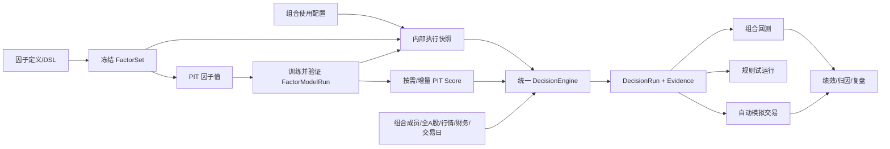

# 组合策略、因子模型与回测全链路贯通开发方案

> 文档性质：开发实施规格 / 产品交互规格 / 量化验收基线
> 适用项目：dataAanlystNew 个人量化工作台
> 版本：v1.15
> 日期：2026-08-16
> 状态：待评审
> 目标读者：产品、前端、后端、量化研究、测试、运维

## 0. 文档结构与执行顺序

本文件按以下顺序使用，章节编号保留历史版本兼容，不代表开发执行顺序：

1. **需求与问题**：第 1-4 章，明确目标、范围、当前 Bug 和根因。
2. **本期改造设计**：第 5-15 章，明确业务规则、架构、页面、接口、数据和迁移方案。
3. **开发计划**：第 16 章，拆分工作包、优先级和交付顺序。
4. **开发前评审**：第 21 章，所有 Grilling Gate 问题必须在进入 P0 开发前闭环；第 27 章用于复审冲突。
5. **测试**：第 17 章，验证需求、实现和跨入口一致性；测试不等同于验收。
6. **验收**：第 18 章，依据测试结果判断是否达到交付门槛。
7. **上线与完成定义**：第 19 章和第 28 章，规定灰度、回滚和最终 Done 条件。
8. **后续优化**：第 20 章，属于专业量化增强项；除非工作包明确纳入，不作为本期 P0 交付阻断条件。

第 22-26 章以及第 27.5 章是对实现、默认决策和页面交互的补充细则，开发时分别归入第 5-16 章对应工作包，不改变“测试在验收之前”的原则。

## 1. 文档目标

本方案解决以下模块“页面已存在、局部功能可用，但配置、计算、回测和模拟交易没有使用同一套规则”的问题：

- `组合校验 -> 策略规则`
- `组合校验 -> 回测中心`
- `设置 -> 因子中心`
- `设置 -> 因子模型管理`
- 默认成员源自动模拟交易链路

最终目标不是继续增加孤立配置项，而是形成一条可验证、可回放、可解释、可恢复的完整链路：

```text
因子定义 -> 因子集冻结 -> PIT 因子值 -> 模型训练/验证/激活 -> PIT Score
       -> 当前组合选择并应用 -> 内部执行快照 -> 统一决策引擎 -> 回测/预检/自动模拟交易
       -> 买卖与拒绝依据 -> 绩效归因 -> 审计和复盘
```

所有页面展示的配置都必须满足以下二选一原则：

1. 已接入执行链，界面明确显示生效版本和生效范围；
2. 尚未接入执行链，不提供可操作控件，显示“规划中”或直接移除。

严禁出现“用户可修改、保存成功，但执行端忽略”的假配置。

## 2. 范围与非目标

### 2.1 本期范围

- 策略规则对已生效模型/因子集的选择、预检、原子保存应用和内部执行快照。
- 因子集、因子模型、评分结果与策略规则之间的真实绑定。
- 回测、规则试运行、自动模拟交易复用同一决策服务。
- 历史因子值、历史 Score、财务数据和行情数据的时点一致性（PIT）。
- 买入、卖出、继续持有、不买入、风控拒绝的证据链。
- 回测参数真实传入、成本模型真实执行、基准数据真实展示。
- 任务幂等、断点恢复、锁、心跳、告警、对账和降级策略。
- 在现有 React + Ant Design + FastAPI + SQLAlchemy + MySQL/DuckDB 架构内增补改造。

### 2.2 非目标

- 不接入实盘券商下单，不承担实盘交易风控合规。
- 不替换现有前端框架、后端框架和数据库体系。
- 不另建一套独立调度平台，沿用并强化现有定时任务与异步任务能力。
- 本期不实现分钟级、高频或逐笔撮合，回测默认以日频为主；数据契约和适配器接口必须预留 `1m/5m/15m/30m/60m/tick` 扩展能力，后续接入时不得推翻日线模型。
- 当前 AkShare/Baostock 主备链路不承诺完整 PIT 财务数据或分钟数据；这是当前数据源接入状态，不代表产品永久排除分钟级能力。
- 本期不实现“按沪深300/中证500历史成分选股”；指数成分证券池作为未来可选能力，只有 PIT 成分数据完备后才允许开放。
- 不把模型分数包装成投资建议；系统输出是可审计的研究与模拟交易决策。

## 3. 术语与统一语义

| 术语 | 定义 |
|---|---|
| Factor | 一个有版本的因子定义，包含公式、输入字段、频率、缺失策略和方向 |
| FactorSet | 一组被冻结的因子及其精确版本，是训练与手工打分的输入契约 |
| FactorModelRun | 某次训练产生的不可变模型运行，包含训练窗口、特征、参数和指标 |
| Score | 指定证券、决策时点、模型/权重版本下的评分结果 |
| StrategyUsageBinding | 当前组合实际使用的模型、FactorSet、选股范围和规则绑定 |
| StrategyExecutionSnapshot | 保存应用或任务启动时自动生成的不可变内部快照，不作为策略页版本管理功能 |
| DecisionRun | 某个内部执行快照在某一决策时点对一个选股范围的完整决策运行 |
| DecisionEvidence | 某只证券为何买、卖、持有、拒绝或无动作的结构化证据 |
| PIT | Point-in-Time，只使用决策时点当时已可获得的数据 |
| decision_at | 策略作出判断的逻辑时点 |
| data_cutoff_at | 允许进入本次判断的数据最晚可用时间 |
| effective_from/to | 规则或版本实际有效的时间区间 |
| fail-closed | 条件不完整或关键数据异常时不产生新买单，并明确记录原因 |

## 4. 当前事实基线与问题判定

以下结论来自当前代码与数据库链路检查。它们是开发前必须锁定的缺陷基线，不应在实现中被重新解释为“产品设计如此”。

| 编号 | 当前问题 | 代码证据 | 用户影响 | 优先级 |
|---|---|---|---|---|
| C-01 | 自动交易仓位计算固定返回 `100.0`，没有使用策略仓位预算 | `app/services/auto_trade_member_source.py` 的 `_calculate_position_size` | 页面配置的仓位和风险预算不决定实际订单 | P0 |
| C-02 | 组合回测强制 `score_weight_mode="manual"` 且 `factor_model_run_id=None` | `app/services/portfolio_backtest.py` | 策略绑定模型与回测结果脱节 | P0 |
| C-03 | 前端默认发送 `only_auto=true`、`current_universe=true`；后端 Score 查询未严格受回测结束时点约束 | `PortfolioBacktestCenter.tsx`、`portfolio_backtest.py` | 请求语义不清，且历史回测存在使用未来评分的风险 | P0 |
| C-04 | 策略保存载荷未完整保存 `stock/etf` 分阶段仓位映射 | `PortfolioStrategyRules.tsx` 与 `allocation.py` 的结构不一致 | 保存后可能触发 `stage_not_allowed`，或覆盖既有规则 | P0 |
| C-05 | 初始资金、手续费、“使用当前策略”等回测控件没有完整进入请求 | `PortfolioBacktestCenter.tsx`、`frontend/src/api/client.ts` | 用户看到的配置与实际回测不一致 | P0 |
| C-06 | 前端模型训练未形成选择 `factor_set_id` 的完整流程 | `FactorModelSettings.tsx`、`FactorModelPage.tsx` | 自定义 DSL 因子无法可靠进入训练和评分 | P0 |
| C-07 | 策略页面的价值、成长、动量等标签是对 Score 字段的近似映射，不是 FactorSet 成员或模型权重 | 策略规则前端和评分服务 | 用户误以为正在使用所选因子 | P0 |
| C-08 | 代码以前缀近似生成“沪深300/中证500证券池”，但当前产品并不需要指数成分选股 | `portfolio_backtest.py` | 用户会误以为基准指数同时决定选股范围，候选样本失真 | P0 |
| C-09 | 缺失基准数据时生成默认年化 5% 曲线 | `portfolio_backtest.py` 的 benchmark fallback | 展示伪造对照数据，污染超额收益判断 | P0 |
| C-10 | MA/MACD/RSI 等名称主要改变标签或阈值，没有执行真实指标条件树 | 策略规则与执行路径 | 规则名和实际算法不一致 | P0 |
| C-11 | PortfolioRule、SignalRule、自动交易开关分步保存，失败时可能仍提示成功 | `PortfolioStrategyRules.tsx` 及相关 API | 策略处于半保存、半生效状态 | P0 |
| C-12 | 已存在激活模型和模型 Score，但最近组合回测仍记录为 manual 且模型为空 | 当前生产库抽样 | 证明链路是部分贯通，不是单纯缺配置 | P0 |
| C-13 | 旧回测和自动交易有各自筛选、打分、仓位逻辑 | 多个 service | 同一策略在不同入口得出不同结果 | P1 |
| C-14 | 缺少逐证券的拒绝证据和规则版本快照 | 当前返回模型 | 用户只能看到结果，无法知道为什么没买或为什么卖 | P1 |

### 4.1 根因总结

根因不是某一个接口错误，而是系统缺少三个核心契约：

1. **不可变执行快照契约**：策略页不需要版本管理，但保存的多份配置必须在运行启动时收敛为一个唯一可信、不可变的执行快照。
2. **统一决策契约**：回测、自动交易和页面预览分别解释规则，导致行为漂移。
3. **时点数据契约**：因子、Score、财务数据和行情数据没有统一约束 `decision_at` 和 `data_cutoff_at`。

## 5. 目标架构



### 5.1 单一事实来源

- 因子输入的事实来源是冻结的 `FactorSet` 及成员版本。
- 模型评分的事实来源是通过验证且处于可用状态的 `FactorModelRun`。
- 策略执行的事实来源是当前 `StrategyUsageBinding` 在运行启动时生成的不可变 `StrategyExecutionSnapshot`。
- 每次运行的事实来源是 `DecisionRun` 及其 `DecisionEvidence`。
- 回测、预检、模拟交易必须使用服务端生成的 `strategy_snapshot_id`，不能各自拼装一套规则 JSON；页面只提交当前组合 ID 和使用参数。

### 5.2 统一决策流水线

所有入口按相同顺序执行，任何入口不得跳步：

1. **加载快照**：读取 `StrategyExecutionSnapshot`，验证哈希和组合绑定关系。
2. **确定时点**：生成 `decision_at`、`data_cutoff_at` 和交易日。
3. **构建证券池**：按执行快照读取用户组合成员，典型规模为几十到上百只；基准指数不参与候选生成。
4. **资格过滤**：上市天数、停牌、ST、退市、成交额、价格、资产类型等。
5. **数据健康门禁**：检查行情、财务、因子和 Score 的新鲜度与覆盖率；基准单独检查，缺失时降级相对指标而不阻断组合回测。
6. **因子/模型打分**：严格绑定 FactorSet 或 FactorModelRun；禁止无提示换模型。
7. **信号判断**：执行真实条件树和指标计算，得到入场、离场、继续持有或无信号。
8. **组合风险检查**：总仓位、单标的、行业、资产类型、回撤熔断、现金下限。
9. **仓位计算**：依据风险预算、分阶段限制、当前持仓和可用现金计算目标仓位。
10. **订单计划**：应用价格、手续费、滑点、最小手数、涨跌停和成交量约束。
11. **证据落库**：保存通过、拒绝和降级原因，再由调用方决定撮合或展示。

## 6. 内部执行快照设计（不作为前端版本管理）

本章的不可变快照用于保证回测、自动模拟交易和审计可复现，不代表策略规则页需要“草稿、发布、历史版本”功能。用户在策略规则页只进行“预检”和“保存并应用”；系统在保存成功时自动生成内部快照。因子和模型的版本生命周期仍由设置页管理。

### 6.1 生命周期

```text
当前组合使用配置 -> 预检 -> 原子保存并应用 -> 生成不可变 execution snapshot
                         \-> 校验失败（保留原绑定）
新配置再次保存 -> 生成新 snapshot；旧 snapshot 仅随历史运行只读保留
```

- 策略规则页不提供快照列表、版本对比、复制和回滚按钮。
- “保存并应用”必须在一个数据库事务中校验模型/因子引用、保存组合规则、切换当前绑定并写审计日志。
- 已被 DecisionRun 引用的快照不得原地修改或删除。
- 自动任务启动时锁定当前 snapshot ID；任务运行中配置变化不影响本次任务。
- 历史回测从运行记录查看其 snapshot ID 和内容，不提供将旧快照直接恢复为当前配置的入口。

### 6.2 建议快照结构

```json
{
  "strategy_snapshot_id": "ss_xxx",
  "portfolio_id": 1,
  "version": 7,
  "effective_from": "2026-08-17T09:25:00+08:00",
  "universe": {
    "type": "portfolio_members",
    "portfolio_id": 1
  },
  "score_source": {
    "mode": "model",
    "factor_set_id": "fs_xxx",
    "factor_model_run_id": "fm_xxx",
    "missing_policy": "reject_symbol"
  },
  "entry_rule_tree": {},
  "exit_rule_tree": {},
  "portfolio_constraints": {},
  "position_sizing": {},
  "execution_assumptions": {},
  "data_policy": {},
  "content_hash": "sha256:..."
}
```

### 6.3 评分模式必须分清

| 模式 | 权重来源 | 可编辑位置 | 执行要求 |
|---|---|---|---|
| `model` | 已验证的 FactorModelRun | 因子模型管理 | 必须绑定模型运行 ID 和其 FactorSet |
| `manual_factor_set` | FactorSetMember 的显式手工权重 | 因子中心 | 策略页只选择已生效 FactorSet，不编辑成员或权重 |
| `legacy_score` | 旧静态 Score 字段 | 仅兼容旧版本 | 标记 legacy，不允许新策略默认选择 |
| `preset` | 仅用于设置页创建 FactorSet/模型候选 | 因子中心/模型管理 | 不能作为策略执行模式 |

“价值/成长/动量”可以作为设置页展示分组或创建预设，但不能伪装成策略页的真实模型权重。

## 7. 时间语义与防未来函数

### 7.1 强制时间字段

每次决策和回测必须持久化：

- `decision_at`：产生信号的时点，例如交易日收盘后。
- `data_cutoff_at`：允许使用的数据最晚发布时间，必须 `<= decision_at`。
- `execution_at`：假设或实际执行时点，通常是下一交易日开盘或指定价格点。
- `as_of_trade_date`：所属交易日。
- `strategy_snapshot_id`、`factor_set_id`、`factor_model_run_id`。
- `universe_type=portfolio_members` 及组合成员快照 ID/可复算变更记录。
- `market_data_revision`、`fundamental_data_revision`、`calendar_revision`。

### 7.2 PIT 规则

- 财报按可获得时间而非报告期结束日进入计算；修订数据保留版本。
- Score 查询条件必须包含 `score.as_of_date <= decision_at`，并限定精确模型运行。
- 回测开始日前预热窗口只用于指标计算，不得产生提前交易。
- T 日收盘数据形成的信号，默认最早在 T+1 可交易时点执行。
- 同日多版数据按 `published_at/revision_at <= data_cutoff_at` 选最后可用版。
- 基准指数只读取指数日 K，不参与证券候选筛选；基准缺失不得改变组合交易结果。
- 用户自定义股票池的成员快照/变更记录缺失、创建时间晚于回测起始日且无法证明当时已知，或成员在决策日尚未上市时，正式 PIT 回测必须阻断或剔除对应成员并记录原因；研究模式可以运行但必须标记幸存者偏差风险。
- 若未来开放 `index_membership` 选股模式，必须先具备带生效区间和来源的 PIT 历史成分；未达到条件时该选项保持隐藏或禁用。

### 7.3 防未来函数自动测试

- 在 `decision_at` 之后插入极端 Score、财务值和行情修订，历史结果必须不变。
- 将同一回测结束日向后延长，原结束日前的订单和证据必须不变。
- 修改当前 active 模型后，引用旧执行快照的历史回放结果必须不变。

## 8. 买卖依据与可解释性细则

### 8.1 统一 DecisionEvidence

每个候选证券，无论最终是否交易，都生成一条结构化证据：

```json
{
  "symbol": "600000",
  "decision_at": "2026-08-14T15:05:00+08:00",
  "action": "BUY",
  "final_status": "ORDER_PLANNED",
  "summary": "模型得分进入前10%，趋势确认通过，目标仓位3.0%",
  "score": {
    "value": 82.4,
    "rank": 18,
    "universe_size": 300,
    "percentile": 0.943,
    "model_run_id": "fm_xxx"
  },
  "factor_contributions": [
    {"factor_code": "turnover_z20", "raw": 1.28, "normalized": 0.84, "weight": 0.21, "contribution": 0.1764}
  ],
  "checks": [
    {"code": "SCORE_THRESHOLD", "actual": 82.4, "operator": ">=", "expected": 75, "passed": true},
    {"code": "MA_TREND", "actual": {"ma20": 11.2, "ma60": 10.7}, "operator": ">", "passed": true}
  ],
  "constraints": {
    "target_weight": 0.03,
    "max_symbol_weight": 0.05,
    "available_cash": 126000,
    "board_lot": 100
  },
  "execution": {
    "signal_price": 11.36,
    "price_type": "NEXT_OPEN",
    "commission_rate": 0.0003,
    "slippage_bps": 5
  },
  "versions": {
    "strategy_snapshot_id": "ss_xxx",
    "factor_set_id": "fs_xxx",
    "model_run_id": "fm_xxx",
    "portfolio_members_snapshot_id": "pms_xxx"
  },
  "reason_codes": []
}
```

### 8.2 动作语义

| 动作/状态 | 含义 | 必须说明 |
|---|---|---|
| `BUY` | 从无仓位进入或加仓 | 哪些入场条件通过、目标仓位、预计成本 |
| `SELL` | 清仓或减仓 | 触发的离场条件、卖出比例、优先级 |
| `HOLD` | 已持仓且继续持有 | 入场仍有效、未触发哪些离场条件 |
| `NO_ACTION` | 无仓位且未产生信号 | 首个未通过条件和完整检查列表 |
| `REJECTED` | 有信号但被资格/数据/风控/交易约束拒绝 | 拒绝层级、原因码、是否可重试 |
| `DATA_BLOCKED` | 关键数据不完整 | 缺哪个数据集、缺失日期、所需修复动作 |

### 8.3 卖出优先级

为避免多规则冲突，默认按以下顺序裁决，当前组合配置可调整，最终顺序必须写入执行快照并在证据中展示：

1. 数据异常保护：价格或持仓数据不可用时冻结新动作并告警，不盲目卖出。
2. 强制风险退出：退市风险、不可接受的组合回撤、硬止损。
3. 流动性与交易约束：停牌、跌停导致无法成交时生成待处理订单而非虚假成交。
4. 策略离场：指标条件树、模型排名退出、持有期规则。
5. 组合再平衡：超目标权重、行业暴露、现金需求。
6. 止盈或时间退出。

同一证券同时触发多条规则时，证据保存全部命中项，执行采用最高优先级动作。

### 8.4 用户应能直接看懂的五个问题

详情页不展示泛泛的“综合评分较高”，而应直接回答：

1. **为什么进入候选池？** 指数/自选池来源、成分生效日期、资格条件。
2. **为什么现在买？** 分数、排名、具体信号条件及阈值比较。
3. **为什么买这么多？** 目标仓位的逐步计算、上限约束和现金约束。
4. **什么时候卖？** 当前版本的硬止损、信号退出、排名退出和再平衡规则。
5. **这次判断用了什么？** 数据截止时间、因子集、模型、内部执行快照和价格假设。

## 9. 前端改造方案

前端继续使用当前 React + Ant Design 布局与交互范式。保留现有导航、页面骨架、表格、抽屉、表单和状态标签，不另起一套视觉系统。

### 9.1 组合校验 -> 策略规则

页面沿用当前“组合交易 -> 策略规则”的页面骨架，定位为因子与模型的**使用端**，不承担因子、FactorSet、模型的训练、验证、激活、版本和历史管理。只有在“设置 -> 因子中心 / 因子模型管理”中已经生效且 Score 就绪的对象，才能在这里被选择和应用。

#### 页面职责边界

- 保留当前组合选择器、`模拟/混合组合` 标签、运行状态、自动接管状态和一级页签。
- 删除策略内容顶部的“策略版本、草稿、发布、历史版本、对比生效版”状态条。
- 因子历史和 FactorSet 版本放在“设置 -> 因子中心”；模型运行历史、验证和激活放在“设置 -> 因子模型管理”。
- 策略规则页只保存“当前组合使用哪个已生效模型/因子集，以及如何执行和风控”。
- 后端仍自动生成不可变执行快照供回测、模拟交易和审计使用，但快照 ID 只在运行详情中展示，不要求用户在策略规则页维护版本。

#### 规则编辑区

- 保留当前左右两栏和卡片标题，不增加规则目录：左侧继续使用“因子模型”，右侧继续使用“条件模型与风控”；通过副标题和字段名称解释职责，不改变用户已经熟悉的页面结构。
- 左侧继续放置当前已有的模型类型、已验证模型、选股池、调仓周期、权重分配和激活因子；界面文案将“选股池”统一为“选股范围”。
- 选股范围本期只提供当前组合成员，显示证券数量、行情/Score 覆盖率和最后同步时间；不得把沪深300等基准指数或全 A 股研究范围混入组合回测。
- 模型区域只返回 `is_runtime_active=true AND score_ready=true` 且资产类型兼容的模型；当前项目以 `factor_runtime_state.active_model_run_id` 判定运行时生效，不能用 `FactorModelRun.status=validated` 代替。
- 选择模型后沿用当前模型摘要区域，补充模型类型、样本外指标、FactorSet、特征数量、Score 覆盖率和最后更新时间，并提供“前往模型管理查看详情”。
- “激活因子”必须由当前选中模型绑定的 FactorSet 成员自动生成，只读展示精确因子编码、版本和模型权重；不得在策略规则页手工增删因子或修改模型权重。
- 模型切换后立即重新加载对应 FactorSet 成员，若因子列表、权重合计或 Score readiness 与模型元数据不一致，则阻断“保存并应用”。
- 若产品保留手工因子模式，只能选择已生效的 FactorSet，其成员和权重同样在因子中心管理，策略页只读使用。
- 右侧继续放置当前已有的择时信号、单股持仓上限、个股止损和回撤熔断；信号选择必须执行真实 MA/MACD/RSI 条件，而非只改变名称。
- `stock`、`etf` 分阶段仓位、总仓位、行业上限、现金下限放在右侧卡片的“高级仓位设置”折叠区，避免占满首屏。
- 在双栏卡片下方新增一个全宽、默认折叠的“交易与成本假设”区，包含执行时点、手续费、印花税、滑点、最小手数、停牌/涨跌停和成交量约束。
- 删除仅改变显示标签但不改变算法的“指标快捷项”；预设应展开为真实条件树。

#### 鼠标靠近与帮助

- 对模型、因子、指标、阈值、仓位约束使用 `Tooltip/Popover`，说明“含义、输入、计算、执行时点、缺失处理”。
- 鼠标靠近因子名称显示：公式摘要、方向、最新覆盖率、所属 FactorSet、版本。
- 鼠标靠近规则结果显示实际值与阈值，例如 `MA20 11.20 > MA60 10.70`。
- 帮助内容必须来自后端元数据或统一公式目录，避免前后端两份定义漂移。

#### 保存应用前校验

- 校验模型仍为 active、FactorSet 已冻结且所有成员版本存在。自动模拟交易校验最新 Score 覆盖率/新鲜度；历史组合回测允许按区间临时计算 Score，不以历史 Score 已长期物化作为前置条件。
- 校验页面显示的激活因子与后端模型快照完全一致，使用成员 ID、版本、方向和权重计算一致性哈希。
- 校验选股范围、模型资产类型和组合资产类型兼容。
- 校验买卖条件、仓位与风控、交易成本字段完整且能被执行服务识别。
- 保存前可以执行一次最近交易日预检，展示预计买入、卖出和拒绝摘要，但不引入“发布流程”。
- 点击“保存并应用”时，后端在一个事务中保存规则、模型绑定和自动交易引用，并自动生成执行快照；任何一步失败全部回滚。
- 保存成功后页面明确显示“当前组合正在使用：模型名称 / 模型运行 ID / FactorSet / Score 截止时间”。

#### 自动接管：候选池白名单与逐日推演

自动接管不是从全市场自由选股，而是在当前组合候选池内执行：

```text
当前组合候选池白名单
  ∩ 自动授权（execution_mode=auto）
  ∩ 当日有效Score
  ∩ 买入条件通过
  ∩ 数据完整且新鲜
  ∩ 组合仓位/风控通过
  = 当日允许自动买入集合
```

- 机会中心或手工加入的股票只有进入当前组合候选池后，才可能被该组合自动买入。
- `PortfolioCandidate` 是组合买入白名单；`PortfolioMember.execution_mode=auto` 是自动执行授权。二者不满足时只能提示或等待确认，不能自动下单。
- 买入后记录候选来源、成员 ID、模型/规则版本和执行快照；持仓清仓后，候选资格不自动删除，股票回到当前组合候选池，下一次推演仍需重新通过 Score、规则、数据和风控检查。
- 用户主动从候选池移除或禁用的股票不得因清仓自动回池；回池动作必须有审计记录。

自动接管按交易日逐日推进，不只读取最新一条 Score：

```text
读取组合上次成功推演日
-> 同步/校验组合全部候选与持仓的最新日K和所需指标
-> 从下一未处理交易日开始逐日计算因子、Score和规则
-> 写入 DecisionRun、DecisionEvidence、订单/持仓快照
-> 推演至最新完整交易日
```

- 每个交易日只能成功提交一次，使用 `(portfolio_id, as_of_trade_date, strategy_snapshot_id)` 幂等。
- 任务中断后从最后一个成功交易日恢复，不跳过中间日期，不把最新日结果直接覆盖历史日期。
- 页面显示“已推演至、待推演至、最新数据日、当前状态、下一步动作”。

#### 数据不完整时的组合级中断与恢复

组合候选或持仓所需任一关键 K 线、因子输入或指标数据不完整时：

1. 当前组合状态切换为 `DATA_INCOMPLETE_PAUSED`，停止该组合的常规逐日推演和新买入。
2. 通过现有消息通知中心发出组合级告警，并按项目已配置的渠道发送；消息包含组合、证券、交易日、缺失数据集/指标、影响范围和恢复入口。
3. 保存 `DataIntegrityAssessment`、中断交易日、缺失清单和通知事件 ID；不得用 0、旧值或跨日近似值继续推演。
4. 数据恢复并通过 readiness 后，策略规则页显示“恢复并继续逐日推演”按钮。按钮从下一未处理交易日开始补算到最新完整交易日，成功后清除中断状态。
5. 定时任务也可以触发恢复，但只有数据质量重新通过才允许继续；恢复过程仍按交易日幂等执行。

正常推演中，已有持仓的强制风险退出是否执行，必须由执行快照中的风险策略明确声明；数据不完整不得产生新的普通买入。

#### 自动接管定时任务

- 默认每日 `20:30` 执行组合数据检查、增量指标计算、缺口评估和逐日推演；时区为项目设置的本地时区。
- 设置 -> 定时任务允许修改执行时间、启用/停用和组合范围；修改后写入审计日志。
- `20:30` 任务不直接绕过数据门禁：数据未恢复时只发送告警并保持 `DATA_INCOMPLETE_PAUSED`。
- 手动“恢复并继续逐日推演”与定时任务使用同一恢复服务、同一幂等键和同一执行快照，不能形成两套计算逻辑。

### 9.2 组合校验 -> 回测中心

#### 配置区

- 必选：当前组合规则、选股范围、开始日、结束日、初始资金和基准代码；基准代码已选但对应日 K 不完整时按降级规则运行，不作为主链阻断条件。
- 高级项：手续费、印花税、滑点、价格类型、再平衡频率、成交量上限。
- 保留当前“应用当前策略”开关；开启时后端在任务启动瞬间锁定当前组合绑定的生效模型、FactorSet、规则和成本参数并生成执行快照，不要求用户选择策略版本。
- 配置区直接回显本次将使用的 `factor_model_run_id`、FactorSet、只读因子数量和 Score 截止时间，避免只显示“当前策略”四个字。
- 删除含义不清的 `current_universe` 参数；组合回测固定 `universe_type=portfolio_members`，执行快照锁定实际组合成员集合或可复算变更记录。
- “基准”控件只选择比较指数及其日 K 数据，不改变选股范围；二者在配置摘要和结果口径中分行展示。控件下方显示“起始日全仓买入并持有，仅作收益参考，不含交易成本”。
- 点击运行前显示“执行确认摘要”，列出最终发送的全部参数。

#### 结果区

- 顶部显示执行快照 ID、模型运行、FactorSet、数据截止、选股范围模式和成本假设。
- 绩效指标同时展示收益、年化、最大回撤、波动率、Sharpe、Calmar、换手率、成交率、超额收益和信息比率。
- 图表支持组合净值、真实基准、回撤、仓位和现金占比。
- 基准缺失时显示“基准不可用”及缺失区间，不生成模拟曲线，不计算超额指标。
- 提供交易明细与“决策证据”抽屉，能从某笔成交回到当日信号、约束和版本。
- 提供未成交/被拒绝列表，区分信号不足、数据缺失、风险拒绝和交易限制。
- 结果标记 `PIT 合格` 或 `非 PIT 研究模式`，不允许用户混淆。

### 9.3 设置 -> 因子中心

- 增加 FactorSet 完整管理：新建草稿、选择因子及版本、配置方向/缺失策略/手工权重、覆盖率预检、冻结、废弃。
- 因子表显示“可训练”“可评分”“数据不足”“版本过期”等能力状态。
- 自定义 DSL 因子保存成功不等于可用；必须完成编译、样本执行、目标股票池/区间计算和质量门禁，不要求全市场永久物化。
- 因子详情增加：输入字段、所需数据集、最早可用日、当前覆盖率、计算耗时、最新批次、被哪些 FactorSet/模型/策略引用。
- 冻结 FactorSet 后不可修改成员；变更必须复制生成新版本。

### 9.4 设置 -> 因子模型管理

- 训练表单必须选择冻结的 `factor_set_id`，提交时真实传入后端。
- 在训练前显示样本量、时间跨度、缺失率、标签定义、训练/验证/测试切分和预估耗时。
- 模型生命周期：`训练中 -> 待验证 -> 验证通过 -> 影子运行 -> 已激活 -> 已退役/失败`。
- 激活前展示模型卡：样本外 IC/RankIC、稳定性、换手、覆盖率、特征贡献、分行业表现、漂移风险。
- 模型激活后异步计算引用组合的最新 Score；覆盖率和新鲜度达标前不得出现在策略页可用模型中。
- 显示引用关系：哪些组合当前正在使用该模型，防止误退役。

### 9.5 今日决策与模拟交易补强

- 列表直接显示动作、评分/排名、目标仓位、首要理由、首要风险、数据截止时间。
- 点击证券打开证据抽屉，分为“买卖依据、因子贡献、规则检查、仓位计算、执行假设、版本信息”。
- 对未买入证券提供“为什么没买”入口，而不是只展示已选中的证券。
- 订单状态区分：计划、待审核、可执行、被风控拒绝、无法成交、已模拟成交、已撤销。
- 自动任务只能引用当前组合已保存应用的绑定；任务启动时再次校验模型 active、因子权重和数据门禁并锁定执行快照。

## 10. 后端与数据模型改造

### 10.1 新增核心表

#### `portfolio_factor_usage`

- `id`、`portfolio_id`、`factor_model_run_id`、`factor_set_id`
- `factor_weights_hash`、`binding_status`、`row_version`
- `applied_by`、`applied_at`、`updated_at`

约束：每个组合只有一条当前使用绑定；保存前验证模型运行、FactorSet 和权重快照，禁止级联删除被组合引用的模型。

#### `strategy_execution_snapshots`

建议字段：

- `id`、`portfolio_id`、`snapshot_no`、`usage_binding_id`
- `snapshot_json`、`content_hash`
- `factor_set_id`、`factor_model_run_id`
- `created_by`、`created_at`

约束：`(portfolio_id, snapshot_no)` 唯一；已被运行引用的快照内容哈希不可变。

#### `decision_runs`

- `id`、`run_type`（dry_run/backtest/auto_simulation）
- `strategy_snapshot_id`、`decision_at`、`data_cutoff_at`
- `universe_type`、`portfolio_members_snapshot_id`（组合成员模式）、`status`、`idempotency_key`
- `input_hash`、`engine_version`、`started_at`、`heartbeat_at`、`finished_at`
- `candidate_count`、`action_count`、`rejected_count`
- `error_code`、`error_detail`、`correlation_id`

#### `decision_evidence`

- `decision_run_id`、`symbol_id`、`action`、`final_status`
- `summary`、`score_json`、`factor_contributions_json`
- `checks_json`、`constraints_json`、`execution_json`
- `reason_codes_json`、`versions_json`

建议唯一键：`(decision_run_id, symbol_id)`。

#### 未来可选：`universe_memberships`

本期不新增该表，也不提供指数成分选股入口。未来确需支持时再增加 `universe_code/symbol_id/effective_from/effective_to/announced_at/source/revision` 等字段，并以 PIT 完整性验收通过作为功能开关前置条件。

### 10.2 统一 DecisionEngine 接口

新增内部服务接口，禁止调用方自行解释规则：

```python
decision_engine.evaluate(
    strategy_snapshot_id: str,
    decision_at: datetime,
    data_cutoff_at: datetime,
    portfolio_state: PortfolioState,
    execution_context: ExecutionContext,
    run_type: Literal["dry_run", "backtest", "auto_simulation"],
) -> DecisionResult
```

`run_type` 只能改变数据读取适配器和是否进行模拟撮合，不得改变选池、信号、风控和仓位算法。

### 10.3 API 规划

| 方法 | 路径 | 用途 |
|---|---|---|
| `GET` | `/portfolios/{id}/factor-usage-options` | 返回运行时生效模型、模型权重因子和 Score readiness |
| `GET` | `/portfolios/{id}/factor-usage` | 返回当前组合实际使用绑定 |
| `POST` | `/portfolios/{id}/strategy-preflight` | 对当前页面配置做最近交易日预检 |
| `PUT` | `/portfolios/{id}/factor-usage` | 原子保存模型/因子使用绑定并生成内部执行快照 |
| `PUT` | `/portfolios/{id}/rules` | 保存买卖条件、仓位风控和成本假设；与 factor usage 由同一 service 事务协调 |
| `GET` | `/decision-runs/{id}/snapshot` | 只读查看某次运行使用的内部执行快照 |
| `POST` | `/portfolio-backtests` | 使用当前组合绑定并在启动时锁定执行快照 |
| `GET` | `/decision-runs/{id}` | 运行状态和摘要 |
| `GET` | `/decision-runs/{id}/evidence` | 分页查询逐证券证据 |
| `GET` | `/decision-runs/{id}/evidence/{symbol}` | 单证券完整解释 |
| `GET` | `/factor-sets/{id}/readiness` | 覆盖率和可用性 |
| `POST` | `/factor-sets/{id}/prepare` | 按股票池和区间计算因子矩阵；可生成有上限的短期缓存 |
| `POST` | `/factor-models/train` | 明确接收 `factor_set_id` |
| `POST` | `/factor-model-runs/{id}/activate` | 验证门禁后激活 |

所有写接口使用 `Idempotency-Key`；所有异步响应返回统一 `task_id`、`correlation_id` 和可查询状态。

### 10.4 原子保存并应用

一个事务内完成：

1. 锁定当前组合使用绑定并校验乐观锁版本。
2. 校验所选模型仍是运行时 active，且 FactorSet、权重快照、Score readiness 完整。
3. 校验选股范围、数据覆盖、买卖条件、仓位风控和成本结构。
4. 保存模型/因子使用绑定和组合规则。
5. 写入不可变内部 execution snapshot。
6. 更新自动模拟交易运行时引用。
7. 写审计事件和 outbox 事件。

任何一步失败全部回滚。前端不得串行调用多个保存接口来模拟一次“保存并应用”。

## 11. 因子到模型的闭环

### 11.1 标准流程

1. 在因子中心创建/修改因子草稿。
2. 编译 DSL，并对样本证券和日期执行。
3. 按训练股票池和区间计算因子矩阵，记录计算批次、代码版本和数据截止；不要求全市场永久物化。
4. 质量检查：覆盖率、缺失率、极值率、重复率、耗时和时点合规。
5. 创建 FactorSet 草稿，选择精确因子版本。
6. 配置方向、缺失策略；手工模式另配权重。
7. 预检通过后冻结 FactorSet。
8. 模型训练显式传入 `factor_set_id`。
9. 训练、时间序列验证、样本外评估和稳定性检查。
10. 影子运行，与当前模型并行计算当前组合所需 Score，但不驱动订单。
11. 人工激活通过门禁的模型。
12. 激活后仅对引用该模型的组合成员增量保存最新 Score；历史研究和回测 Score 按区间计算，不默认永久保存。

### 11.2 因子矩阵和 Score 存储策略

- 组合回测仅处理当前组合的几十到上百只股票，不计算 5,500 只全市场证券。
- 启动回测时，在数据准备阶段一次性计算所需 FactorSet 和日期区间的因子矩阵；回测逐日循环不得重复计算底层因子。
- 因子矩阵优先在 DuckDB 内存或临时 Parquet 中使用；回测结束后自动删除。相同“成员快照 + 区间 + 因子版本 + 数据快照”允许短期缓存。
- 短期缓存不是正确性前置条件，必须设置容量上限和 7~30 天 TTL；只修改手续费、仓位或止损时应复用因子/Score，不能重新计算。
- MySQL 只保存公式版本、计算批次元数据、当前自动模拟交易所需最新 Score、回测摘要和证据，不保存所有研究实验的十年逐日 Score。
- 因子模型训练可以使用独立研究股票池，但属于因子模型管理范围，不得把全市场研究规模强加给组合回测。

### 11.3 当前数据能力不足的因子

系统按能力分类，不允许编译成功就宣称支持：

| 状态 | 含义 | 行为 |
|---|---|---|
| `SUPPORTED` | 字段、历史和频率均满足 | 可按需计算、可训练、可执行 |
| `PARTIAL_DATA` | 仅部分证券/日期可用 | 显示覆盖率；是否可用由门禁决定 |
| `MISSING_DATASET` | 项目没有所需数据集 | 禁止冻结到生产 FactorSet |
| `FREQUENCY_MISMATCH` | 公式需要分钟/逐笔，但当前仅有日线数据集就绪 | 当前禁止执行并显示“待接入对应频率数据源”；数据就绪后可重新预检，不需要修改公式 |
| `NOT_PIT_SAFE` | 数据只有当前值或发布日期未知 | 仅允许当前截面研究，不允许历史回测 |
| `COMPUTE_UNSUPPORTED` | DSL/执行器不支持函数或窗口 | 编译阶段明确报错 |

Factor 元数据必须声明 `required_datasets`、`frequency`、`min_history_bars`、`pit_safe`、`coverage_start/end` 和 `freshness_sla`。

## 12. 证券池与基准数据

### 12.1 证券池与指数基准必须分离

本期组合回测只支持 `portfolio_members`：用户维护的组合成员，典型规模为几十到上百只。正式 PIT 回测必须使用回测开始前已存在的成员快照，或使用带 `effective_from/effective_to` 的组合变更记录按决策日重建候选；不能把今天的持仓列表直接回填到十年前。

全 A 股属于因子研究/模型训练的未来扩展范围，不进入本期组合回测页面、DecisionEngine 候选生成和性能验收。

“沪深300”“中证500”等在当前页面只属于业绩比较基准，不是选股范围。系统不得根据指数名称、证券代码前缀或当前指数成分生成候选股。用户自定义股票池仍然属于 PIT 输入，必须保存快照和成员变更血缘。

未来若增加“指数成分证券池”，应作为独立的 `index_membership` 能力开发，必须具备历史生效区间、公告/可得时间、来源和修订版本，并通过 PIT 验收后才显示；该未来能力不属于本期开发、门禁和验收范围。

### 12.2 基准

- 完全移除缺数据时的年化 5% 人造曲线。
- 基准只使用真实指数日 K，并与组合交易日历对齐；选择沪深300只需要沪深300历史日 K，不要求其历史成分股。
- 基准采用独立的“起始日全仓买入并持有”口径：以回测初始资金在首个共同有效交易日按指数收盘点位建立理论基准份额，之后不调仓、不追加资金，直至回测结束。
- 基准净值计算为 `benchmark_equity_t = initial_capital * index_close_t / index_close_base`，基准累计收益为 `index_close_t / index_close_base - 1`。它只是一条辅助参考曲线，不进入证券池、DecisionEngine、仓位风控或策略交易流水。
- 基准默认展示毛收益，不扣手续费、印花税和滑点；页面和导出报告必须标注“指数买入并持有（不含交易成本）”。若未来支持 ETF 可交易基准，应作为另一种明确命名的模式，不能与指数点位基准混用。
- 回测开始日不是指数交易日或指数点位缺失时，使用区间内下一个与组合共有的有效交易日作为 `benchmark_base_date`，并在运行确认和结果页展示实际基准起算日；超过允许缺口则按基准不可用处理。
- 可以对非交易日做有界前向填充，但不得跨越超出配置的最大缺口。
- 基准日 K 缺失时：组合回测继续运行，组合净值和绝对收益正常展示；基准曲线、超额收益、跟踪误差、信息比率显示“基准数据不足，暂不可计算”。
- 回测结果保存 `benchmark_symbol`、`benchmark_mode=buy_and_hold_index`、`benchmark_base_date`、`benchmark_base_close`、数据版本、覆盖区间和缺失日。

### 12.3 数据源缺失与第三方对接治理

本节为正式 PIT 回测、模型训练、Score 计算和自动模拟交易的强制前置规则。当前项目只有字段级 `DataQualitySnapshot`、接口运行状态和 AkShare 指数退避重试，尚未形成多源切换、熔断、隔离发布、人工修复血缘和生产门禁闭环。因此以下均为待实施能力，不能把“任务失败后可重试”视为已经完成数据源治理。

#### 12.3.1 数据缺失分级算法

每次运行按“数据集 + 字段 + 选股范围 + 请求区间”生成不可变 `DataIntegrityAssessment`。先检查关键性，再计算缺失比例和连续缺口；命中多个等级时取最严重等级。基准日 K 使用独立 assessment，不计入组合主链路的 `HEAVY` 判定。

| 等级 | 默认量化条件 | 正式 PIT 模式 | 研究模式 |
|---|---|---|---|
| 轻度 `LIGHT` | 缺失股票日占比 `<= 0.5%`、最长连续缺口 `<= 2` 个交易日，且未命中关键数据规则 | 允许运行；逐项剔除缺失样本，报告和结果页显示黄色风险标记 | 允许运行并披露，不得把缺失值静默填 0 |
| 中度 `MEDIUM` | 缺失占比 `> 0.5% 且 <= 2%`，或最长连续缺口 `3-10` 个交易日，且未命中关键数据规则 | 阻断自动激活和自动模拟交易；回测仅允许人工确认后运行，结果为“受限 PIT”，不进入正式绩效榜单 | 允许运行，必须记录填充/剔除策略并标记数据失真风险 |
| 重度 `HEAVY` | 缺失占比 `> 2%`、最长连续缺口 `> 10` 个交易日，或命中任一关键数据规则 | 直接阻断模型训练、模型激活、正式回测、Score 发布和模拟交易 | 只允许隔离的探索任务；结果固定标记“非 PIT / 不可发布”，不能被生产模型或策略引用 |

以下情况不看总体缺失比例，直接按 `HEAVY`：

- 财报记录缺少可验证的首次披露时间，且该记录试图进入正式 PIT 特征。
- 交易日历、复权因子、标签未来收益或成交价格缺失会改变样本时点或成交可行性。
- 数据源返回日期倒置、证券映射歧义、主键重复且值冲突、未来时间戳或跨版本污染。
- 使用报告期末日期冒充披露日期，或使用决策时点之后的数据回填。

缺失比例以“理论应有记录数”为分母；分母必须来自交易日历、有效证券区间和数据频率契约，不能使用已返回行数。轻度缺失允许运行不等于允许任意插值：价格、成交量和披露时间均不得跨日推测；只允许执行数据集契约中预先批准的填充策略。

#### 12.3.2 正式 PIT 与研究模式隔离

- 正式入口默认 `data_mode=production_pit`，只读取 `published` 且 `pit_status=verified` 的数据快照；前端不得提供关闭 PIT 的普通开关。
- 研究入口使用 `data_mode=research`，在页面顶栏、结果卡、导出文件和运行列表持续显示“研究数据，不可用于生产”。
- 研究模式允许使用明确声明的近似值，但每条近似记录必须包含 `imputation_method`、输入版本、影响区间和风险等级；禁止把研究快照晋升为生产快照。
- 使用人工修复或近似填充数据生成的运行写入 `distortion_flags`。只要包含 `APPROXIMATE_FILL`，对应模型和策略不能通过 production 门禁自动激活；人工导入的官方原始数据只有通过格式校验、差异预览、用户明确确认、质量校验和 PIT 校验后，才可标记为 `OFFICIAL_MANUAL_REPAIR` 并进入正式链路。
- production 与 research 的快照 ID、缓存键、任务队列和结果列表必须隔离，禁止同一运行中混用两种模式。

#### 12.3.3 AkShare/Baostock 主备数据源治理

当前项目的实际数据源配置固定为：

| 角色 | 数据源 | 适用范围 | 不得误用 |
|---|---|---|---|
| 主数据源 | AkShare | A 股日线行情、指数日 K、PE/PB 估值、日常增量落库 | 当前链路不承诺完整 PIT 财务披露时间或分钟数据 |
| 备用数据源 | Baostock | A 股日线行情、可验证的指数日 K/PE/PB、主源故障时的日常增量补采 | 仅对能力目录确认支持的数据集启用，不作为完整 PIT 财务数据替代源 |

适用场景为 A 股日线行情、PE/PB 估值、日常增量落库和自动故障切换。AkShare 与 Baostock 均须通过统一适配器做字段映射、证券代码转换、交易日对齐和质量校验；某个接口实际不提供字段时必须返回 `UNSUPPORTED_DATASET`，不得填 0 冒充支持。

数据源链路为 `AkShare(primary) -> Baostock(backup)`。具体接口配置由本地用户在“基础数据 -> 数据源”设置中维护；每个接口登记字段映射、更新频率、时区、有效期语义和 SLA。当前不引入 Wind、Choice、聚宽、米筐或交易所专线作为项目依赖；未来增加第三方源时，必须新增适配器和能力声明，不能直接改名复用 Baostock。

分钟级能力必须按以下扩展契约预留：

- `DataSourceCapability` 以 `dataset + frequency + market` 为唯一能力键，`frequency` 至少支持 `1d/60m/30m/15m/5m/1m/tick`，不能用单个 `supports_market_data` 布尔值写死日线。
- 每种频率拥有独立的 provider chain、SLA、交易时段、时区、复权口径、分区规则和 `dataset_snapshot_id`；分钟数据不得混入现有日线表或复用日线新鲜度阈值。
- 数据适配器统一实现 `fetch(symbols, start_at, end_at, frequency, adjustment)`，当前 AkShare/Baostock 适配器只注册已验证的 `1d` 能力；将来可为分钟数据注册新的供应商，而无需修改 DecisionEngine 和 DSL AST。
- DSL 因子元数据继续声明 `frequency` 和 `min_history_bars`。当前分钟数据未就绪时返回 `FREQUENCY_MISMATCH`；未来对应 readiness 通过后，同一公式版本可以按新频率重新计算，但必须生成新的计算批次和数据快照。
- 回测请求和执行快照预留 `bar_frequency`、`session_calendar`、`price_timestamp_semantics`、`intraday_execution_model`；本期前端仅开放 `1d`，其他值由后端返回 `CAPABILITY_NOT_READY`，不能静默降级为日线。
- 分钟级正式启用前必须单独完成容量、存储、增量水位、停复牌、午间休市、集合竞价、时间戳和撮合模型验收；日线主备验收通过不代表分钟级自动通过。

自动取数流程固定为：

```text
读取 AkShare -> 原始响应落盘并计算哈希 -> Schema/语义/PIT 校验
       -> 通过：生成候选快照 -> 跨源对账 -> 原子发布
       -> 瞬时失败：有界重试 -> 仍失败/熔断：切 Baostock
       -> Baostock 不可用或校验失败：保持上一已发布快照并标记过期，阻断受影响正式任务
```

- Baostock 返回数据只有通过同一套证券代码映射、交易日、重复记录、数值范围和跨源差异校验后才能发布；“接口返回 200”不代表数据可用。
- 自动切换按完整数据分区执行，不得在没有记录级血缘的情况下逐行拼接多个来源。任务开始后锁定 `source_snapshot_id`；中途切源必须生成新快照，不能修改正在使用的快照。
- 同证券同交易日的未复权收盘价相对差异 `<= 0.1%` 自动通过，`> 0.1% 且 <= 1%` 暂停自动发布并要求查看差异，`> 1%` 隔离；PE/PB 相对差异分别采用 `<= 2%` 自动通过、`> 2% 且 <= 10%` 警告、`> 10%` 隔离。停牌、除权和口径不同记录须先标准化再比较，不能用容差掩盖复权口径错误。
- 主备切换成功也必须写审计事件，并在后续回测和模型报告中显示实际使用的行情/估值来源。

#### 12.3.4 本地官方数据修复

本期本地修复覆盖日线行情、指数日 K、估值和财务数据缺口，不建设历史指数成分导入入口。项目是个人工作台，不设计管理员角色和多人审批流。

导入流程为：下载模板 -> 上传官方文件 -> 解析预览 -> 映射证券代码/指数代码 -> 校验日期、唯一键和冲突 -> 展示影响范围和差异 -> 本地用户填写来源并明确确认 -> 生成修复批次 -> 发布新数据快照。预览和发布必须分步，发布前重新校验文件哈希。必须保存 `repair_batch_id`、数据集、来源、原文件 SHA-256、用户确认时间、逐行错误、差异和被替代快照。

修复不覆盖旧历史行；发布新版本后旧版本仍可回放。未来若开发指数成分证券池，再单独补充成分文件格式、公告/生效日校验和 PIT 血缘规则。

#### 12.3.5 财务数据两类缺失处理

财务数据必须把“指标值缺失”和“披露时间缺失”分开，二者不能共用一个 `null` 原因：

| 场景 | 正式链路处理 | 研究模式处理 |
|---|---|---|
| 指标值缺失，但披露时间可信 | 当前证券当期该指标为缺失，按因子预先声明的 `drop/winsorized_cross_section_fill` 策略处理；不得从未来报告倒填 | 可使用明确的行业截面近似，但写入 `APPROXIMATE_FILL` |
| 首次披露时间缺失或不可信 | 当期整份财报不得进入 PIT 特征；剔除后重新计算覆盖，达到重度标准即阻断 | 可按预设保守滞后日近似，仅标记为非 PIT 研究，禁止生产激活 |
| 修订值存在 | 决策日只读取当时已披露的版本，保存 `restatement_version` | 可以对比首次值与修订值，但不得替换历史正式快照 |

不得用报告期末、数据库入库时间或当前接口返回时间替代首次披露时间。财务查询必须同时满足 `period_end <= decision_at`、`first_published_at <= data_cutoff_at` 和版本在该时点可见。

#### 12.3.6 第三方接口重试、熔断和限流

在现有 `call_akshare_with_retry` 之上增加统一 `DataProviderClient`，所有第三方适配器通过它调用，不允许业务服务各自实现无限重试。

- 只对超时、连接中断、HTTP 429 和 5xx 等瞬时错误重试；Schema 变化、鉴权失败、参数错误和脏数据不重试。
- 默认最多 3 次请求，使用指数退避加随机抖动；429 优先遵守 `Retry-After`。总耗时超过数据集 SLA 后立即终止，不占用任务线程无限等待。
- 同一接口连续失败 5 次，或 10 分钟内至少 10 次调用且失败率 `>= 50%`，熔断 15 分钟；半开状态只放行 2 个探测请求，全部成功才关闭熔断。
- 熔断按“供应商 + 接口 + 凭证”隔离，一个接口故障不能拖垮所有数据任务。熔断开启后由数据源编排器尝试备用源，而不是继续向故障源施压。
- 每次调用记录 request ID、供应商、接口、参数摘要、响应哈希、耗时、重试次数、状态码、错误分类和关联任务；敏感凭证不得进入日志。

#### 12.3.7 脏数据隔离与多版本快照

第三方响应先进入只写 staging，不得直接更新生产表。发布状态固定为：

```text
received -> validating -> validated -> published
                      \-> quarantined
```

校验至少包括 Schema 和类型、交易日、证券映射、唯一键、重复冲突、日期与时区、数值范围、OHLC 关系、成交量非负、财务单位/币种、披露时间以及跨源差异。失败分区进入 quarantine，保留原始响应和原因，不得部分提交后仍把整个批次标记成功。

每个发布快照包含 `dataset_snapshot_id/source_id/source_version/schema_version/as_of_at/acquired_at/content_hash/parent_snapshot_id/quality_assessment_id`。发布采用原子指针切换；模型、回测和模拟交易在启动时锁定精确快照 ID，后续修复不能改变旧结果。相同内容哈希应幂等复用，内容变化必须生成新版本。

#### 12.3.8 每日对账、告警和审计

交易日数据到齐 SLA 后自动执行全市场对账，至少检查：覆盖率、新鲜度、连续缺口、重复冲突、主备差异、基准指数日 K 连续性、财报披露时间缺失率、价格异常和隔离分区数量。

- 对账结果按数据集、日期、证券池保存，不只保留一条总百分比。
- `LIGHT` 写入告警中心；`MEDIUM` 在工作台通知中心持续提醒并暂停受影响模型自动激活；`HEAVY` 同时暂停受影响正式任务和模拟交易新买单。
- 所有数据修复、发布、回滚、主备切换、阈值变更、人工确认和隔离解除写入不可变 `DataGovernanceAuditEvent`，包含操作者、前后版本、原因、证据和 `correlation_id`。
- 告警恢复必须基于新一次对账通过，不允许手工把红灯改绿而不生成新证据。

#### 12.3.9 报告披露与前端交互

每份模型报告、回测报告和模拟交易运行详情固定附带“数据完整度”章节：

```text
数据结论：受限 PIT（中度缺口）
覆盖：99.1%  | 缺失股票日：0.9% | 最长连续缺口：4 日
日线行情：Baostock（AkShare 故障切换）/ snapshot ds_20260816_xxx
基准日K：AkShare / snapshot ds_index_20260816_xxx / 覆盖 100%
财务：披露时间缺失 37 条，已剔除
人工修复：2 个分区 / repair_batch rb_xxx
近似填充：存在（不可自动激活 production）
[查看缺口清单] [查看来源与版本] [查看修复审计]
```

前端沿用当前基础数据页面布局，增加“数据源”“质量与缺口”“修复记录”三个二级页签；不新建外部数据一级菜单。列表默认按重度、中度、轻度排序，支持按数据集、日期、来源和状态筛选。鼠标靠近等级、覆盖率和来源切换标记时显示计算口径与处置动作；点击缺口数量打开按日期/证券聚合的抽屉，本地用户可从抽屉进入批量修复。

运行按钮旁显示本次锁定的数据快照和完整度结论。正式任务命中 `HEAVY` 时按钮禁用并列出修复入口；研究任务仍可运行时必须使用独立的风险确认抽屉，不能用普通提示一闪而过。导出报告包含相同证据，不能只在网页上展示。

#### 12.3.10 后端对象和接口

新增或扩展以下服务端契约：

- `DataSourceRegistry`：AkShare 主源、Baostock 备用源、SLA、Schema 映射和熔断策略。
- `DataSourceSnapshot`、`DataPartitionLineage`：不可变数据版本及分区/修复血缘。
- `DataIntegrityAssessment`、`DataIntegrityIssue`：轻中重结论、指标、缺口明细和影响范围。
- `DataRepairBatch`：文件哈希、预览、复核、发布与回滚状态。
- `DataGovernanceAuditEvent`：来源切换、修复、发布、阈值和状态变更审计。
- `GET /data-governance/readiness`：按运行类型、证券池和区间返回可否执行及原因。
- `GET /data-governance/issues`、`GET /data-governance/snapshots/{id}/lineage`：缺口和血缘查询。
- `POST /data-governance/repairs/preview|publish`：本地修复两阶段接口；publish 必须引用未过期的 preview ID、匹配文件哈希并携带明确确认信息。
- `POST /data-governance/sources/{id}/failover`：本地用户可人工切源，仍须完成校验、风险确认和审计，不允许直接指定结果为健康。

DecisionEngine、模型训练和回测服务只消费 readiness decision ID 与已发布快照 ID，不接受前端提交 `ignore_data_quality=true`。readiness 计算结果必须进入 `StrategyExecutionSnapshot`、`FactorModelRun` 和报告证据。

## 13. 稳定性与可运维性

### 13.1 Fail-closed 门禁

以下情况禁止产生新买单：

- 当前组合使用绑定不存在，或执行快照内容哈希不匹配。
- 绑定模型已退役、验证失败或 Score 超过新鲜度 SLA。
- 因子/Score 覆盖率低于策略阈值。
- 选股范围无法解析，或正式 PIT 所需组合成员快照/变更血缘缺失。
- 行情日历、价格或组合持仓快照不可用。
- 当前组合候选或持仓所需任一关键 K 线、因子输入或指标数据不完整，组合状态为 `DATA_INCOMPLETE_PAUSED`。
- 仓位限制结构缺失或无法计算。
- 自动任务无法确认上次运行是否完成。

卖出处理不能简单共用“禁止一切动作”：风险退出和已有订单恢复要按预先定义的安全策略处理，并在保存应用前明确展示。

### 13.2 幂等和并发

- 决策幂等键：`strategy_snapshot_id + decision_at + portfolio_id + run_type`。
- 订单计划幂等键：`decision_run_id + symbol_id + action + target_position`。
- 异步任务重复投递只能返回已有运行，不能重复写订单或成交。
- 组合保存应用、模型激活和自动任务使用数据库行锁或可验证的租约锁。
- DuckDB 只允许受控的单写者；写任务经现有任务编排串行化，读任务使用快照。
- MySQL 与 DuckDB 跨库操作使用 outbox + 可重放步骤，不假装具备分布式事务。

### 13.3 任务状态

统一状态：

```text
PENDING -> RUNNING -> SUCCEEDED
                   -> FAILED_RETRYABLE -> RUNNING
                   -> FAILED_FINAL
                   -> CANCELLING -> CANCELLED
RUNNING -> INTERRUPTED -> RESUMING -> RUNNING
```

- 运行中每 30 秒更新心跳和处理进度。
- 分片任务保存游标、已处理日期/证券和写入行数。
- 后端重启后由现有恢复任务识别 `RUNNING + heartbeat timeout`，转为 `INTERRUPTED` 后恢复。
- 取消只在安全检查点生效，并保留已完成分片和审计记录。
- 错误返回业务错误码、中文说明、相关数据集、可操作建议和 `correlation_id`。

### 13.4 监控指标

- 决策运行成功率、耗时 P50/P95/P99、候选数和拒绝率。
- Score/因子覆盖率、新鲜度、极值率和跨日漂移。
- 回测吞吐、单交易日耗时、内存峰值、恢复成功率。
- 自动模拟订单数量、重复订单数、计划与成交对账差异。
- 组合使用绑定保存成功率、恢复次数、预检失败原因分布。
- 模型预测分布、特征漂移、RankIC 滚动值和行业偏移。

### 13.5 每日对账

- `DecisionEvidence` 动作数与订单计划数一致性。
- 订单计划、模拟成交、持仓变更和现金变更的守恒检查。
- 当日执行快照、模型运行、FactorSet 与 Score 版本一致性。
- 证券池候选数异常变化检查。
- 基准和行情数据缺口检查。

## 14. 文件级改造清单

以下是实施时的建议归属，编码前应以实际依赖图复核。

### 14.1 修改

| 文件 | 改造内容 |
|---|---|
| `frontend/src/components/portfolio-trading/PortfolioStrategyRules.tsx` | 只加载运行时生效模型；按 FactorWeightSnapshot 只读展示因子；完整阶段仓位；预检与保存应用 |
| `frontend/src/components/portfolio-trading/PortfolioBacktestCenter.tsx` | 回显当前模型/FactorSet/Score readiness；传入资金/成本/基准；移除默认 current universe；结果证据入口 |
| `frontend/src/components/FactorModelSettings.tsx` | 训练必须选择并提交 `factor_set_id`；展示 readiness 与验证门禁 |
| `frontend/src/components/factors/FactorModelPage.tsx` | FactorSet 操作闭环、模型生命周期、引用关系和激活门禁 |
| `frontend/src/api/client.ts` | 新增 factor usage 聚合、保存绑定、决策证据、FactorSet readiness API 类型；修正回测请求契约 |
| `frontend/src/types/index.ts` | FactorUsage、StrategyExecutionSnapshot、DecisionRun、DecisionEvidence、BacktestConfig 类型 |
| `frontend/src/i18n/zh-CN.ts`、`en-US.ts` | 状态、错误、证据、PIT 和数据能力文案 |
| `app/services/auto_trade_member_source.py` | 改为调用统一 DecisionEngine；删除固定仓位 `100.0` |
| `app/services/portfolio_backtest.py` | 调用统一 DecisionEngine；使用绑定模型和显式选股范围；基准仅加载真实指数日 K；移除 5% fallback |
| `app/services/allocation.py` | 统一仓位预算结构和校验；提供可解释计算明细 |
| `app/services/portfolio_backtest_snapshot.py` | 快照扩展为 StrategyExecutionSnapshot、模型/因子数据版本和执行参数 |
| `app/api/routes/backtest.py` | 接收组合 ID 和完整执行假设，服务端锁定 `strategy_snapshot_id`，返回 task/run ID |
| `app/api/routes/factor_sets.py` | 增加 readiness、按需计算/短期缓存、引用检查接口 |
| `app/api/routes/factor_models.py` | 强制 FactorSet 契约、生命周期和激活门禁 |
| `app/services/factors/factor_set_executor.py` | DSL 因子全量执行、PIT 元数据、断点和质量结果 |
| `app/services/factors/ridge_model.py` | 禁止新训练静默走静态特征；完善时间切分和模型卡 |
| `app/services/factors/scoring_bridge.py` | 精确绑定 FactorSet/模型，保存所需贡献明细和数据 cutoff |
| `app/services/scheduled_tasks.py` | 在现有调度器增加数据检查、当前组合最新 Score、决策和对账依赖链 |

### 14.2 新增

建议新增，文件名可按项目命名规范微调：

- `app/models/portfolio_factor_usage.py`
- `app/models/strategy_execution_snapshot.py`
- `app/models/decision_run.py`
- `app/schemas/portfolio_factor_usage.py`
- `app/schemas/strategy_execution_snapshot.py`
- `app/schemas/decision.py`
- `app/api/routes/portfolio_factor_usage.py`
- `app/api/routes/decision_runs.py`
- `app/services/decision_engine.py`
- `app/services/decision_evidence.py`
- `app/services/portfolio_factor_usage.py`
- `app/services/strategy_execution_snapshot.py`
- `app/services/strategy_validator.py`
- 对应 Alembic migration。
- 对应前端 `FactorUsageSummary`、`DecisionEvidenceDrawer`、`DataReadinessBadge` 等小组件；不在策略页新增版本选择和 Diff 组件。
- 对应单元、集成、PIT、一致性和 E2E 测试文件。

`universe_membership` 模型、服务、接口和导入工具属于未来指数成分证券池扩展，本期不创建。

### 14.3 删除

- 删除 `portfolio_backtest.py` 中缺基准数据时构造年化 5% 曲线的逻辑。
- 删除自动交易固定返回 `100.0` 的仓位占位逻辑。
- 删除指数名称到代码前缀近似证券池的映射。
- 删除只改变名称/阈值、不执行真实公式的指标伪实现。
- 删除前端默认强制 `only_auto=true/current_universe=true` 的行为。
- 删除策略页模型模式下的 `DEFAULT_FACTORS`、`FACTOR_MODEL_PRESETS` 和 `toggleFactor`；因子展示改为读取 `FactorWeightSnapshot`。
- 删除绑定模型后仍使用 `stage_limits_json.factors` 进行手工近似评分的回退路径；模型 Score 缺失时改为 fail-closed。

### 14.4 废弃但暂不物理删除

- 旧 `PortfolioRule`/`SignalRule` 分散写接口：只供迁移和旧版本查看，禁止新页面调用。
- 新策略中的 `legacy_score`：保留兼容读取，UI 默认不推荐。
- 旧回测载荷：服务端转换成临时不可变快照，并标记 `legacy_non_reproducible`。
- 旧策略因子标签：只作为展示元数据，不再作为执行权重来源。

### 14.5 最终技术优化方案（当前项目落地口径）

本方案将全市场数据能力与组合回测能力分离，避免把基础数据规模误传导为每次回测的计算规模。

#### 14.5.1 数据分层

```text
AkShare/Baostock
  -> 全市场标的、日线、估值、财务同步
  -> MySQL基础业务数据 / DuckDB-Parquet历史数据
  -> 质量校验、数据快照、PIT读取
```

- 全市场同步和发现中心继续保留，用于数据覆盖、扫描和未来研究；它们不自动成为组合回测候选。
- 组合回测只读取当前组合的成员快照或带生效区间的成员变更记录，典型规模为几十到上百只。
- 沪深300只读取历史指数日 K，按“回测起始日全仓买入并持有”生成辅助基准曲线，不需要历史成分股。

#### 14.5.2 因子与 Score 计算

```text
组合成员快照 + 回测区间 + FactorSet
  -> DuckDB批量读取
  -> Pandas计算因子矩阵
  -> 模型生成Score
  -> DecisionEngine执行回测
```

- 历史组合回测按所需股票池和区间临时计算因子与 Score，不做全市场十年永久物化。
- 临时矩阵使用内存或 Parquet；相同输入允许短期缓存，缓存设置容量上限和 7~30 天 TTL。
- MySQL长期保存因子/模型版本、计算批次、回测摘要、交易证据和当前模拟交易所需的最新 Score。
- 自动模拟交易只计算当前组合、当前生效模型的最新 Score；Score 失败或版本不一致时禁止新买单，已有持仓仍允许风险退出。
- 因子模型训练可使用独立研究股票池，但该研究规模不进入组合回测性能基线。

#### 14.5.3 当前范围与未来扩展

| 能力 | 当前落地 | 未来扩展 |
|---|---|---|
| 全市场基础数据同步 | 保留 | 增加更多数据源和频率 |
| 组合回测股票池 | 当前组合成员，几十到上百只 | 可增加经过 PIT 验收的指数成分池 |
| 因子计算 | 按需计算、短期缓存 | 研究场景可扩展批量特征缓存 |
| Score 保存 | 当前模型/当前组合增量保存 | 多模型影子运行 |
| 沪深300基准 | 历史日 K 买入并持有 | ETF 可交易基准另立口径 |

#### 14.5.4 性能验收

- 基准场景：单组合 `50~100` 只股票、10 年日线、`30~50` 个因子。
- 首次回测不超过 `3分钟`；复杂滚动回归或财务因子场景不超过 `5分钟`。
- 相同输入重复回测不超过 `30秒`；只修改手续费、仓位或止损不超过 `20秒`，且不得重新计算底层因子。
- 关闭缓存时结果必须与开启缓存一致；缓存只改善性能，不改变订单、净值和证据。

## 15. 迁移与兼容

### 15.1 旧策略迁移

1. 读取当前 PortfolioRule、SignalRule、自动交易来源和组合设置。
2. 转换为当前 `StrategyUsageBinding` 和第一份内部执行快照。
3. 对缺失的 `stock/etf` 阶段仓位不做猜测，标记阻断并要求用户确认。
4. 无模型 ID 的旧策略明确设为 `legacy_score`。
5. 空 `auto_trade_source_mode` 使用旧运行行为映射，但在第一次“保存并应用”前必须显式选择。
6. 对规则名与真实计算不一致的 MA/MACD/RSI 配置标记 `needs_review`。
7. 用户确认并校验通过后才激活 v1。

### 15.2 旧回测

- 旧记录保持可读，不重算、不改写历史指标。
- UI 显示“旧版不可完全复现”，并列出缺失的策略/模型/数据版本字段。
- 新旧回测结果默认不在同一对比图直接比较；用户主动选择时提示口径差异。

### 15.3 无静默重解释

任何无法精确转换的字段都进入迁移报告，不允许用默认值悄悄补齐。默认值只能用于新的组合使用配置，且保存应用确认必须展示。

## 16. 工作包与实施顺序

### P0：先消除错误结果与假贯通

| WP | 内容 | 依赖 | 交付物 |
|---|---|---|---|
| WP0-1 | 冻结口径与数据库备份、建立缺陷基线测试 | 无 | 基线报告、迁移回滚点 |
| WP0-2 | FactorUsage 与内部执行快照数据模型、预检、原子保存应用 | WP0-1 | 使用绑定 API、迁移脚本、审计日志 |
| WP0-3 | 统一 DecisionEngine 骨架与证据模型 | WP0-2 | dry-run 可运行、证据可查询 |
| WP0-4 | 仓位预算和阶段限制统一 | WP0-3 | 自动交易不再固定 100，计算可解释 |
| WP0-5 | 回测改用 StrategyExecutionSnapshot/DecisionEngine | WP0-3/4 | 回测与预检同决策 |
| WP0-6 | PIT Score、真实基准日 K 与降级逻辑 | WP0-5 | 无未来数据；无假基准；缺基准不阻断组合收益 |
| WP0-7 | FactorSet -> 训练 -> Score -> 策略闭环 | WP0-2 | 自定义因子真实进入模型和策略 |
| WP0-8 | 前端去除假控件，完成生效模型使用、只读因子映射和回测确认 | WP0-2~7 | 所见即所执行 |
| WP0-9 | 数据完整性分级、production/research 隔离、AkShare/Baostock 主备、基准降级和财报 PIT 门禁 | WP0-1/6 | 主链重度缺口无法进入正式链路；基准缺失仅降级相对指标；运行锁定数据快照 |

P0 完成前不应扩大自动模拟交易范围。

### P1：可解释、可恢复、可对账

- WP1-1：逐证券 DecisionEvidence 和买卖依据抽屉。
- WP1-2：任务心跳、取消、恢复、幂等和跨库 outbox。
- WP1-3：模型影子运行、Score readiness 和漂移监控。
- WP1-4：交易、持仓、现金、证据每日对账。
- WP1-5：旧策略/旧回测迁移报告和兼容查看。
- WP1-6：内部执行快照审计与恢复；因子/模型版本对比留在设置页。
- WP1-7：第三方接口熔断、staging/quarantine 原子发布、官方修复批次和每日数据对账。

### P2：专业量化体验优化

- 组合暴露：行业、市值、风格、流动性、集中度。
- 绩效归因：选股、择时、行业配置、交易成本贡献。
- 滚动稳定性：滚动收益、回撤、IC、换手和分市场阶段表现。
- 情景压力：指数急跌、流动性折损、成本翻倍、因子失效。
- 模型冠军/挑战者对比和自动失效告警，但不自动无审查切换生产模型。
- 分钟级扩展：接入独立分钟数据适配器和快照链路，完成容量与撮合专项验收后再开放 `1m-60m` 回测；不与本期日线主备交付混为一项。

## 17. 测试方案

### 17.1 单元测试

- 内部 execution snapshot 哈希、不可变性和组合使用绑定乐观锁。
- factor usage options 只返回 `factor_runtime_state.active_model_run_id` 对应模型，不返回其他 validated 候选。
- 使用因子必须逐项等于 `FactorWeightSnapshot` 的因子编码、版本和标准化权重。
- 条件树：嵌套 AND/OR、比较符、MA/MACD/RSI 真实计算、空值传播。
- 仓位预算：总仓位、分阶段、单标的、资产类型、行业、现金和手数。
- 因子贡献之和与模型分数的数值一致性。
- 原因码优先级和多规则冲突裁决。
- 基准无数据时返回不可用，不产生任何默认曲线。
- 缺失等级边界、关键数据直接升级为 HEAVY、production/research 隔离和数据快照不可变性。
- 熔断状态机、AkShare/Baostock 主备选择、跨源差异阈值和官方修复两阶段确认。

### 17.2 集成测试

- DSL 因子 -> FactorSet 冻结 -> 按训练区间计算 -> 模型训练 -> 验证 -> 激活 -> 当前组合最新 Score。
- 生效模型 -> 读取权重因子 -> 组合预检 -> 保存应用 -> 自动模拟决策。
- 当前组合绑定 -> 内部执行快照 -> 组合回测 -> DecisionEvidence -> 绩效归因。
- 保存绑定任一步失败时数据库完全回滚，原绑定保持可用。
- 回测和自动交易不得将绑定模型覆盖为 `manual/None`，缺模型 Score 时必须 fail-closed。
- 模型退役、Score 过期、组合成员快照缺失或候选主数据缺口均正确阻断新买单。
- 模型训练、回测和模拟交易使用同一个 readiness decision 和数据快照；中途切源不改变已启动任务。
- 财报披露时间缺失时正式链路剔除当期记录，研究近似值不能晋升 production。

### 17.3 PIT/无未来数据测试

- 决策日后新增数据不改变历史订单、持仓和证据。
- 当前组合成员按执行快照生成正确候选，基准选择变化不改变候选集合。
- 用户股票池在回测起始日前已冻结时可用于正式 PIT；回测期间的成员增删按生效日生效，当前持仓列表不得向历史回填。
- 代码前缀近似的沪深300/中证500伪证券池不能通过页面或 API 选择。
- 基准日 K 完整时展示基准曲线和超额指标；基准日 K 缺失时组合回测仍完成，相对指标明确不可用。
- 基准首个共同有效交易日归一化为初始资金，之后的曲线严格等于指数点位涨跌；修改策略规则、股票池或交易成本不得改变基准曲线。
- 财报发布日期晚于决策日时不得进入特征。
- 财报首次披露时间为空时不得用报告期末或入库时间替代；修订值只在其披露后可见。
- T 日收盘信号不得用 T 日收盘价假设提前成交。
- 修改当前组合配置或激活模型不改变旧执行快照回放。

### 17.4 跨入口一致性测试

固定同一执行快照、模型运行、决策时点、组合状态和数据版本：

- `dry-run` 与回测单日产生相同候选、动作、目标仓位、原因码。
- 自动模拟交易与 dry-run 的订单计划一致。
- 允许的差异仅限撮合结果，并必须由价格/流动性证据解释。
- 一致性以逐证券结果哈希对比，不只比较总订单数。

### 17.5 前端测试

- 所有可编辑控件都进入请求；请求回显与执行快照一致。
- 策略页不能把 `validated` 模型误标为“运行时已激活”。
- 保存使用绑定失败不显示成功，并保留原有有效绑定和错误定位。
- 模型、FactorSet 不可用时选项禁用并显示原因。
- 基准缺失、数据阻断、任务中断、旧版不可复现状态正确展示。
- 数据轻/中/重等级、来源切换、人工修复和近似填充风险在运行页与导出报告一致展示。
- Tooltip/Popover 可通过鼠标和键盘访问，内容不遮挡操作区。
- 长因子名、长错误信息、小屏布局不溢出。

### 17.6 E2E 关键用例

1. 新建 DSL 因子并完成样本/训练区间计算，加入 FactorSet，冻结后训练模型，影子验证后激活。
2. 在策略规则页选择该已激活模型，确认只读因子与模型权重一致，配置真实指数池、买卖规则和仓位，预检后保存应用。
3. 运行两年 PIT 回测，查看一笔买入、一笔卖出和一个拒绝的完整证据。
4. 触发每日自动模拟任务，验证使用同一模型运行、FactorSet 和执行快照并完成订单/持仓/现金对账。
5. 在设置页切换激活模型，验证已有组合不会静默切换；用户重新确认应用后，下一次任务使用新模型，旧运行仍可复现。
6. 将机会中心候选加入组合候选池并授权自动执行，验证池外股票不能买入；清仓后候选仍可重新进入后续筛选。
7. 让组合某一成员缺失一个关键指标，验证逐日推演中断、消息通知发送、状态变为 `DATA_INCOMPLETE_PAUSED`，恢复数据后手动按钮和 20:30 定时任务均可从下一未处理日继续。

### 17.7 故障注入

- 后端在组合保存应用事务中途退出。
- 异步任务运行中重启。
- MySQL 暂时不可用、DuckDB 写锁冲突。
- Score 只覆盖部分组合成员、基准缺失一周或组合成员快照不可用。
- 组合候选/持仓任一成员缺少关键 K 线或指标，验证组合级中断、消息通知、恢复后不重复推演。
- AkShare 超时、Baostock 返回脏数据；验证保持上一快照并阻断，不得把未经校验的数据发布为成功。
- AkShare 超时、Baostock 正常；验证只发布 Baostock 的新快照并完整记录切换链。
- 第三方接口连续失败 5 次触发熔断，15 分钟半开探测失败后继续保持熔断。
- 本地用户导入包含重叠有效区间、未知证券和错误公告时间的成分文件。
- 同一任务重复投递三次。
- 模拟成交写入成功但持仓更新失败。

期望：无重复订单、无半保存绑定、可恢复任务有明确进度，不可恢复任务给出可执行错误信息。

### 17.8 性能测试

- 基准场景固定为单组合 `50~100` 只股票、10 年日线、`30~50` 个因子；使用已经同步到本地的数据，计时包含因子矩阵准备、Score 计算、DecisionEngine、撮合和结果汇总。
- 首次组合回测目标 `<= 3 分钟`；包含复杂滚动回归或财务因子的扩展场景目标 `<= 5 分钟`。超过 5 分钟必须输出各阶段耗时并阻断性能验收。
- 相同成员快照、区间、FactorSet、模型和数据快照的重复回测目标 `<= 30 秒`；只修改手续费、仓位或止损时目标 `<= 20 秒`，且因子计算批次数不得增加。
- 回测期间不得调用 AkShare/Baostock；第三方同步耗时不计入回测计时，但本地数据未就绪时必须在运行前明确阻断。
- 短期缓存关闭时也必须完成相同结果校验；缓存只改善重复运行性能，不能影响订单、净值和证据。
- 性能报告记录机器 CPU、内存、磁盘类型、数据量、缓存冷热状态和各阶段耗时，连续运行 3 次取 P95。
- 10 个并发页面查询运行状态、证据和结果，不阻塞写任务。

### 17.9 落地验证流水线

“项目能落地”必须按以下顺序推进，上一阶段未通过不得进入下一阶段。每阶段都要保存测试报告、请求/响应摘要、截图或对账结果，不能以“本地页面能打开”代替。

| 阶段 | 测试内容 | 进入条件 | 通过门槛 | 产物 |
|---|---|---|---|---|
| G0 契约 | 数据库 migration、Pydantic/API 类型、快照哈希、错误码 | 代码可构建 | 所有必填字段、枚举、幂等键和版本引用有自动化测试；无 schema 漂移 | 契约测试报告 |
| G1 单元 | 门禁、PIT 时间过滤、规则树、仓位、成本、证据组装、分页 | G0 通过 | 新增/修改逻辑覆盖率不低于 90%；所有硬阻断边界通过 | 单测报告和失败样例 |
| G2 集成 | MySQL/DuckDB、真实任务队列、快照锁定、Score 查询、回测写入 | G1 通过 | 从模型/FactorSet 到回测流水和证据可完整跑通；事务失败可回滚 | 集成运行 ID、数据库核对 |
| G3 黑盒 E2E | 按 BT-UI-01~20 操作真实前后端，不使用前端 mock | G2 通过 | 20 条用例 100% 通过；桌面和移动截图无布局阻断 | Playwright/录屏/截图 |
| G4 数据故障 | AkShare 超时、Baostock 切换、脏数据、缺口、PIT 财报、熔断 | G3 通过 | 轻中重处置、快照隔离和 fail-closed 与文档一致；无脏数据发布 | 故障注入报告、审计事件 |
| G5 对账双跑 | 新旧决策链并行，不产生订单 | G4 通过 | 连续至少 10 个交易日逐证券比较候选、动作、仓位、拒绝原因；差异 100% 有归因 | 双跑差异报告 |
| G6 灰度 | 指定组合启用新链路 | G5 通过且无 P0/P1 未解释差异 | 至少一个完整再平衡周期，订单计划、成交、持仓、现金和证据对账为零差异 | 灰度签署记录 |
| G7 放量 | 扩大到全部目标组合 | G6 通过 | 监控、告警、回滚和人工停止新买单均演练成功 | 上线验收单 |

#### 17.9.1 黑盒主流程

测试人员使用普通用户界面完成以下闭环，不直接改数据库绕过页面：

```text
选择已激活模型 -> 确认回测参数 -> 运行 PIT 回测
-> 打开回测历史 -> 进入当前结果
-> 切换交易流水/拒绝记录 -> 打开一笔证据
-> 核对规则、因子、仓位、执行时间和成本
-> 导出报告 -> 使用同一运行 ID 重新打开并核对一致
```

必须额外执行三组反例：

1. 绑定模型已退役或 Score 过期：运行按钮禁用，不能生成成功结果。
2. 数据为 `HEAVY` 或财报披露时间缺失：正式回测阻断，研究回测带风险标识且不能激活生产。
3. 回测中途修改当前策略或模型：本次运行流水、证据和结果不变；下一次运行才读取新快照。

#### 17.9.2 数据和证据对账

每次测试运行结束后自动执行以下 SQL/API 对账，不接受只比对总收益：

- `DecisionEvidence` 的 BUY/SELL/REJECT 数量与交易流水、拒绝记录数量一致。
- 每条流水的 `decision_evidence_id`、`strategy_snapshot_id`、`factor_model_run_id`、`factor_set_id` 与运行快照一致。
- 计划数量、成交数量、未成交数量满足守恒关系；成本明细之和等于流水成本。
- 列表分页合计数量等于后端 `total`；切换筛选不产生重复 ID 或漏 ID。
- 抽屉展示值与证据 API 数值误差不超过 `1e-6`，时间同时包含信号时间和执行时间。
- 导出报告、页面结果和再次打开同一运行的摘要哈希一致。

#### 17.9.3 发布阻断条件

出现以下任一情况，版本只能回到修复阶段，不得灰度：

- 任何 BT-UI 用例失败，尤其是流水分页失效、证据抽屉遮挡左侧配置或关闭后状态丢失。
- 任意入口使用不同模型、FactorSet、数据快照或成本口径，逐证券结果无法解释。
- 出现未来数据、披露时间伪造或近似填充模型自动激活。
- 交易流水、拒绝记录、订单计划、持仓或现金对账不守恒。
- 数据源切换无审计、脏数据进入 published、旧快照被覆盖或任务重启后重复写入。
- 10 个交易日双跑仍存在未归因差异，或失败率、恢复时间和内存峰值超过已锁定基线。

## 18. 验收标准

### 18.1 功能验收

- 当前组合保存应用后，预检、回测和自动模拟交易均引用同一个 `factor_model_run_id`、FactorSet 和内部执行快照。
- 策略页只显示设置页真正激活且 Score 就绪的模型，激活因子与 `FactorWeightSnapshot` 一致率 100%。
- 页面可选的初始资金、成本、基准、模型、选股范围和规则均能在运行快照中逐项找到。
- 自动模拟交易不再出现固定 `100.0` 仓位占位值。
- 自动买入集合必须是“当前组合候选池 ∩ 自动授权标的 ∩ Score/规则/数据/风控均通过”；全市场扫描候选未加入当前组合时不得买入。
- 股票清仓后仍保留在当前组合候选池；用户主动移除的候选不得自动回池。
- 自动接管按上次成功推演日逐日追演至最新完整交易日，不能跳过中间日期或直接用最新日覆盖历史。
- 任一关键 K 线、因子输入或指标缺失时，组合切换为 `DATA_INCOMPLETE_PAUSED`，通过现有消息通知渠道告警；数据恢复并通过 readiness 后，策略规则页显示“恢复并继续逐日推演”按钮。
- 默认每日 20:30 执行数据检查和逐日推演；设置 -> 定时任务可修改时间，任务不得绕过数据门禁。
- 自定义 DSL 因子可经 FactorSet 进入模型，并在交易证据中看到贡献。
- 用户能查看每个买、卖、持有、不买和拒绝的结构化原因。
- 无真实基准时不展示伪造曲线和超额指标。
- 组合回测选股范围仅允许当前组合成员，基准指数不参与候选筛选；代码前缀伪指数池和全 A 股研究范围无法通过组合回测 UI 或 API 选择。当前组合成员必须具备 PIT 快照或变更血缘。
- 单组合 `50~100` 只股票、10 年日线、`30~50` 个因子的首次回测不超过 3 分钟；重复回测不超过 30 秒；只修改成本、仓位或止损不超过 20 秒且不重新计算因子。
- 基准日 K 完整时展示真实基准曲线及超额收益、跟踪误差、信息比率；基准缺失时组合回测仍成功，以上相对指标明确显示不可计算。
- 每份模型、回测和模拟交易报告均包含数据完整度、来源快照、缺口、修复及失真风险；字段完整率 100%。
- 使用 `APPROXIMATE_FILL` 的模型无法通过 API 或定时任务自动激活 production。
- 回测中心保留当前“组合回测 / 单标的回测”、左侧参数配置和右侧结果区，不新增替代性一级工作台。
- 成功回测的右侧结果区按“指标卡 -> 净值曲线 -> 结果二级 Tab”呈现；交易流水位于净值曲线下方，不放入左侧参数栏或窄卡片。
- 结果二级 Tab 固定包含“绩效概览、交易流水、持仓变化、拒绝记录、数据说明”；“绩效概览”默认选中且有明确选中态，交易流水和拒绝记录显示真实数量。
- 原右下“回测明细”统计卡改名为“绩效统计”，并归入“绩效概览”；页面不得用该名称指代逐笔交易。
- 交易流水按信号时间倒序、服务端分页，固定展示信号时间、执行时间、证券、动作、触发原因、计划/成交、成交价、成本、状态和查看依据；十年数据不能一次性加载到浏览器。
- 点击交易流水或拒绝记录的查看依据图标，打开右侧 520px `DecisionEvidenceDrawer`；关闭后保留原 Tab、筛选、分页、滚动位置和焦点行。
- 桌面抽屉不得覆盖左侧参数配置或操作按钮；窄屏使用全屏 Drawer，浮动按钮不得遮挡抽屉关闭、证据内容和分页操作。

### 18.2 量化验收

- PIT 污染测试 100% 通过。
- LIGHT/MEDIUM/HEAVY 缺失边界和所有关键数据升级规则测试 100% 通过。
- AkShare/Baostock 主备切换、跨源对账、日线/指数日 K 官方修复血缘和旧快照回放一致性 100% 通过。
- 财报披露时间未知记录进入正式特征的数量为 0。
- 同输入跨入口逐证券决策一致率 100%；撮合差异可解释率 100%。
- Score 与模型/FactorSet 版本绑定完整率 100%。
- DecisionEvidence 对候选证券覆盖率 100%。
- 因子贡献与最终分数数值核对误差低于预设浮点容差。
- 成本、滑点、手数、涨跌停和停牌约束均进入成交模拟。
- 模型报告至少包含样本外 IC/RankIC、稳定性、覆盖率、换手与分组表现；不以单一收益率决定激活。

### 18.3 稳定性验收

- 重复任务投递不产生重复订单或重复成交。
- 组合保存应用、模型激活中途失败不产生半生效状态。
- 服务重启后可恢复任务恢复成功，或明确进入终态并可人工重试。
- 所有运行可用 `correlation_id` 串联任务、决策、订单、持仓和错误日志。
- 每日对账差异为零；非零时自动告警且暂停新买单。

### 18.4 产品可理解性验收

让未参与开发的目标用户完成以下任务并观察：

- 能在 3 分钟内说清当前策略使用哪个证券池、模型和买卖规则。
- 能在 2 分钟内解释任意一笔交易为何发生、为何是该仓位。
- 能区分“模型验证通过”“模型运行时已激活”和“当前组合已应用”。
- 能发现一次基准缺失或 Score 过期，理解前者只影响基准相对指标、后者可能阻断策略主链路。
- 不查看数据库或日志即可确认一次回测使用的全部关键假设。
- 能在 30 秒内从“回测历史”打开指定运行，并在结果页找到“交易流水”Tab；不能把“绩效统计”误认为逐笔交易。
- 能在 2 分钟内从交易流水定位一笔买入和一笔拒绝，并通过右侧抽屉说出信号时间、执行时间、触发规则和未成交/拒绝原因。
- 关闭证据抽屉后能继续查看原筛选结果，不丢失列表位置或回到默认 Tab。

评测通过标准：关键任务完成率 100%，不允许把系统错误解释成策略无信号；任何一项布局约束未满足，都不得标记回测中心验收通过。

## 19. 上线与回滚

### 阶段 1：影子链路

- 新 DecisionEngine 与旧链路并行运行，不生成模拟订单。
- 每日比较候选、动作、仓位和原因；差异逐项归因。
- 记录性能、覆盖率、错误率和数据缺口。

### 阶段 2：双跑验证

- 选少量组合，旧链路继续驱动模拟订单，新链路生成对照订单计划。
- 连续至少 10 个交易日完成逐证券差异复核。
- P0 差异清零后进入下一阶段。

### 阶段 3：有限切换

- 仅对指定组合启用新链路。
- 保留旧版本只读和一键停止新买单能力。
- 每日人工查看对账与数据健康报告。

### 阶段 4：全面切换

- 全部自动模拟组合只认当前已保存应用的 FactorUsage 和启动时执行快照。
- 旧写接口关闭，旧数据保持只读。
- 运行一个完整再平衡周期后再考虑清理废弃代码。

### 回滚原则

- 恢复上一份组合使用配置时生成新的当前绑定，不回写或修改已生成的历史证据和执行快照。
- 新引擎异常时先停止新买单，保留风险退出和人工处理能力。
- 数据库 migration 必须有向下兼容窗口；应用回滚后新表可暂时保留。
- 禁止在不清楚已有订单和持仓状态时直接切回旧引擎。

## 20. 资深量化视角的进一步优化

这些能力不是 P0 贯通的前提，但决定系统能否从“能跑”变成“值得信任”。

### 20.1 用排序和容量解释替代单一分数

对用户同时展示绝对分数、池内排名、分位数和行业内排名。分数本身会随模型版本漂移，分位和排名更有可比性；但排名必须注明证券池和日期。

### 20.2 展示信号与实际可交易性的差异

策略产生 BUY 不代表一定成交。证据应分开显示：

- 研究信号：模型和规则想做什么。
- 风控裁决：组合是否允许。
- 交易计划：准备下多少。
- 撮合结果：实际模拟成交多少。

这样用户不会把“未成交”误解为“策略没选中”。

### 20.3 增加退出依据面板

买入时同步展示退出计划：硬止损、模型排名退出阈值、趋势退出、最大持有期、再平衡日。持仓页显示每条退出规则当前距离，例如“距止损 6.2%”“排名 42，退出阈值 80”。

### 20.4 组合层解释优先于单票故事

不只回答“为什么买这只”，还要回答“为什么组合现在需要它”：行业暴露变化、风格暴露、相关性、集中度、风险预算占用和替代候选。否则用户容易把多因子组合误解成个股推荐器。

### 20.5 模型健康与策略健康分开

- 模型健康：覆盖率、漂移、IC、特征异常。
- 策略健康：回撤、换手、成交率、容量、风险暴露、规则触发分布。

模型健康不等于策略赚钱，策略短期亏损也不自动等于模型失效。页面应避免用单个红绿灯混合两类概念。

### 20.6 回测必须披露研究偏差

结果页固定展示检查表：幸存者偏差、未来函数、成分历史、财务发布时间、手续费、滑点、停牌、涨跌停、成交量约束、参数选择次数。任何一项未覆盖都要清楚标为限制，而不是藏在帮助文档里。

### 20.7 防止过拟合的产品门禁

本节不是研究建议，而是模型从“候选”进入“生效”的默认硬标准。门禁配置必须版本化并写入 `FactorModelRun` 和执行快照；任何指标缺失、非有限值或无法重算时，按不通过处理，不能用 `0`、历史结果或人工文字说明代替。

#### 20.7.1 当前项目真实差距

项目已经具备部分门禁代码，但还不能据此宣称完成过拟合防控：

| 位置 | 当前实现 | 风险 | 改造要求 |
|---|---|---|---|
| `ridge_model.ModelGate` | 默认仅要求 500 个样本、20 只证券、60 个训练交易日、20 个验证交易日，验证 IC 只要求不小于 0 | 属于联调级门槛，不是正式发布标准 | 增加 `research`、`production` 两套不可混用的配置；激活只能使用 `production` |
| `ridge_model.ModelGate` 增强字段 | ICIR、成本后收益、权重漂移、因子簇暴露默认为 `None`，FactorSet 健康检查默认为关闭 | 字段存在但实际跳过检查 | production 配置不得为 `None`，且 `require_factor_set_healthy=true` |
| `factor_evaluator.GATE_THRESHOLDS` | 连续因子为覆盖率 70%、ICIR 0.15、验证 50 日、有效样本 10,000 | 可用于因子研究初筛，不能直接作为模型激活门槛 | 保留为 research gate；模型发布走本节 production gate |
| `factor_shadow` | 最少 20 个有效日、完整率 90%；近 5 日 IC 低于历史 50%只告警 | 观察期短，告警不会阻断新激活 | 研究沿用 20 日；正式激活前提高到 40 日，并增加 20 日持续衰减阻断 |
| 参数搜索 | 训练入口只接收 alpha 列表，没有统一试验台账、搜索预算和测试集揭盲控制 | 可反复试到偶然最优而不留痕 | 新增 ExperimentLedger、搜索预算和测试集一次揭盲约束 |

因此，本节对应的是**待实现标准**，不是当前系统已经具备的能力。完成状态只能由本节末尾的专项验收用例判定。

#### 20.7.2 统一统计口径

- 所有训练、验证、测试均按交易日做 Purged Walk-Forward，禁止随机切分。
- `RankIC_t` 为同一交易日、同一证券池内因子分数与未来收益的 Spearman 相关系数；先逐日计算，再跨日汇总，禁止直接把所有股票日摊平计算一个相关系数。
- `ICIR = mean(RankIC_t) / std(RankIC_t)`，沿用当前 `factor_evaluator.py` 的**非年化**口径；前后端均不得再乘 `sqrt(252)`。如未来增加年化 ICIR，字段名必须显式为 `annualized_icir`，不能覆盖现字段。
- `IC t-stat = mean(RankIC_t) / (std(RankIC_t) / sqrt(n_valid_ic_days))`。
- IC 衰减比一律使用绝对值计算，并单独检查方向：`decay_ratio = abs(later_ic) / max(abs(earlier_ic), 0.005)`；前后阶段 IC 异号直接阻断，不能因绝对值比例较高而通过。
- `effective_samples` 是完成 PIT、标签对齐、停牌/涨跌停过滤和缺失策略后实际进入评估的股票日数量；不能使用查询行数或填充前数量。
- 所有阈值按 `gate_policy_version` 固化。修改阈值只影响新运行，不得回写旧模型的历史结论。

#### 20.7.3 数据与滚动窗口硬门槛

正式模型每次评估至少包含 3 个 Walk-Forward fold；每个 fold 的最小值如下：

| 指标 | 通过 | 警告 | 硬阻断 |
|---|---:|---:|---:|
| 训练窗口 | `>= 250` 交易日 | 不设警告区 | `< 250` 交易日 |
| 验证窗口 | `>= 50` 交易日 | 不设警告区 | `< 50` 交易日 |
| purge gap | `>= target_horizon`，T+5 即至少 5 交易日 | 不设警告区 | 小于预测周期 |
| embargo gap | `>= target_horizon` | 不设警告区 | 小于预测周期 |
| 累计样本外验证日 | `>= 150` 交易日 | 不设警告区 | `< 150` 交易日 |
| 独立测试窗口 | `>= 63` 交易日 | 不设警告区 | `< 63` 交易日 |
| 有效样本 | `>= 30,000` 股票日 | 10,000 至 29,999 | `< 10,000` |
| 有效证券数 | `>= 200` | 100 至 199 | `< 100` |
| 每日有效截面中位数 | `>= 200` 只 | 100 至 199 只 | `< 100` 只 |
| 总体数据覆盖率 | `>= 95%` | 90% 至不足 95% | `< 90%` |

警告项不自动否决已存在模型的研究评估，但**任何警告都禁止自动激活**，必须由本地用户查看完整证据并明确确认。事件型因子不强行套用 200 只证券的连续截面标准，仍须满足当前事件门禁的至少 50 个事件样本、30%事件覆盖和 30 个验证日，并在模型卡醒目标记“事件稀疏样本”；事件型模型仍必须保留独立测试集。

#### 20.7.4 IC、ICIR 与衰减硬门槛

正式模型按全部 Walk-Forward 样本外结果汇总，必须同时满足：

| 指标 | 通过 | 警告 | 硬阻断 |
|---|---:|---:|---:|
| 样本外平均 Rank IC | `>= 0.010` | `0.005` 至不足 `0.010` | `< 0.005` 或方向与定义不一致 |
| 非年化 ICIR | `>= 0.20` | `0.15` 至不足 `0.20` | `< 0.15` |
| IC t-stat | `>= 1.96` | `1.65` 至不足 `1.96` | `< 1.65` |
| 正 IC 日比例 | `>= 55%` | 50% 至不足 55% | `< 50%` |
| 验证 IC / 训练 IC | `>= 0.60` | 0.35 至不足 0.60 | `< 0.35` 或异号 |
| 独立测试 IC / 验证 IC | `>= 0.60` | 0.40 至不足 0.60 | `< 0.40` 或异号 |
| 残差 ICIR | `>= 0.15` | 0.10 至不足 0.15 | `< 0.10` |
| 扣标准成本后分层多空收益 | `> 0` | 不设警告区 | `<= 0` |

这里的“同时满足”是为了防止只靠单个漂亮指标过门。指标处在警告区时模型只能保持 `candidate/review_required`，不能由定时任务自动设为 active。对于反向因子，方向必须在因子定义发布前固定；评估后临时乘以 `-1` 视为新增一次试验并生成新版本。

#### 20.7.5 参数搜索预算与多重检验

新增不可变的 `ExperimentLedger`，以“数据快照 + 标签定义 + 因子集 + 模型族 + 目标区间”为一个研究族，记录所有成功、失败、取消的参数组合，不能只保存最佳结果。

| 同一研究族累计参数组合数 | 结论 | 处理 |
|---:|---|---|
| `1-20` | 通过 | 可进入标准 Walk-Forward 评估 |
| `21-50` | 警告 | 禁止自动激活；模型卡显示已消耗预算和选择偏差警告 |
| `> 50` | 硬阻断 | 普通流程不得发布；只有完成嵌套 Walk-Forward 且 BH-FDR `q <= 0.10` 才可提交人工评审 |

计数必须包括 alpha、窗口、因子组合、缺失策略、标准化、阈值、持有期和因子方向的任一变化；仅改随机种子也计为一次。批量网格搜索按笛卡尔积实际组合数计数，不能按“一次任务”计数。

独立测试集只允许揭盲一次。读取测试指标即写入 `test_revealed_at` 和操作者；揭盲后再修改任何因子、参数或规则，原测试集立即失去独立性，新候选必须滚动到新的测试区间。任何用户、API 或任务不得删除试验记录来恢复预算。

#### 20.7.6 稳健性压力测试

正式激活前必须自动生成基准场景及以下压力场景，结果进入同一个 `robustness_report_id`：

| 场景 | 通过 | 警告 | 硬阻断 |
|---|---:|---:|---:|
| 每个连续参数分别 `+10%/-10%` | Rank IC 和成本后收益均保留基准的 `>= 70%` | 50% 至不足 70% | 任一 `< 50%` 或收益转负 |
| 交易成本乘 2 | 成本后超额收益仍 `> 0` | 不设警告区 | `<= 0` |
| 信号延迟 1 个交易日 | 超额收益保留 `>= 50%` | 30% 至不足 50% | `< 30%` 或转负 |
| 股票池边界扰动 | 交易动作重合率 `>= 70%` | 50% 至不足 70% | `< 50%` |
| 时间窗口前后平移 20 日 | Rank IC 保留 `>= 70%` | 50% 至不足 70% | `< 50%` 或 IC 反向 |

“保留比例”分母取基准绝对值并设置 `1e-6` 下限；基准收益接近 0 时，不使用比例掩盖问题，直接按压力场景收益是否为正判定。压力测试不是前端临时重跑，必须由后端使用同一数据快照、成本口径和代码版本可复现执行。

#### 20.7.7 权重与集中度门槛

- 单因子绝对归一化权重 `<= 40%`；单因子模型必须使用显式模型类型，不得通过“只有一个成员”绕开门禁。
- 同一相关性簇绝对权重之和 `<= 50%`；簇划分使用训练期数据并写入快照，不能使用测试期相关性反向调簇。
- 与上一 active 模型的归一化权重 L1 距离：`<= 0.30` 通过，`> 0.30 且 <= 0.50` 警告，`> 0.50` 硬阻断直接激活。
- 相比上一 active 模型，公共因子权重符号翻转比例：`<= 20%` 通过，`> 20% 且 <= 30%` 警告，`> 30%` 硬阻断。
- FactorSet 任一成员处于 blocked、quarantined、PIT 未通过或健康状态未知时，整个模型硬阻断；production 配置必须启用 `require_factor_set_healthy`。

#### 20.7.8 Shadow 与上线后 IC 衰减

研究候选可沿用现有至少 20 个有效 Shadow 日；正式模型首次激活前必须满足“至少 40 个有效交易日”与“至少 3 个完整调仓周期”两者中的较大值，且完整率 `>= 95%`。当前代码的 90%完整率仅保留为研究门槛。

衰减采用两级窗口，避免 5 日噪声直接停用模型：

- 近 5 个有效日 IC / 历史 IC `< 0.50`：警告，沿用现有 `IC_DECAY_THRESHOLD=0.50`，禁止新模型自动激活，但不立即停止已有持仓。
- 近 20 个有效日 IC / 激活时样本外 IC：`>= 0.60` 正常，`0.40-0.60` 降级并暂停新买单，`< 0.40` 硬阻断新买单并进入人工复核。
- 近 20 日 IC 与激活时 IC 异号，或连续 3 个有效日数据缺失/常数化：直接 blocked；只能减仓或退出，不得产生新买入。
- 近 5 日覆盖率低于历史覆盖率 70%：沿用现有 `COVERAGE_DROP_THRESHOLD=0.70` 告警；绝对覆盖率 `< 90%` 时暂停新买单。

自动阻断必须留下状态变更、触发指标、阈值版本、受影响组合和恢复条件。恢复不能只靠用户刷新页面，必须完成数据补算或新的 Shadow 观察并重新通过门禁。

#### 20.7.9 例外审批边界

只有警告项允许本地用户确认例外，硬阻断默认不可越过。例外记录必须包含用户填写的原因、确认时刻、模型和数据快照、实际指标、阈值、影响组合、失效时间和补救计划；最长有效期 20 个交易日，到期自动恢复为未通过。个人工作台不虚构申请人、审批人或多人审批状态。

以下项目任何角色都不得例外放行：未来函数或 PIT 失败、训练验证泄漏、测试集重复揭盲后继续调参、指标缺失/不可重算、因子版本不可追溯、成本后收益非正、FactorSet 含 quarantined 因子。需要改变这些规则时只能发布新的门禁策略版本并重新评审，不能改单条运行结果。

#### 20.7.10 页面展示与交互

“设置 -> 因子模型管理 -> 模型运行详情”新增“过拟合门禁”页签，不在“组合校验 -> 策略规则”重复配置。策略规则页只读显示所选 active 模型的总状态和证据入口。

```text
┌ 过拟合门禁 ───────────────────────────────────────────────┐
│ 总结论：阻断     策略版本：production-v1     评估时间       │
│ [数据样本] [IC稳定性] [参数搜索] [压力测试] [Shadow]        │
├───────────────────────────────────────────────────────────┤
│ 指标                  实际值       阈值          结论        │
│ 独立测试/验证 IC       0.32         >= 0.60       阻断        │
│ 参数组合数             28           <= 20         警告        │
│ 滚动验证交易日         150          >= 150        通过        │
│ [查看 Walk-Forward 明细] [查看全部 28 次试验]               │
└───────────────────────────────────────────────────────────┘
```

- 默认先显示阻断项，再显示警告和通过项；每行必须同时显示实际值、比较符、阈值、样本区间和计算口径提示。
- 鼠标靠近指标名显示公式、窗口、是否年化和数据来源；不能只显示“IC 不达标”。
- 点击 Walk-Forward 明细展开 fold 列表和 IC 时间序列；点击试验次数进入完整 ExperimentLedger，最佳运行需在全部试验中高亮而非单独展示。
- 激活按钮在存在硬阻断或缺失指标时禁用，并在按钮附近直接列出前三个原因；存在警告时进入风险确认抽屉，要求阅读证据、填写原因和确认有效期，不使用普通确认框一键绕过。
- 策略规则页模型选择器只列出 active 且当前健康的模型；已绑定模型后来降级时，保留只读名称和状态，禁止新买单并提供“查看门禁证据”，不得静默切换备用模型。

#### 20.7.11 后端落地与专项验收

后端新增版本化 `OverfitGatePolicy`、不可变 `ExperimentLedger`、`WalkForwardFoldResult`、`RobustnessReport` 和 `GateDecision`。`GateDecision` 保存每个检查项的 `metric_key/actual/operator/threshold/status/evidence_id`，模型激活服务只接受服务端重算出的 decision ID，禁止前端提交 `passed=true`。

以下用例全部通过后，本节才能标记为“已处理”：

1. 249/250 个训练日、49/50 个验证日、62/63 个测试日的边界值分别准确阻断/通过。
2. purge 或 embargo 小于 target horizon 时，无论收益多高都阻断。
3. 参数组合第 20、21、50、51 次分别得到通过、警告、警告、阻断；失败和取消任务仍计数。
4. 测试集第一次揭盲后修改任一参数，旧测试集不能再次作为独立测试通过激活。
5. IC 衰减比恰好位于 0.35、0.40、0.50、0.60 边界时，后端与前端结论一致；IC 异号始终阻断。
6. ICIR 使用非年化口径，前端显示值与 `factor_evaluator.py` 重算误差 `<= 1e-6`。
7. 参数 `+10%/-10%`、成本 2 倍、延迟 1 日和窗口平移均使用同一数据快照，可重复运行且结果一致。
8. 权重 L1 漂移 0.30/0.50、单因子权重 40%、单簇暴露 50%的边界结论正确。
9. 任一门禁指标为 `null`、`NaN`、`Inf`、证据不存在或策略版本未知时均不得激活。
10. 警告例外到期自动失效；PIT、数据泄漏、成本后收益非正等硬阻断无法通过 API 越权放行。
11. 页面可查看全部 fold、全部试验和压力场景，不只展示最佳结果；实际值、阈值、结论与 API 逐项一致。
12. active 模型触发 20 日 IC 硬衰减后，回测可继续用于诊断，但预检和自动模拟交易均拒绝新买单并留下审计证据。

## 21. 开发前必须回答的评审问题（Grilling Gate）

以下问题没有明确答案前，不建议直接编码。每项必须形成决策记录，不能用“先做出来再看”代替。

1. 决策时点究竟是收盘前、收盘后还是次日开盘前？对应允许使用哪些数据？
2. T 日信号默认使用 T+1 开盘、VWAP 还是其他价格撮合？不同资产是否一致？
3. 沪深300基准日 K 的主备数据源、复权口径、覆盖率和最大允许缺口是什么？
4. 财务数据是否有真实发布日期和修订版本？没有时哪些因子禁止 PIT 回测？
5. 已确定：历史回测 Score 按组合和区间计算并短期缓存；自动模拟交易只增量保存当前组合、当前模型的最新 Score。覆盖率和新鲜度 SLA 如何按组合规模配置？
6. 模型缺 Score 时是拒绝单个证券、阻断整次运行，还是显式使用备用模型？备用策略由谁批准？
7. 已持仓证券数据缺失时如何处理：冻结、仅允许减仓，还是人工介入？
8. 组合点击“保存并应用”后立即用于下一次任务，还是下一交易日生效？盘中保存如何处理？
9. 回滚旧版本时，旧模型和旧 FactorSet 是否仍有可用 Score 与数据？
10. 单标的、行业、资产类型、总仓位约束冲突时，优先级和缩放算法是什么？
11. 多个卖出规则同时命中时，是一次清仓还是分阶段退出？
12. 自动模拟交易是否需要人工审核订单？哪些风险级别强制审核？
13. 已确定：本期组合回测只使用当前组合成员。组合成员快照的冻结时点、成员变更生效规则是否已完整落库？
14. 旧策略缺失阶段仓位时由用户补齐，还是迁移脚本按某个明确规则生成？
15. 哪些模型指标是激活硬门槛，哪些只是提示？阈值由谁维护？
16. 个人工作台允许同时运行几个回测/因子计算任务？内存和数据库锁的上限是多少？
17. 证据保存多久？是否保存完整因子贡献，还是冷热分层归档？
18. 出现对账差异时，是否接受系统自动暂停新买单？恢复权限属于谁？
19. 用户看到的“买入依据”是技术事实还是自然语言生成？若使用 AI，总结必须以结构化证据为唯一输入，且不得改写数值或补造原因。
20. 产品最终定位是研究与模拟交易，还是未来要接实盘？若未来接实盘，权限、审核和交易风控必须另立项目，不能顺延默认上线。

## 22. 具体实现方案

本章将前面的设计转换为可直接拆分到代码任务的实现步骤。实现顺序必须遵守数据契约 -> 决策服务 -> 调用方 -> 前端的依赖关系，不能先改页面再猜后端行为。

### 22.1 第一阶段：建立版本和数据契约

#### 22.1.1 数据库迁移

新增 Alembic migration，先创建表，再添加索引和约束：

```sql
CREATE TABLE portfolio_factor_usage (
  id VARCHAR(64) PRIMARY KEY,
  portfolio_id BIGINT NOT NULL,
  factor_model_run_id VARCHAR(64) NOT NULL,
  factor_set_id VARCHAR(64) NOT NULL,
  factor_weights_hash CHAR(71) NOT NULL,
  binding_status VARCHAR(24) NOT NULL,
  row_version INT NOT NULL DEFAULT 1,
  applied_at DATETIME NOT NULL,
  UNIQUE KEY uq_portfolio_factor_usage (portfolio_id)
);

CREATE TABLE strategy_execution_snapshots (
  id VARCHAR(64) PRIMARY KEY,
  portfolio_id BIGINT NOT NULL,
  usage_binding_id VARCHAR(64) NOT NULL,
  snapshot_no INT NOT NULL,
  snapshot_json JSON NOT NULL,
  content_hash CHAR(71) NOT NULL,
  factor_set_id VARCHAR(64) NOT NULL,
  factor_model_run_id VARCHAR(64) NOT NULL,
  created_by VARCHAR(64) NOT NULL,
  created_at DATETIME NOT NULL,
  UNIQUE KEY uq_strategy_snapshot (portfolio_id, snapshot_no),
  KEY ix_strategy_snapshot_usage (usage_binding_id)
);

CREATE TABLE decision_runs (
  id VARCHAR(64) PRIMARY KEY,
  portfolio_id BIGINT NOT NULL,
  strategy_snapshot_id VARCHAR(64) NOT NULL,
  run_type VARCHAR(24) NOT NULL,
  decision_at DATETIME NOT NULL,
  data_cutoff_at DATETIME NOT NULL,
  status VARCHAR(24) NOT NULL,
  idempotency_key VARCHAR(200) NOT NULL,
  input_hash CHAR(71) NOT NULL,
  engine_version VARCHAR(32) NOT NULL,
  candidate_count INT NOT NULL DEFAULT 0,
  action_count INT NOT NULL DEFAULT 0,
  rejected_count INT NOT NULL DEFAULT 0,
  heartbeat_at DATETIME NULL,
  error_code VARCHAR(64) NULL,
  error_detail TEXT NULL,
  created_at DATETIME NOT NULL,
  started_at DATETIME NULL,
  finished_at DATETIME NULL,
  UNIQUE KEY uq_decision_idempotency (idempotency_key),
  KEY ix_decision_portfolio_time (portfolio_id, decision_at)
);

CREATE TABLE decision_evidence (
  id BIGINT PRIMARY KEY AUTO_INCREMENT,
  decision_run_id VARCHAR(64) NOT NULL,
  symbol_id BIGINT NOT NULL,
  symbol VARCHAR(32) NOT NULL,
  action VARCHAR(16) NOT NULL,
  final_status VARCHAR(24) NOT NULL,
  summary VARCHAR(500) NOT NULL,
  score_json JSON NULL,
  factor_contributions_json JSON NULL,
  checks_json JSON NOT NULL,
  constraints_json JSON NULL,
  execution_json JSON NULL,
  versions_json JSON NOT NULL,
  reason_codes_json JSON NOT NULL,
  created_at DATETIME NOT NULL,
  UNIQUE KEY uq_decision_symbol (decision_run_id, symbol_id),
  KEY ix_evidence_action (decision_run_id, action, final_status)
);
```

实施要求：

- 表结构使用项目现有 SQLAlchemy model 和 Alembic 迁移，不在运行时自动建表。
- JSON 字段保存完整快照；常用筛选字段必须单独列出，不能依赖 JSON 全表扫描。
- 所有外键删除策略使用 `RESTRICT` 或显式归档，不能因删除模型而级联删除历史证据。
- `content_hash` 使用 canonical JSON（键排序、统一小数精度、无空白）计算，前后端不得各自计算不同哈希。

#### 22.1.2 组合使用绑定与执行快照服务

新增 `app/services/portfolio_factor_usage.py` 和 `app/services/strategy_execution_snapshot.py`，至少实现：

```python
get_factor_usage_options(portfolio_id) -> FactorUsageOptionsRead
get_current_usage(portfolio_id) -> PortfolioFactorUsageRead
preflight_usage(portfolio_id, payload) -> ValidationReport
save_and_apply_usage(portfolio_id, payload, expected_row_version) -> PortfolioFactorUsageRead
create_execution_snapshot(portfolio_id, binding_id) -> StrategyExecutionSnapshotRead
```

`save_and_apply_usage` 的事务伪代码：

```python
with db.begin():
    usage = lock_portfolio_usage(portfolio_id)
    assert usage.row_version == expected_row_version
    model = require_runtime_active_model(payload.factor_model_run_id)
    weights = load_factor_weight_snapshot(model.id)
    readiness = require_model_score_ready(model.id)
    report = validate_usage(payload, model, weights, readiness)
    if report.has_blocker:
        raise UsageApplyBlocked(report)
    binding = update_portfolio_usage(usage, payload, model, weights)
    snapshot = create_execution_snapshot(binding, model, weights)
    update_auto_trade_reference(portfolio_id, snapshot.id)
    write_audit_event("PORTFOLIO_FACTOR_USAGE_APPLIED", binding.id, actor)
    write_outbox_event("PORTFOLIO_USAGE_CHANGED", snapshot.id)
```

任何验证或写入失败都回滚；前端只有收到 `binding_status=ready` 且服务端回显模型/因子哈希后才显示保存成功。

### 22.2 第二阶段：统一决策引擎

新增 `app/services/decision_engine.py`，按以下固定接口拆分内部步骤：

```python
class DecisionEngine:
    def evaluate(self, request: DecisionRequest) -> DecisionResult:
        snapshot = self.strategy_loader.load(request.strategy_snapshot_id)
        context = self.clock.resolve(request.decision_at, request.data_cutoff_at)
        self.gate.check_snapshot(snapshot, context)
        universe = self.universe.build(snapshot.universe, context)
        eligible = self.eligibility.filter(universe, snapshot, context)
        health = self.data_health.check(snapshot, eligible, context)
        if health.block_new_action:
            return self.evidence.block_all(eligible, health.reason_codes)
        scores = self.scorer.load_or_compute(snapshot.score_source, eligible, context)
        signals = self.signal.evaluate(snapshot.rule_tree, eligible, scores, context)
        decisions = self.risk.allocate(signals, request.portfolio_state, snapshot)
        return self.evidence.persist(decisions, snapshot, context)
```

每个步骤必须返回结构化对象，不允许返回只有字符串的“通过/不通过”。内部对象至少包含：

- `input_count`、`output_count`、`missing_count`、`duration_ms`。
- `reason_codes` 和受影响证券列表。
- 使用的数据版本和查询条件。
- 是否属于阻断、警告或可重试错误。

#### 22.2.1 Score 选择算法

```text
if score_source.mode == model:
    require exact factor_model_run_id
    query Score where model_run_id = bound_id
else if score_source.mode == manual_factor_set:
    require frozen factor_set_id
    load exact member versions and weights
    compute score from PIT factor values
else:
    allow only legacy strategy versions
    mark result non_recommended

for each symbol:
    choose latest score with as_of_date <= decision_at
    and published_at <= data_cutoff_at
    if no score or stale: emit DATA_BLOCKED/STALE_SCORE
```

绝不能使用“全表最新 Score”再按证券代码过滤；这正是历史回测引入未来数据的来源之一。

#### 22.2.2 仓位算法

建议先计算目标金额，再依次应用限制：

```text
base_amount = nav * risk_budget * signal_strength
scaled_amount = min(base_amount, symbol_cap, asset_type_cap, industry_remaining)
cash_limited = min(scaled_amount, available_cash - cash_reserve)
lot_amount = floor(cash_limited / price / lot_size) * lot_size * price
target_weight = lot_amount / nav
```

输出必须包括每次缩放前后数值和触发的限制。若 `lot_amount=0`，动作改为 `REJECTED`，原因码为 `ORDER_BELOW_LOT_SIZE`，不能伪造一笔 100 元订单。

### 22.3 第三阶段：回测和自动模拟交易接入

#### 22.3.1 回测请求

`POST /portfolio-backtests` 的新请求示例：

```json
{
  "portfolio_id": 1,
  "apply_current_strategy": true,
  "start_date": "2018-01-01",
  "end_date": "2026-08-14",
  "initial_capital": 1000000,
  "benchmark": "000300",
  "price_type": "NEXT_OPEN",
  "commission_rate": 0.0003,
  "stamp_tax_rate": 0.001,
  "slippage_bps": 5,
  "volume_limit_pct": 0.1,
  "rebalance_frequency": "DAILY",
  "pit_mode": true,
  "idempotency_key": "bt_p1_20180101_20260814_v1"
}
```

服务端处理：

1. 从当前组合使用绑定读取模型、FactorSet、规则和选股范围，在任务启动时生成并锁定 `strategy_snapshot_id`；不从请求体接收第二份规则 JSON。
2. 将日期区间拆成交易日，按交易日调用 DecisionEngine。
3. 将 `execution_at` 设置为规则定义的下一可交易价格时点。
4. 将每笔计划、成交、费用和未成交原因写入回测明细。
5. 基准缺失只影响基准字段和相关指标，不填充虚拟收益。

#### 22.3.2 自动模拟交易

现有 `auto_trade_member_source.py` 不再自行计算筛选、分数和仓位，只负责：

1. 获取当前组合已保存应用的 FactorUsage，验证模型仍 active、因子权重一致且 Score 就绪。
2. 生成并锁定 `strategy_snapshot_id`，创建带幂等键的 `DecisionRun(run_type="auto_simulation")`。
3. 调用 DecisionEngine。
4. 将 `ORDER_PLANNED` 证据转换为模拟订单。
5. 根据模拟撮合结果更新持仓、现金和对账记录。

任务启动前必须锁定执行快照 ID；任务运行中即使用户保存新配置或设置页切换模型，本次运行也继续使用启动时快照。

### 22.4 第四阶段：因子中心和模型管理接入

#### 22.4.1 FactorSet readiness 接口

`GET /factor-sets/{id}/readiness` 返回：

```json
{
  "factor_set_id": "fs_001",
  "status": "frozen",
  "ready_for_training": true,
  "ready_for_scoring": false,
  "coverage": {"start": "2016-01-04", "end": "2026-08-14", "ratio": 0.973},
  "members": [
    {"factor_code": "turnover_z20", "version": 3, "coverage": 0.998, "pit_safe": true}
  ],
  "blockers": ["score_materialization_not_complete"],
  "warnings": ["small_capitalization_coverage_below_1.0"]
}
```

前端以此决定按钮状态，不根据 FactorSet 的 `status=frozen` 直接推断可训练或可评分。

#### 22.4.2 模型训练提交

`POST /factor-models/train` 必须接收：

```json
{
  "factor_set_id": "fs_001",
  "label_definition": {"horizon": 20, "return_type": "excess_return"},
  "train_start": "2016-01-01",
  "train_end": "2023-12-31",
  "validation_start": "2024-01-01",
  "validation_end": "2025-12-31",
  "test_start": "2026-01-01",
  "test_end": "2026-08-14",
  "algorithm": "ridge",
  "hyperparameters": {"alpha": 1.0},
  "idempotency_key": "train_fs001_ridge_20260816"
}
```

后端若 `factor_set_id` 为空，只有旧版兼容接口可以接受，并必须返回 `legacy_static_features=true`；新前端训练按钮不得发送空值。

### 22.5 第五阶段：前端逐状态实现

#### 策略规则页面状态机

```text
加载中 -> 获取生效模型 -> 模型/Score就绪 -> 可编辑使用参数 -> 预检 -> 保存并应用
                         \-> 不可使用（显示阻断原因并跳转设置）
```

页面必须实现以下可观察行为：

- 模型下拉只展示运行时已激活且 Score 就绪的模型；当前项目只有一个全局 active 模型时直接选中，不制造多个“已生效”选项。
- 激活因子来自所选模型的 `FactorWeightSnapshot`，只读展示，不提供开关和权重编辑。
- 校验失败时，表单滚动到第一个阻断项，并显示修复建议。
- 预检返回候选、买入、卖出、拒绝摘要，点击证券可打开证据抽屉。
- “保存并应用”确认框列出模型运行、FactorSet、只读因子、选股范围、买卖条件、仓位与风控和交易成本。
- 保存成功后刷新当前组合的使用绑定和自动任务引用，不改变设置页的模型激活状态。

#### 回测中心状态机

```text
参数未完成 -> 参数已确认 -> 排队 -> 运行中 -> 可查看结果
                                      \-> 可重试失败
                                      \-> 已取消
```

运行按钮旁必须有“本次将使用”的摘要，而不是只显示日期。结果页固定显示“执行快照 / 模型运行 / FactorSet / PIT / 基准覆盖 / 成本假设”。

#### 证据抽屉布局

从上到下固定为：

1. 动作结论：买入/卖出/持有/未行动/拒绝。
2. 一句话摘要：使用结构化数据生成，不允许 AI 自由发挥。
3. 规则检查：实际值、操作符、阈值、通过/失败。
4. 因子贡献：原始值、标准化值、权重、贡献。
5. 仓位计算：预算、上限、缩放、手数、现金。
6. 执行假设：价格时点、滑点、手续费、成交量限制。
7. 数据和版本：截止时间、行情/财务版本、模型、FactorSet、内部执行快照。
8. 失败处理：原因码、是否可重试、建议动作。

## 23. 工作包的具体产出与完成定义

| 工作包 | 开发任务 | 必须提交 | 完成判定 |
|---|---|---|---|
| WP0-1 | 基线与迁移准备 | migration、备份记录、现状 SQL 报告 | 可回滚，现有页面仍可读 |
| WP0-2 | FactorUsage 与执行快照 | model、schema、service、API、审计事件 | 并发保存不产生半绑定，运行快照不可变 |
| WP0-3 | DecisionEngine | engine、证据 model、单日 dry-run API | 一证券一证据，拒绝也落库 |
| WP0-4 | 仓位统一 | allocation 重构、预算明细 | 不再固定 100，阶段 map 完整校验 |
| WP0-5 | 回测接入 | backtest route/service、请求类型 | 页面参数与运行快照逐项一致 |
| WP0-6 | PIT 与基准 | Score cutoff、真实指数日 K、基准独立降级 | 注入未来数据结果不变；缺基准不改变组合交易结果 |
| WP0-7 | 因子模型闭环 | readiness、训练、按需计算/增量 Score、激活 | factor_set_id 可追溯到 Score |
| WP0-8 | 前端贯通 | 规则、回测、模型页面和测试 | 不存在忽略执行的控件 |
| WP1-1 | 证据和归因 | 证据抽屉、交易链接、归因 API | 用户能解释任意交易/拒绝 |
| WP1-2 | 稳定性 | 幂等、心跳、恢复、故障注入 | 重复投递不重复订单 |
| WP1-3 | 模型健康 | shadow、漂移、readiness 监控 | 不合格模型不能激活 |
| WP1-4 | 对账 | daily reconciliation、告警 | 订单/成交/持仓/现金守恒 |

每个工作包合并请求必须同时包含代码、迁移（如有）、单元测试、接口样例、失败场景和截图/录屏证据；只提交后端接口而没有前端状态或测试不算完成。

## 24. 最终用户效果

### 24.1 用户打开策略规则页

用户第一眼看到：

```text
当前使用：Ridge 模型 fm_20260810 [运行时已激活] [Score就绪]
因子来源：FactorSet fs_001 · 1个因子 · 权重快照一致
选股范围：当前组合成员（128 只）
数据状态：行情正常 · Score 最新至 2026-08-14 · 财务覆盖率 97.3%
```

用户可以明确判断：当前组合真正使用哪个生效模型、模型包含哪些只读因子、Score 是否就绪以及哪些数据仍有风险。

### 24.2 用户配置回测

点击运行前看到完整确认：

```text
当前策略：模型 fm_20260810 / FactorSet fs_001 / 执行快照 snap_xxx
区间：2018-01-01 ~ 2026-08-14 · PIT 正式回测
初始资金：1,000,000 元
撮合：次日开盘 · 滑点 5bp · 手续费 0.03% · 印花税 0.1%
基准：沪深300（起始日全仓买入并持有，不含交易成本，日 K 覆盖完整）
预计：约 2,100 个交易日决策 · 预计使用当前组合模型 Score 约 270,000 条
```

若主链路数据缺失，用户看到阻断原因和处理建议；若仅基准日 K 缺失，组合回测继续完成，并明确隐藏基准曲线和相对指标。

### 24.3 用户查看一笔买入

用户能够看到：

```text
买入 600000，目标仓位 3.0%
理由：模型分位 94.3%，超过入场阈值 90%；MA20 11.20 > MA60 10.70；行业暴露仍低于 25%
仓位：基础预算 42,000 元 -> 单票上限 35,000 元 -> 现金约束 34,080 元 -> 3000 股
执行：下一交易日开盘，预估价格 11.36，预估滑点 5bp
未触发：止损、停牌、涨跌停、流动性拒绝
依据版本：快照 ss_xxx / 模型 fm_xxx / 因子集 fs_001 / 数据截止 2026-08-14 15:00
```

### 24.4 用户查看一只没买的证券

页面显示首要阻断和完整检查：

```text
未买入 000001
首要原因：REJECTED_INDUSTRY_CAP
模型信号：通过（分位 93.1%）
规则信号：通过
组合约束：不通过，银行行业当前权重 24.8%，上限 25%，新增目标仓位 1.6%
建议：等待行业权重下降，或修改当前组合风控并重新“保存并应用”
```

这样用户不会把风控拒绝误认为模型没有选中。

### 24.5 用户查看回测结果

结果顶部显示口径，表格显示每笔交易和拒绝证据，图表显示真实基准。用户可以从净值曲线某一天下钻到 DecisionRun，再下钻到单只证券和因子贡献，形成完整的“结果 -> 交易 -> 规则 -> 数据”路径。

## 25. 实现前后的差异验收矩阵

| 场景 | 当前表现 | 改造后表现 | 验收证据 |
|---|---|---|---|
| 修改仓位规则 | 可能仍固定 100 | 预算、阶段和现金真实影响目标数量 | API 快照 + 订单计划 |
| 绑定 Ridge 模型回测 | 被强制改成 manual | 使用绑定模型和 PIT Score | 回测 run JSON |
| 选股范围 | 代码前缀伪装指数池 | 仅当前组合成员，基准不参与选股；全 A 股留在研究范围 | 快照候选清单 + API 枚举校验 |
| 缺基准行情 | 生成 5% 曲线 | 显示不可用，不计算超额 | 结果 JSON 无 benchmark curve |
| 因子集训练 | 页面可选但未必提交 | `factor_set_id` 强制进入模型 | 训练请求、模型 hyperparameters |
| 策略保存失败 | 可能部分成功 | 单事务回滚，页面显示失败 | 故障注入日志 |
| 回测参数 | 部分控件不生效 | 所有参数进入执行快照 | 前端请求与后端快照 diff |
| 没买某股 | 原因不清楚 | 显示规则、数据、风控拒绝链 | DecisionEvidence |
| 任务重试 | 可能重复写入 | 幂等恢复，不重复订单 | 重复投递测试 |

## 26. 默认产品决策（若评审未另行否决）

为避免评审后再次陷入“先做一个默认值”的循环，以下作为推荐默认值：

- 决策时点：T 日收盘后 15:05，数据截止 15:00；执行时点：T+1 开盘。
- 正式回测默认 PIT；选股范围固定为当前组合成员，并与基准完全解耦。
- Score 缺失或过期：拒绝该证券；当前组合成员 Score 覆盖率低于 95% 时阻断整次正式运行。
- 已持仓数据缺失：冻结加仓，保留人工处理入口；不自动猜测卖出价格。
- 基准缺失：保留组合净值，禁用超额指标，不生成替代曲线。
- 保存应用：默认用于下一次尚未启动的任务；不得改变已经启动并锁定执行快照的任务。
- 自动接管默认每日 20:30 执行数据检查和逐日推演；用户可在设置 -> 定时任务修改时间。
- 组合状态为 `DATA_INCOMPLETE_PAUSED` 时，自动任务只发送/更新告警，不得绕过门禁买入；恢复后从下一未处理交易日继续。
- 仓位优先级：总仓位 -> 资产类型 -> 行业 -> 单票 -> 现金 -> 最小手数。
- 订单审核：模拟交易默认自动生成计划；触发数据阻断、强制退出或大额变更时要求人工确认。
- 证据保存：明细保留至少 2 年，因子贡献按冷热分层，但摘要和版本永久保留。
- AI 解释：只能把结构化证据转成自然语言，AI 输出不参与决策，也不能覆盖原始数值。

这些默认值必须在内部执行快照中显式保存，不能藏在代码常量里。

## 27. Grilling 复审清单

在进入编码评审时，逐项追问并要求现场演示：

1. 任何一个前端控件，能否指出对应的 API 字段、数据库字段和 DecisionEngine 代码入口？不能就删除。
2. 任意一笔 BUY，能否只凭 `DecisionEvidence` 重建它的分数、规则、仓位和价格？不能就不允许上线。
3. 任意一笔 NO_ACTION，是否也有证据？如果没有，系统是否会把缺数据伪装成无信号？
4. 回测结束后修改当前模型，旧结果是否保持不变？现场修改并重放验证。
5. 把未来一天的 Score 写入数据库后，历史回测是否变化？必须有自动化反例测试。
6. 删除一个 FactorSet 或退役模型后，历史策略和证据是否仍能查看？不能就修正外键和归档策略。
7. 重复点击保存应用、重复点击回测、任务重启三种情况下，是否会产生重复绑定、重复任务或重复订单？
8. 基准缺失时，产品是否明确承认“不可计算”，而不是为了图表完整制造数据？
9. 基准日 K 覆盖不足时，用户是否能在运行前看到缺口日期，并清楚知道组合回测仍可运行、哪些相对指标会不可用？
10. 组合层限制拒绝一笔信号时，用户能否区分“模型看好”与“组合不允许”？
11. 卖出规则是否比买入规则更清楚？页面是否显示每个持仓距离退出条件的距离？
12. 统计指标是否披露成本、滑点、容量、幸存者偏差和参数试验次数？
13. 自动模拟交易停止后，如何确认没有遗留未处理订单？是否有对账结果作为恢复前置条件？
14. 如果当前数据源永远无法提供某个公式所需字段，产品会显示“不支持数据”，还是让用户继续配置？必须选择前者。
15. 研究模式、正式 PIT 回测、模拟交易三者的结果是否在 UI 上有不可混淆的标识？

评审结束时必须形成三份附件：字段映射表、异常决策表、最终 UI 截图/录屏。没有附件的“已评审”不视为通过。

## 27.5 页面级布局与历史记录交互蓝图

本节是前端实现的具体排版约束。页面继续使用当前项目的顶部导航、组合交易一级页签、Ant Design `Card`、`Tabs`、`Table`、`Drawer`、`Modal` 和 `Tag`，不新建独立工作台。核心原则是：**列表负责选择和比较，详情负责解释，抽屉负责快速查看，页面跳转负责深度操作**。

### 27.5.1 策略规则页：只选择和使用已生效模型

#### 页面布局

页面必须以当前项目截图为基线，明确区分三层：全局一级目录、当前组合状态栏、组合内二级页签。全局一级目录当前选中“组合交易”；组合内二级页签当前选中“策略规则”。改造只发生在“策略规则”内容区内部：

```text
┌──────────────────────────────────────────────────────────────────────────┐
│ 今日决策  【组合交易】  机会中心  宏观数据  行情消息  设置                │
│             一级目录选中：浅色底 + 品牌色文字                            │
├──────────────────────────────────────────────────────────────────────────┤
│ main [模拟] [混合组合]  [运行中] [自动接管：已就绪]  [组合排名] [加候选] │
├──────────────────────────────────────────────────────────────────────────┤
│ 总览    持仓成员    【策略规则】    回测中心                              │
│                       ━━━━━━━                                            │
│                  二级页签选中：青色文字 + 2px底部指示线                  │
├──────────────────────────────────────────────────────────────────────────┤
│ 自动接管                                          [运行中] [开关]         │
├───────────────────────────────────┬──────────────────────────────────────┤
│ 因子模型                          │ 条件模型与风控                       │
│ 选择因子打分模型、选股范围与权重   │ 择时信号与组合风险参数               │
│                                   │                                      │
│ 模型类型：[多因子增强模型 ▼]       │ 择时信号：[MACD ▼]                   │
│ 生效模型：[ridge/fm_xxx ▼]         │ 单股持仓上限：[15] %                  │
│ 状态：[已生效][Score就绪]          │ 个股止损：[5% ▼]                     │
│ 模型摘要：FactorSet / IC / 覆盖率  │ 回撤熔断：[10% ▼]                    │
│ [前往因子模型管理查看详情]          │                                      │
│ 选股范围：[当前组合成员（128只）▼] │                                      │
│ 覆盖：行情99.8% · Score 97.3%     │ [高级仓位设置 ▼]                     │
│ 调仓周期：[周调 ▼]                 │ 股票/ETF阶段、总仓位、行业、现金下限  │
│ 权重分配：[风险平价 ▼]             │                                      │
│ 使用因子（只读）：                 │ 风险提示                              │
│ turnover_z20 v3 · 权重100%         │                                      │
├───────────────────────────────────┴──────────────────────────────────────┤
│ 交易与成本假设 [展开 ▼]                                                  │
│ 摘要：T+1开盘 · 手续费0.03% · 印花税0.10% · 滑点5bp · A股100股           │
├──────────────────────────────────────────────────────────────────────────┤
│ 当前使用：fm_xxx / fs_001 / Score截至2026-08-14  [预检] [保存并应用]   │
│ 状态：已推演至 2026-08-14 · 下一次任务：2026-08-15 · 数据完整             │
│ 数据中断时：缺失指标告警 · [恢复并继续推演]（仅数据恢复后可用）       │
└──────────────────────────────────────────────────────────────────────────┘
```

布局约束：

- 一级目录必须完整保留当前“今日决策 / 组合交易 / 机会中心 / 宏观数据 / 行情消息 / 设置”，选中“组合交易”的视觉效果沿用当前浅绿色背景和深绿色文字。
- `main / 模拟 / 混合组合 / 运行中 / 自动接管` 属于组合上下文和状态，不是目录，不使用导航选中样式。
- “总览 / 持仓成员 / 策略规则 / 回测中心”属于组合内二级页签；“策略规则”必须有当前项目一致的青色文字和底部指示线，并提供 `aria-selected=true`。
- 不增加“规则配置 / 发布预览 / 历史版本 / 运行记录”第三层页签，避免与当前组合内二级页签竞争。
- 不增加左侧“规则导航”，现有两栏已经能在一个桌面首屏内承载高频配置。
- 左侧“因子模型”和右侧“条件模型与风控”沿用当前卡片，仅补充副标题、数据状态和缺失字段。
- “交易与成本假设”放在两栏下方，默认仅显示摘要，展开后编辑低频参数。
- 页面底部只保留“预检”和“保存并应用”，不出现草稿、发布、历史版本和版本对比。
- 因子和模型的版本/历史入口只放在“设置 -> 因子中心 / 因子模型管理”，策略页仅提供跳转链接。
- “使用因子”是由所选模型的 FactorSet 自动解析出的只读结果，不是第二份可编辑配置。

### 27.5.2 因子和模型版本管理只放在设置

策略规则页不展示因子/模型历史列表和版本 Diff。相关能力分别归属：

- `设置 -> 因子中心`：因子定义、公式版本、FactorSet 成员、冻结/生效、计算批次和历史。
- `设置 -> 因子模型管理`：训练运行、验证指标、影子运行、生效/退役、模型对比和引用组合。

因子模型管理的生效模型列表应至少展示：

| 模型运行 | 状态 | FactorSet | 因子数 | Score 覆盖率 | Score 截止 | 使用组合 | 操作 |
|---|---|---|---:|---:|---|---:|---|
| fm_xxx | 已生效 | fs_001 | 1 | 99.8% | 2026-08-14 | 2 | 查看、对比、退役检查 |
| fm_old | 已退役 | fs_001 | 1 | 97.1% | 2026-07-31 | 0 | 查看、复制训练 |

模型只有同时满足以下条件，才进入策略规则页的“生效模型”下拉框：

```text
FactorModelRun.status = validated
AND factor_runtime_state.weight_mode = ridge
AND factor_runtime_state.active_model_run_id = FactorModelRun.id
AND FactorSet 状态 = frozen/active
AND Score readiness = ready
AND Score 覆盖率 >= 配置阈值
AND 资产类型兼容当前组合
```

策略规则页点击“前往因子模型管理查看详情”时，携带 `factor_model_run_id` 跳转并定位到对应模型详情；返回策略页后保持原表单状态。

#### 当前项目真实缺口

当前页面“看起来已经选择了模型和激活因子”，但还不能证明它们在执行端真正生效：

| 当前实现 | 问题 | 必须改成 |
|---|---|---|
| `PortfolioStrategyRules.tsx` 调用 `getFactorModels("validated", 50)` | `validated` 只是训练验证通过，不等于当前已激活 | 从 `factor_runtime_state.active_model_run_id` 获取实际生效模型；当前架构只有一个全局 active 指针 |
| 页面 `factors` 来自预设或 `stage_limits_json` | 与模型的 `FactorWeightSnapshot` 是两套来源，可以互相矛盾 | 按所选模型读取 `FactorWeightSnapshot`，只读展示 `factor_code/factor_version/normalized_weight` |
| 页面允许 `toggleFactor` 和修改权重 | 用户改的是展示配置，不一定改变模型 Score | 模型模式删除因子开关和权重编辑；要改因子必须回到因子中心重新建 FactorSet、训练并激活模型 |
| `factor_model_run_id` 塞在 `stage_limits_json` | 缺少强类型外键和保存时引用校验 | 本期先兼容 JSON，但保存服务必须验证外键和写入绑定快照；后续迁移为独立绑定字段/表 |
| 组合回测末端仍强制 `manual/None` | 页面选择的模型没有真正进入回测 | 删除强制覆盖，按绑定的精确 model run 查询 PIT Score |
| 自动交易存在“优先匹配模型 Score”的分支 | 缺 Score 时可能回退到其他评分且用户不知情 | 缺绑定模型 Score 时 fail-closed，并生成 `MODEL_SCORE_MISSING` 证据 |

#### 阻断问题：当前“激活因子”不是因子中心的真实因子

当前策略页存在两条相互独立的数据链，页面名称会让用户误以为它们已经贯通：

```text
真实模型链：
因子中心 -> FactorSetMember -> 模型训练 -> FactorWeightSnapshot
                                      -> 仅用于上方“模型权重构成”摘要

当前页面链：
DEFAULT_FACTORS / FACTOR_MODEL_PRESETS
        -> React factors state
        -> 可点击 toggleFactor
        -> stage_limits_json.factors
        -> 手工近似评分或兜底评分
```

具体事实：

- `PortfolioStrategyRules.tsx` 内写死 `DEFAULT_FACTORS` 和 `FACTOR_MODEL_PRESETS`，包含“规模、动量、价值、低波、质量、成长”等展示标签及权重。
- 页面初始化优先从 `PortfolioRule.stage_limits_json.factors` 恢复这些标签；没有保存值时使用前端默认预设。
- 切换页面顶部的模型类型会重新套用前端预设，但不会读取因子中心、FactorSetMember 或重新训练模型。
- 下方“激活因子”通过 `toggleFactor` 允许开关；该操作只修改 React 状态和保存 JSON，不会改变 `FactorWeightSnapshot`。
- 选择已训练模型后，真实 `run.weights` 目前只用于“权重构成（前 5）”文字摘要，没有同步到下方因子标签。
- 因此，即使下方恰好显示 `turnover_z20 100%`，也只能说明 JSON 内容碰巧如此，不能证明它来自当前模型权重。

这意味着当前“激活因子”命名不成立：它不是因子中心激活结果，也不保证是模型使用的特征。该问题必须列为 P0，未修复前不得用这组标签解释买卖依据。

#### 必须删除或停止使用

在模型模式下删除或停用以下前端逻辑：

- `DEFAULT_FACTORS`
- `FACTOR_MODEL_PRESETS`
- `toggleFactor`
- 模型模式下的因子开关按钮
- 模型模式下的因子权重编辑和总权重进度条计算
- “不绑定模型，使用 UI 因子权重”的默认执行路径
- 将前端 `factors` 作为模型权重写入 `stage_limits_json` 的行为

兼容期可继续读取旧 `stage_limits_json.factors`，但只能标记为 `legacy_ui_factor_preset`，不得与模型因子混合展示，也不得在绑定模型时参与评分。

#### 改造后的唯一来源

模型模式下，“使用因子（只读）”只能按以下链路生成：

```text
factor_runtime_state.active_model_run_id
  -> FactorModelRun.id
  -> FactorWeightSnapshot.model_run_id
  -> factor_code / factor_version / normalized_weight / validation_ic
  -> 对照 FactorSetMember 确认因子版本和成员资格
  -> 策略页只读展示
```

前端不得自行换算、补齐或猜测因子。接口返回什么，页面就展示什么；数据不完整时显示阻断状态。

只读因子区域建议展示：

| 字段 | 来源 | 示例 |
|---|---|---|
| 因子编码 | `FactorWeightSnapshot.factor_code` | `turnover_z20` |
| 因子版本 | `FactorWeightSnapshot.factor_version` | `v3` |
| 模型权重 | `FactorWeightSnapshot.normalized_weight` | `100%` |
| 验证 IC | `FactorWeightSnapshot.validation_ic` | `0.017` |
| FactorSet | `FactorModelRun.hyperparameters.factor_set_id` | `fs_001` |
| 数据状态 | Score readiness | `已就绪，截至 2026-08-14` |

交互规则：

- 因子标签不可点击、不可关闭、不可拖动、不可在策略页修改权重。
- 鼠标靠近显示公式摘要、数据字段、版本、覆盖率和验证指标。
- 点击因子编码跳转“设置 -> 因子中心”对应因子详情。
- 点击 FactorSet 跳转对应 FactorSet 详情。
- 需要调整因子时，用户必须在因子中心创建新 FactorSet，并在模型管理重新训练、验证和激活模型。
- 模型切换后整组只读因子随模型原子切换，不能保留上一模型的部分因子。

#### 双来源冲突处理

保存应用时若同时存在绑定模型和旧 `stage_limits_json.factors`：

1. 执行端只认绑定模型及其 `FactorWeightSnapshot`。
2. 旧 UI factors 不参与评分、排序和买卖解释。
3. 返回警告 `LEGACY_UI_FACTORS_IGNORED`，并记录迁移审计。
4. 首次保存成功后从新的执行快照中移除旧 UI factors，原始历史规则保持只读。
5. 如果模型权重快照为空、FactorSet 成员对不上或权重哈希不一致，阻断保存和新买单，禁止回退旧 UI factors。

#### 专项验收用例

- 将 `FACTOR_MODEL_PRESETS` 中“动量”权重从 30% 改成 99%，生效模型因子展示、回测结果和自动交易结果必须完全不变。
- 修改旧 `stage_limits_json.factors`，绑定模型下的 Score、排序和证据必须完全不变。
- 模型 `fm_A` 的权重为 `turnover_z20=100%` 时，页面只能显示这一因子，不能夹带价值/成长等预设标签。
- 切换设置页激活模型为 `fm_B` 后，策略页必须明确提示重新确认；确认后因子整体切换为 `fm_B` 的权重快照。
- 删除某条 FactorWeightSnapshot 或制造 FactorSet 版本不一致，策略页显示阻断，不得出现预设兜底。
- 买卖依据中的因子贡献必须可以按 `factor_model_run_id + factor_code + factor_version` 回查到模型权重记录。

#### 生效模型落地链路

```text
设置 -> 因子中心
  冻结 FactorSet（精确因子版本）
        ↓
设置 -> 因子模型管理
  用 FactorSet 训练 -> 验证 -> 激活
        ↓ 写 factor_runtime_state.active_model_run_id
        ↓ 增量计算组合最新 Score(factor_model_run_id, factor_set_id)
组合交易 -> 策略规则
  读取 active_model_run_id
  -> 读取 FactorModelRun
  -> 读取 FactorWeightSnapshot（只读激活因子）
  -> 校验 Score readiness
  -> 保存当前组合对该模型的使用绑定
        ↓
回测 / 自动模拟交易
  精确查询 Score.factor_model_run_id = 绑定模型 ID
  -> 记录因子贡献和执行证据
```

#### 策略页加载接口

建议新增聚合接口，避免前端分别读取模型、运行时、权重和 Score 后自行拼装：

```http
GET /portfolios/{portfolio_id}/factor-usage-options
```

响应示例：

```json
{
  "runtime_mode": "ridge",
  "active_model": {
    "id": "ridge-6e...bec0",
    "model_type": "ridge",
    "asset_type": "stock",
    "status": "validated",
    "is_runtime_active": true,
    "factor_set_id": "fs_001",
    "activated_at": "2026-08-14T16:10:00+08:00",
    "metrics": {"validation_ic": 0.017, "sample_count": 654085},
    "score_readiness": {
      "ready": true,
      "coverage_ratio": 0.998,
      "data_cutoff_at": "2026-08-14T15:00:00+08:00"
    },
    "factors": [
      {
        "factor_code": "turnover_z20",
        "factor_version": 3,
        "normalized_weight": 1.0,
        "validation_ic": 0.017
      }
    ]
  },
  "current_binding": {
    "factor_model_run_id": "ridge-6e...bec0",
    "binding_status": "ready"
  },
  "blockers": []
}
```

注意：`FactorModelRun.status=validated` 与“运行时已生效”不是同一概念。当前项目通过 `factor_runtime_state.active_model_run_id` 表示真正激活，前端必须显示 `is_runtime_active`，不能看到 `validated` 就标记“已生效”。

#### 当前单模型限制与最终交互

当前 `factor_runtime_state` 是单例，只能有一个全局运行时 active 模型。因此本期按现状实现：

- 有 active 且 Score 就绪：策略页自动显示该模型；选择控件只有一个有效项时表现为只读选择框，不让用户误以为还有其他已生效模型。
- 无 active：显示空状态“暂无已生效模型”，禁用“保存并应用”，提供“前往因子模型管理激活”。
- active 但 Score 未就绪：显示模型名称和“Score 未就绪”阻断状态，不回退到其他 validated 模型。
- 其他 `validated` 模型只在设置页展示，不进入策略页。

如果后续确实要求多个模型同时“已发布可用”、由不同组合自行选择，则先新增模型部署层，例如：

```text
FactorModelRun：training / validated / rejected（训练结果状态）
FactorModelDeployment：available / suspended / retired（是否允许组合使用）
FactorRuntimeState：系统默认模型指针（不再代表唯一可用模型）
```

只有 `FactorModelDeployment.status=available` 且 Score readiness 达标的模型才能进入策略页下拉框。该扩展应单独验收，不能把现有所有 `validated` 模型直接当成“已生效”。

#### 保存使用绑定

```http
PUT /portfolios/{portfolio_id}/factor-usage
```

```json
{
  "factor_model_run_id": "ridge-6e...bec0",
  "expected_runtime_version": 7,
  "stock_pool": "zz500_pit",
  "rebalance_period": "weekly",
  "weighting": "risk_parity"
}
```

后端必须在同一事务中：

1. 校验提交的模型仍等于当前 `active_model_run_id`。
2. 校验模型的 FactorSet、FactorWeightSnapshot 和因子版本完整。
3. 校验 Score 绑定同一 `factor_model_run_id/factor_set_id` 且 readiness 达标。
4. 保存组合使用绑定及当时的因子权重哈希。
5. 更新 PortfolioRule 中的兼容字段，但不再接受前端提交自定义 `factors` 作为模型权重。
6. 生成内部执行快照，返回 `binding_status=ready`。

任何一步失败都不改变当前组合已使用的模型。

#### 落地验收

- 页面显示的每个“使用因子”都能在 `factor_weight_snapshots` 中按模型 ID 找到精确记录。
- 页面显示的因子权重与模型权重快照一致率 100%，前端没有独立计算或预设回退。
- 策略保存后，组合规则、回测运行和自动交易运行中的 `factor_model_run_id` 完全相同。
- 回测/自动交易读取的每条 Score 都满足 `Score.factor_model_run_id = 当前绑定模型 ID`。
- 删除或注入其他模型的更高 Score，不得改变当前组合决策。
- 激活模型没有 Score、FactorSet 成员缺失或因子版本不一致时，“保存并应用”和新买单均被阻断。
- 模型在设置页切换激活后，不自动悄悄替换已有组合绑定；策略页显示“当前绑定已非全局 active，请重新确认”，由用户重新保存应用。

### 27.5.3 预检结果：用候选列表承接买卖依据

点击策略页“预检”后不弹出大段文本，而是在当前页面打开运行结果区域：

```text
┌─────────────────────────────────────────────────────────────────────┐
│ 预检：当前组合规则 · 2026-08-14 · 数据截止 15:00        [重新运行]   │
│ 候选 300 | 买入 12 | 卖出 5 | 持有 86 | 未行动 171 | 阻断 26         │
├─────────────────────────────────────────────────────────────────────┤
│ [全部] [买入] [卖出] [持有] [未行动] [阻断]   搜索证券  原因筛选 ▼    │
├──────┬──────┬────────┬────────┬──────────┬───────────────────────┤
│ 证券 │ 动作 │ 分数/排名│目标仓位│ 首要原因 │ 数据状态              │
├──────┼──────┼────────┼────────┼──────────┼───────────────────────┤
│600000│买入  │82.4/18 │3.0%    │信号通过  │正常                   │
│000001│阻断  │81.2/23 │0       │行业上限  │正常                   │
│300001│未行动│68.0/91 │0       │未过阈值  │Score 过期             │
└──────┴──────┴────────┴────────┴──────────┴───────────────────────┘
```

点击一行打开 `DecisionEvidenceDrawer`；点击“阻断”原因可直接跳到对应策略配置或数据健康页面。表格支持服务端分页、排序和导出证据 JSON，避免一次性加载全市场详情。

### 27.5.4 回测中心：配置、运行记录、结果三层结构

回测中心必须沿用当前页面框架，不改变一级导航关系：顶部保留“组合回测 / 单标的回测”分段选择，右上角保留“回测历史”入口；左侧继续是参数配置，右侧继续是本次运行结果。不得为了增加交易流水，把页面重做成另一套独立工作台。

```text
[组合回测] [单标的回测]                         [回测历史]
┌──────────────┬────────────────────────────────────────────┐
│ 参数配置      │ 本次回测结果                               │
│ 日期/资金     │ 指标卡 -> 净值曲线 -> 结果二级 Tab          │
│ 基准/成本     │                                            │
│ 当前策略      │                                            │
│ [开始回测]    │                                            │
└──────────────┴────────────────────────────────────────────┘
```

“回测历史”负责进入多次运行记录，不与“交易流水”混用：前者是一条回测任务一行，后者是某次回测内部的一笔买卖或拒绝一行。打开某次历史运行后，仍回到同一右侧结果区域展示，不新开一套结果页面。

#### 新建回测

```text
┌──────────────────────── 回测配置 ───────────────────────────────┐
│ 应用当前策略   [开启]                                            │
│ 当前使用       Ridge fm_xxx · FactorSet fs_001 · 1个因子         │
│ Score状态      已就绪 · 覆盖率99.8% · 截至2026-08-14             │
│ 日期区间       [2018-01-01] 至 [2026-08-14]                    │
│ 初始资金       [1,000,000] 元                                  │
│ 交易价格       [次日开盘                                  ▼]   │
│ 基准           [沪深300 · 覆盖完整                         ▼]   │
│                起始日全仓买入并持有 · 仅作参考 · 不含成本        │
│ 成本模型       手续费 0.03%  印花税 0.10%  滑点 5bp             │
│ 高级设置       [展开]                                          │
│ ┌────────────────────────────────────────────────────────────┐ │
│ │ 本次执行：PIT 正式回测 / 模型 fm_xxx / 因子集 fs_001       │ │
│ │ 选股：当前组合成员 / Score 97.3% / 基准日K 100%            │ │
│ └────────────────────────────────────────────────────────────┘ │
│                         [取消] [保存配置] [运行回测]            │
└───────────────────────────────────────────────────────────────┘
```

“运行回测”按钮只有在当前模型/因子绑定、选股范围、日期、资金和主链数据门禁通过后启用。基准日 K 缺失不禁用按钮，确认摘要显示“基准数据不足；组合回测可运行，超额指标不可计算”。高级设置折叠时也必须在确认摘要中显示实际值。

#### 运行记录

历史回测必须使用列表展示，原因是用户需要按模型、FactorSet、区间和运行状态比较多次实验：

| 运行时间 | 回测名称 | 使用模型 | 区间 | 状态 | 总收益 | 最大回撤 | 操作 |
|---|---|---|---|---|---:|---:|---|
| 08-16 10:20 | Ridge 基准测试 | fm_xxx | 2018-2026 | 成功 | 86.2% | -18.4% | 查看、比较、复制 |
| 08-15 18:03 | Ridge 高成本 | fm_xxx | 2018-2026 | 成功 | 72.1% | -21.0% | 查看、比较 |
| 08-15 16:40 | 旧模型对照 | fm_old | 2018-2026 | 成功 | 64.7% | -19.8% | 查看、比较 |
| 08-15 15:01 | PIT 检查 | fm_xxx | 2018-2026 | 阻断 | - | - | 查看原因 |

支持按状态、使用模型、时间和回测名称筛选。点击“比较”最多选择 3 条运行记录，进入指标对比表和净值叠加图；不同模型/FactorSet、PIT 口径、基准或成本模型时，页面必须先显示“口径不同，谨慎比较”。

#### 当前结果

右侧结果区采用“摘要指标 -> 净值曲线 -> 结果二级 Tab -> 证据下钻”的纵向结构。交易流水固定放在净值曲线下方的二级 Tab 中，不放入左侧参数栏，不与净值图左右挤压，也不塞进当前右下角窄卡片。

```text
┌──────────────────────────────────────────────────────────────────────┐
│ fm_xxx / fs_001 · PIT正式回测 · 2018-2026 · [执行快照] [导出报告]   │
├────────┬────────┬────────┬────────┬────────┬────────┬───────────────┤
│总收益  │年化    │最大回撤│Sharpe  │换手率  │成交率  │基准超额       │
│86.2%   │8.1%    │-18.4%  │0.88    │3.2     │91.4%   │不可用/12.5%   │
└────────┴────────┴────────┴────────┴────────┴────────┴───────────────┘
│                                                                  │
│                    净值曲线 / 基准曲线                            │
│                                                                  │
├──────────────────────────────────────────────────────────────────┤
│ [绩效概览] [交易流水 126] [持仓变化] [拒绝记录 18] [数据说明]       │
├──────────────────────────────────────────────────────────────────┤
│ 当前二级 Tab 内容                                                  │
└──────────────────────────────────────────────────────────────────────┘
```

基准不可用时，指标卡显示 `--` 和原因 Tooltip，不显示“0%”或虚拟曲线。

当前页面右下角名为“回测明细”、实际展示年化收益、波动、夏普、胜率等统计指标的卡片，必须改名为“绩效统计”，并与左下角回撤曲线一起归入“绩效概览”Tab。不能继续用“回测明细”指代统计摘要，避免用户误以为那里是逐笔交易。

#### 结果二级 Tab 约束

- `绩效概览`：默认选中，承载当前已有的回撤曲线和绩效统计；必须有明显选中态，切换时不改变左侧参数。
- `交易流水`：使用右侧结果区完整宽度展示真实成交、部分成交和未成交记录；标题显示总数量。
- `持仓变化`：按交易日展示期初、买卖变化、期末数量和权重，不与交易流水重复堆列。
- `拒绝记录`：展示产生候选或交易意图但被数据、规则、风控、涨跌停、停牌或容量拦截的记录；标题显示数量。
- `数据说明`：展示 PIT 状态、行情/估值来源、数据完整度、人工修复、近似填充和数据快照。
- 回测未运行或运行中时，保留当前净值区域的状态提示；结果 Tab 不展示伪造空表。成功、部分成功或被门禁阻断后才按可用证据开放对应 Tab。
- 二级 Tab 的选中项写入页面 URL 查询参数或本地路由状态；打开证据再关闭后必须回到原 Tab、原筛选和原滚动位置。

#### 交易流水列表约束

交易流水使用表格而不是卡片列表，默认按信号时间倒序，服务端分页。固定列如下：

| 列 | 展示要求 |
|---|---|
| 信号时间 | 产生决策的交易日和时点，不能只显示日期 |
| 执行时间 | 实际撮合日和时点；未执行时显示 `--` 及原因 |
| 证券 | 代码 + 简称，支持筛选 |
| 动作 | 买入、卖出、持有、未成交；颜色之外必须有文字 |
| 触发原因 | 第一优先原因摘要，例如“排名进入前20”“止损-8%” |
| 计划/成交 | 计划数量、成交数量和成交比例 |
| 成交价 | 明确开盘、收盘或其他撮合语义，未成交不得显示 0 |
| 成本 | 手续费、印花税和滑点合计，可展开分项 |
| 状态 | 已成交、部分成交、未成交、取消 |
| 依据 | 使用查看图标并提供 Tooltip“查看买卖依据” |

表格顶部提供日期、证券、动作、触发类型和成交状态筛选，以及清除筛选和导出按钮。表头吸顶；分页、排序和筛选均由后端执行，禁止一次性把十年流水全部加载到浏览器。列表行高保持紧凑稳定，长原因单行截断并在悬停时显示完整内容。

交易流水只收录已经形成交易计划的记录；没有形成计划的候选统一进入“拒绝记录”。同一 `decision_evidence_id` 可关联计划、成交和拒绝证据，不能因部分成交拆成互相无法追溯的多条孤立记录。

### 27.5.5 买卖依据抽屉：从表格右侧进入，不新开页面

用户在策略试运行、回测交易流水、今日决策三处点击同一个“查看依据”图标，统一打开右侧 520px 抽屉。抽屉覆盖右侧结果区但不重置列表，左侧参数配置不随抽屉滚动；关闭后焦点回到原列表行。抽屉顶部固定证券和动作，内容可折叠：

```text
┌──────────────────────────────┐
│ 600000 · 买入 · 3.0%       × │
│ 模型分位 94.3% · 排名 18/300  │
├──────────────────────────────┤
│ 为什么买？                    │
│ ✓ 分位数 94.3% >= 90%         │
│ ✓ MA20 11.20 > MA60 10.70     │
│ ✓ 行业权重 22.4% < 上限 25%   │
├──────────────────────────────┤
│ 因子贡献                 [展开]│
│ turnover_z20  +0.1764         │
│ value_score   +0.0912         │
├──────────────────────────────┤
│ 仓位怎么算？             [展开]│
│ 预算 42,000 -> 上限 35,000    │
│ -> 现金约束 34,080 -> 3000股  │
├──────────────────────────────┤
│ 执行假设                 [展开]│
│ T+1 开盘 / 滑点 5bp / 手续费  │
├──────────────────────────────┤
│ 数据与版本               [展开]│
│ 快照 ss_xxx / 模型 fm_xxx     │
│ FactorSet fs_001 / cutoff ... │
└──────────────────────────────┘
```

抽屉交互要求：

- 首屏只展示结论和前三条最重要规则，避免信息过载。
- “展开”后展示完整 JSON 对应的可读表格，原始 JSON 放在“查看原始证据”中。
- 原因码可点击，跳转到规则定义、数据健康或模型详情。
- 抽屉支持键盘 `Esc` 关闭、左右切换上一/下一证券、复制证据 ID。
- AI 摘要只能基于抽屉中的结构化字段生成；用户始终可以展开原始证据核对。
- 桌面宽度不足以同时容纳 520px 抽屉和可读正文时，抽屉占右侧结果区宽度但不覆盖左侧参数；移动端改为全屏 Drawer。
- 页面右下角存在浮动按钮时，打开抽屉必须隐藏或避让，不能遮挡关闭按钮、证据内容或分页操作。

### 27.5.6 回测中心布局专项验收细则

本节是 27.5.4、27.5.5 的可执行验收用例。测试人员必须使用真实接口返回和浏览器网络记录验证，不能只依据静态截图判断通过。除特别说明外，测试数据至少包含 126 条交易流水、18 条拒绝记录、3 个历史回测运行和 1 条部分成交记录。

| 编号 | 前置条件与操作 | 预期结果 | 必留证据 |
|---|---|---|---|
| BT-UI-01 | 在 1440x900 桌面打开回测中心 | 顶部存在“组合回测/单标的回测”和“回测历史”；左侧是参数配置，右侧是结果区；无横向滚动条 | 桌面截图、DOM 结构检查 |
| BT-UI-02 | 未运行任何回测 | 净值、回撤和指标显示明确空态；结果 Tab 不显示伪造数据或 0；开始按钮状态符合数据门禁 | 空态截图、接口响应 |
| BT-UI-03 | 成功运行一笔组合回测 | 右侧按指标卡 -> 净值曲线 -> 二级 Tab 顺序展示；左侧参数不被结果内容挤压 | 成功结果截图 |
| BT-UI-04 | 检查二级 Tab | 固定出现“绩效概览、交易流水、持仓变化、拒绝记录、数据说明”；绩效概览默认选中并有文字/底部线选中态 | 截图、`aria-selected` 或路由状态 |
| BT-UI-05 | 查看现有右下统计区域 | 标题为“绩效统计”，展示收益、波动、Sharpe、胜率等；不得继续称为“回测明细” | DOM 文本断言、截图 |
| BT-UI-06 | 点击“交易流水” | 交易流水出现在净值曲线下方并占结果区完整宽度，不出现在左侧参数栏或窄卡片中 | 截图、布局计算结果 |
| BT-UI-07 | 检查交易流水列 | 至少显示信号时间、执行时间、证券、动作、触发原因、计划/成交、成交价、成本、状态和查看依据 | 表头截图、接口字段断言 |
| BT-UI-08 | 打开 10 年、超过一页的流水 | 首次请求只返回当前页；请求包含 `page/page_size` 或游标；浏览器内存中不得一次出现全量十年记录 | Network HAR、后端查询日志 |
| BT-UI-09 | 切换页码、排序和筛选 | 服务端重新请求；筛选条件保留在 URL/状态中；清除筛选恢复第一页；总数与接口一致 | 多次请求记录、截图 |
| BT-UI-10 | 筛选“拒绝记录” | 仅显示未形成交易计划但有候选/交易意图的记录；标题数量与接口一致；交易流水不重复出现 | 两个 Tab 对比截图、ID 集合断言 |
| BT-UI-11 | 点击一条已成交流水 | 打开右侧约 520px 证据抽屉，左侧参数区不被覆盖；显示证券、动作、规则、因子、仓位、执行假设、版本信息 | 抽屉截图、宽度测量 |
| BT-UI-12 | 点击部分成交流水 | 同一 `decision_evidence_id` 下同时看到计划数量、成交数量、未成交数量和原因；不得拆成无法关联的孤立记录 | API 证据 JSON、抽屉截图 |
| BT-UI-13 | 在抽屉内展开规则和因子贡献 | 实际值、操作符、阈值、通过/失败、原始值、标准化值、权重和贡献均可见；原始 JSON 可查看 | 展开态截图、字段断言 |
| BT-UI-14 | 关闭抽屉或按 Esc | 返回原交易流水 Tab，筛选、页码、滚动位置和焦点行保持不变 | 操作录屏或 Playwright 断言 |
| BT-UI-15 | 使用上一/下一证券和复制证据 ID | 切换记录不重置抽屉结构；复制内容与接口 `decision_evidence_id` 一致 | 操作录屏、剪贴板断言 |
| BT-UI-16 | 打开“回测历史”并选择旧运行 | 历史列表一行代表一次回测；打开后回到同一右侧结果区；不会把历史运行与交易流水混在同一列表 | 历史/结果截图、运行 ID 断言 |
| BT-UI-17 | 模拟数据门禁阻断 | 结果页显示阻断原因和数据说明入口；不可展示成功净值或可误解为成功的交易流水 | 阻断截图、状态码/响应 |
| BT-UI-18 | 在 1280x800、1024x768 和 390x844 查看 | 桌面窄屏不遮挡左侧配置；移动端指标可横向滚动，证据抽屉变为全屏，按钮和表格不溢出 | 三种尺寸截图 |
| BT-UI-19 | 打开抽屉时点击右下浮动按钮区域 | 浮动按钮隐藏或避让，不遮挡关闭按钮、证据内容和分页 | 交互截图 |
| BT-UI-20 | 关闭并重新打开同一历史运行 | 运行使用的模型、FactorSet、PIT、成本和数据快照与原执行快照一致；流水数量和证据 ID 不变化 | 前后 API JSON 对比 |

专项通过条件：BT-UI-01 至 BT-UI-20 全部通过；任一用例出现全量加载、伪造空数据、流水与拒绝重复、抽屉遮挡左侧配置、关闭后状态丢失或执行快照不一致，回测中心验收直接不通过。

#### 验收数据与执行约束

- 测试环境必须固定浏览器、视口、时区、数据快照、模型运行和 `strategy_snapshot_id`，避免因数据变化导致结果漂移。
- 视觉用例至少保存成功、空态、阻断、分页、抽屉展开、移动端六类截图；数据用例必须保存请求参数和响应摘要。
- 前端显示值与后端证据允许的浮点误差为 `1e-6`；时间必须显示时区和信号/执行两个语义，不能只比较格式化文本。
- 测试不得通过前端 mock 掩盖真实接口分页、筛选、权限和快照字段缺失。

### 27.5.7 因子中心和模型管理：列表优先，详情承载版本

#### 因子列表

因子中心主页面使用可搜索列表，不把所有因子塞进卡片：

| 因子编码 | 名称 | 版本 | 数据频率 | 覆盖率 | PIT | 可训练 | 可评分 | 被引用 |
|---|---|---:|---|---:|---|---|---|---:|
| turnover_z20 | 换手率 Z20 | 3 | 日 | 99.8% | 是 | 是 | 是 | 2 |
| analyst_rev | 盈利预测修正 | 1 | 季度 | 63.1% | 未确认 | 否 | 否 | 0 |

点击因子编码打开详情抽屉；点击版本号进入版本列表。版本列表按时间倒序，显示公式摘要、输入字段、编译状态、计算批次和废弃原因。禁止用一个“当前版本”下拉框隐藏历史版本。

#### 模型列表

模型管理采用“模型运行列表 + 模型卡详情”：

- 列表列出状态、FactorSet、训练区间、样本外指标、覆盖率、创建时间、引用策略数。
- 点击模型运行打开模型卡；模型卡中显示特征列表、权重、分组贡献、验证报告和影子运行差异。
- “激活”按钮旁显示阻断项；模型存在引用策略时，退役按钮改为“新版本迁移后退役”。

### 27.5.8 移动和窄屏交互

当前项目以桌面操作为主，窄屏不压缩表格到不可读：

- 策略规则页两栏在窄屏改为上下排列，版本状态区改为两行；不出现左侧规则导航。
- 历史版本表格保留版本、状态、时间和操作，其余字段进入行展开区。
- 回测结果指标卡横向滚动；证据抽屉改为底部全屏 Drawer。
- 所有操作按钮保留文字和图标，不仅依赖颜色区分状态。

## 28. Definition of Done

本项目不能以“页面开发完成”或“接口能返回 200”作为结束。只有同时满足以下条件才算完成：

- P0 工作包全部交付，C-01 至 C-12 均有自动化回归测试。
- 同一执行快照、模型和 FactorSet 在预检、回测和自动模拟交易中的决策一致。
- 所有交易与拒绝都有可查询的结构化证据。
- 所有历史回测通过 PIT 测试，或被明确标为非 PIT 研究结果。
- 前端不存在执行端忽略的可操作控件。
- 数据缺失不伪造结果，关键异常按 fail-closed 处理。
- 组合保存应用、任务恢复、幂等、对账和绑定恢复完成故障演练。
- G0-G7 落地验证流水线全部通过；BT-UI-01~20、PIT/跨入口/故障注入/双跑对账均有可审计测试产物。
- 产品、量化、测试和开发共同签署验收记录。
